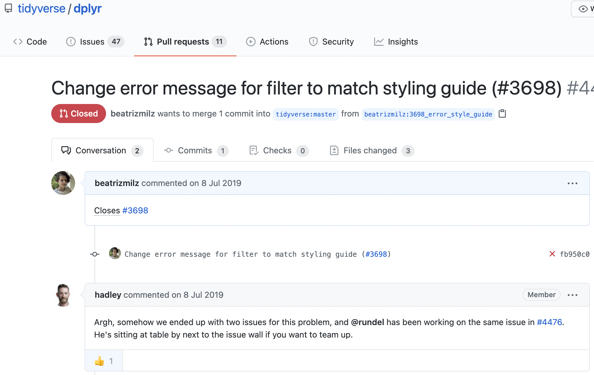
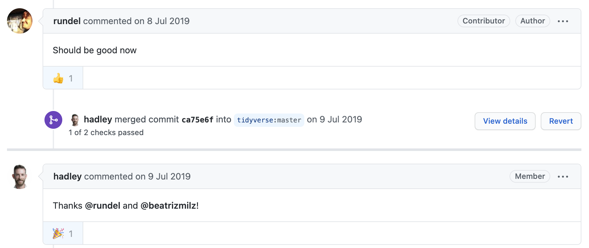
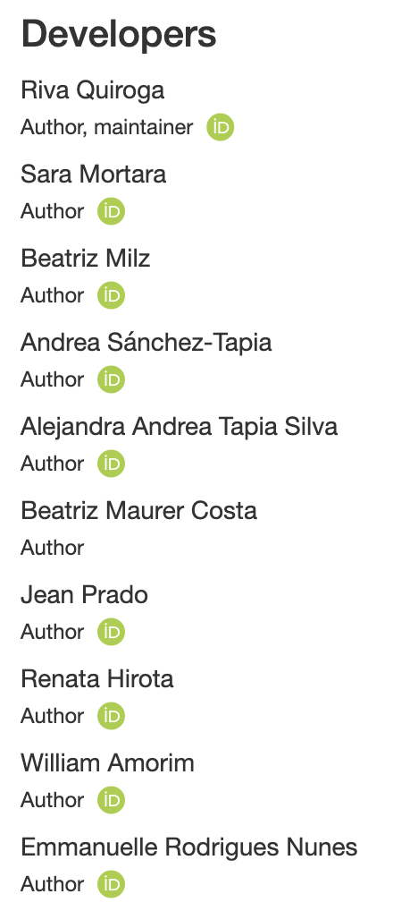

class: middle, center


.pull-left[
## Minha experiência na useR! 2019
### ES: Mi experiencia en useR! 2019  <br><br>  EN: My experience at useR! 2019


### Beatriz Milz - 28/04/2021
]

.pull-right[
```{r echo=FALSE, out.width="100%", fig.align="center"}
knitr::include_graphics("img/horst-starwars-hands.png")
```

Art created by [Allison Horst](https://twitter.com/allison_horst) for the Keynote by [Julia Stewart Lowndes](https://jules32.github.io/useR-2019-keynote/#7)
]

---
class: center, middle
background-image: url(img/tidydevday.png)
background-position: right
background-size: 70%
class: middle


```{r setup, include=FALSE}
options(htmltools.dir.version = FALSE)
knitr::opts_chunk$set(
  fig.width=9, fig.height=3.5, fig.retina=3,
  out.width = "100%",
  cache = FALSE,
  echo = TRUE,
  message = FALSE, 
  warning = FALSE,
  fig.show = TRUE,
  hiline = TRUE
)
```

```{r xaringan-themer, include=FALSE, warning=FALSE}
library(xaringanthemer)
style_duo_accent(
  primary_color = "#88398a",
  secondary_color = "#2065b6",
  inverse_header_color = "#FFFFFF"
)
```

```{r xaringanExtra, echo=FALSE}

#devtools::install_github("gadenbuie/xaringanExtra")

# xaringanExtra::use_logo(image_url = "https://beatrizmilz.github.io/slidesR/introR/img/rainbow-inclusive.png",
#                         link_url = "https://github.com/R-Ladies-Sao-Paulo/RLadies-Brasil")


```


.pull-left[

## Aprender...


## Learn...


]

---

## Tidy dev day

```{r echo=FALSE, out.width="60%", fig.align="center"}

```

https://github.com/tidyverse/dplyr/pull/4477

---

## Tidy dev day

```{r echo=FALSE, out.width="80%", fig.align="center"}

```


https://github.com/tidyverse/dplyr/pull/4476


---
class: center, middle
background-image: url(img/brasileiros.png)
background-position: right
background-size: contain
class: middle


.pull-left[
## Fazer amizades..

## Hacer amigues..

## Make friends..

]


---
class: center, middle
background-image: url(img/bea.jpeg)
background-position: right
background-size: 70%
class: middle


.pull-left[


## Compartilhar...


## Compartir...

## Share...

]
---

## Conectar com a comunidade de R na América Latina

### Conectar con la comunidad de R en Latino America

### Network with the R community in Latin America

<center>
<iframe width="560" height="315" src="https://www.youtube.com/embed/RMR0vye6Kms" title="YouTube video player" frameborder="0" allow="accelerometer; autoplay; clipboard-write; encrypted-media; gyroscope; picture-in-picture" allowfullscreen></iframe>

<BR>


</center>

https://www.youtube.com/watch?v=RMR0vye6Kms


---
class: inverse, center, middle


## Algumas "consequências"...

## Algunas "consecuencias"...

## Some of the outcomes...


---


.pull-left[
## Estudar Espanhol!

## Estudiar Español!

## Study Spanish
]

.pull-right[

## LatinR

https://latin-r.com/

```{r echo=FALSE, out.width="70%", fig.align="center"}
knitr::include_graphics("https://pbs.twimg.com/profile_images/946491642084773888/1bxpJg-v_400x400.jpg")

```

]


---

.pull-left[
## Pacote/Paquete/Package Dados

```{r echo=FALSE, out.width="60%", fig.align="center"}
knitr::include_graphics("https://cienciadedatos.github.io/dados/reference/figures/dados-hex.png")

```

https://cienciadedatos.github.io/dados/

]

.pull-right[
```{r echo=FALSE, out.width="50%"}

```

]

---
## satRday São Paulo

```{r echo=FALSE, out.width="80%", fig.align='center'}

```

https://saopaulo2019.satrdays.org/

---
## satRday São Paulo

.pull-left[
```{r echo=FALSE, out.width="100%", fig.align='center'}
knitr::include_graphics("img/satrdaysp-org1.png")
```
]

.pull-right[
```{r echo=FALSE, out.width="100%", fig.align='center'}
knitr::include_graphics("img/satrdaysp-org2.png")
```
]


---
class: center, middle

## Obrigada! / Muchas gracias! / Thanks!

```{r echo=FALSE, out.width="15%"}
knitr::include_graphics("https://beatrizmilz.com/img/bea.png")
```


<i class="fas fa-home"></i> [beatrizmilz.com](https://beatrizmilz.com)

<i class="fab fa-twitter"></i> [BeaMilz](https://twitter.com/BeaMilz)

<i class="far fa-envelope"></i> [milz.bea@gmail.com](mailto:milz.bea@gmail.com)


Slides created via the R packages: [**xaringan**](https://github.com/yihui/xaringan)<br>
[gadenbuie/xaringanthemer](https://github.com/gadenbuie/xaringanthemer). The chakra comes from [remark.js](https://remarkjs.com), [**knitr**](http://yihui.name/knitr), and [R Markdown](https://rmarkdown.rstudio.com).


<!-- inicio font awesome -->
<script src="https://kit.fontawesome.com/1f72d6921a.js" crossorigin="anonymous"></script>
<!-- final font awesome -->