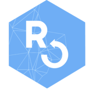
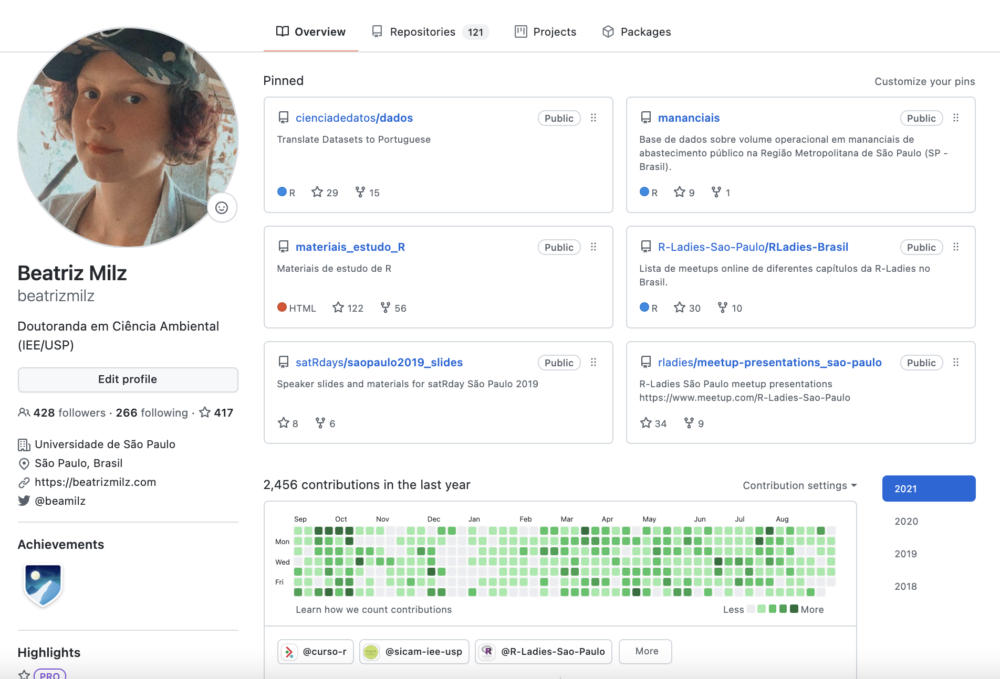

class: middle

```{r setup, include=FALSE}
options(htmltools.dir.version = FALSE)
knitr::opts_chunk$set(
  fig.width=9, fig.height=3.5, fig.retina=3,
  out.width = "100%",
  cache = FALSE,
  echo = FALSE,
  message = FALSE, 
  warning = FALSE,
  hiline = TRUE,
  fig.align = "center"
)
```

```{r eval=FALSE, include=FALSE}
# devtools::install_github("hadley/emo")
# devtools::install_github("gadenbuie/xaringanExtra")
# devtools::install_github("gadenbuie/ermoji")
# remotes::install_github("mitchelloharawild/icons")
```


```{r xaringanExtra-clipboard, echo=FALSE}
xaringanExtra::use_clipboard()
```


```{r xaringan-themer, include=FALSE, warning=FALSE}
library(xaringanthemer)
style_duo_accent(outfile = "xaringan-themer2021-nov.css",
  primary_color = "#0a427b",
  title_slide_background_color = "#0a427b",
  title_slide_text_color = "#FFFFFF",
  inverse_text_color = "#FFFFFF",
  inverse_header_color = "#FFFFFF",
  secondary_color = "#145683",

  header_font_google = google_font("Jost"),
  text_font_google   = google_font("Work Sans", "300", "300i"),
  code_font_google   = google_font("Fira Code"),
  base_font_size = "25px"
)
```

```{css echo=FALSE}
blockquote {
    background-color: lavender; !important
}

a, a > code {
    color: #145683;
    text-decoration: underline;
    text-decoration-style: dotted;
}

.inverse a, .inverse a > code {
    color: #ffdfb9;
}


.remark-inline-code{
    color: #3bc6c7;
}
```


.pull-left[

## Beatriz Milz      
[`r icons::icon_style(icons::fontawesome(name = "question", style = "solid"), fill = "#145683", scale = 1.7)`](https://discourse.curso-r.com/u/beatrizmilz/summary) 
[`r icons::icon_style(icons::fontawesome(name = "home", style = "solid"), fill = "#145683", scale = 1.7)`](https://beatrizmilz.com/)
[`r icons::icon_style(icons::fontawesome("twitter"), fill = "#145683", scale = 2)`](https://twitter.com/BeaMilz)
[`r icons::icon_style(icons::fontawesome(name = "github"), fill = "#145683", scale = 2)`](https://github.com/beatrizmilz)
[`r icons::icon_style(icons::academicons("orcid"), fill = "#145683", scale = 2)`](https://orcid.org/0000-0002-3064-4486)
[`r icons::icon_style(icons::academicons("lattes"), fill = "#145683", scale = 2)`](http://lattes.cnpq.br/5150665880581477)


 
]

.pull-right[


- 2019 - * - Doutoranda em Ciência Ambiental - PROCAM/IEE/USP

- 2016-2018 - Mestrado em Ciências - Programa de Pós-Graduação em Análise Ambiental Integrada - UNIFESP

- 2012-2015 - Bacharelado em Gestão Ambiental - EACH/USP

]


---


### R: Comunidades, eventos, pacotes, livros..
<center>


<a href='https://curso-r.com/'>  </a>

<a href='https://education.rstudio.com/trainers/'>  </a>


<a href='https://rladies.org/'>  </a>


<a href='https://livro.curso-r.com/'>  </a>


<a href='https://saopaulo2019.satrdays.org/'>  </a>
<a href='https://latin-r.com/'>  </a><a href='https://carpentries.org/'></a>
<a href='https://user2021.r-project.org/'></a><a href='https://cienciadedatos.github.io/dados/'></a>
<a href='https://beatrizmilz.github.io/mananciais/'>  </a>
<a href='https://ropensci.org/'>  </a>


</center>

---

## Conteúdo

- [Pré-requisitos](#prerequisitos)

- [Conceitos básicos importantes](#conceitosimportantes)

- [Configurando o Git e GitHub no RStudio](#configurando)

- [Primeiros passos com o Git e GitHub no RStudio](#primeirospassos)

---
class: middle, center, inverse
name: prerequisitos

## Pré-requisitos


---
class: middle

.pull-left[
### R 
  - [Download neste link](https://cran.r-project.org/)
  - Use a versão mais recente `r emo::ji("wink")`


  
]

.pull-right[
```{r, out.width="100%"}
knitr::include_graphics("img/R_logo.svg.png")
```
]


---
class:middle

```{r, out.width="100%"}
knitr::include_graphics("img/prints/install_R.png")
```


---
class: middle


.pull-left[
### RStudio
  - [Download neste link](https://www.rstudio.com/products/rstudio/download/)
  - Use a versão mais recente `r emo::ji("wink")`
  

  
]

.pull-right[
```{r out.width="100%"}
knitr::include_graphics("img/rstudio.png")
```
]

---
class: middle

```{r, out.width="100%"}
knitr::include_graphics("img/prints/install_RStudio.png")
```

---
class: middle

.pull-left[

### Git 
  - [Download neste link](https://git-scm.com/downloads)

  

]


.pull-right[
```{r out.width="80%"}
knitr::include_graphics("https://git-scm.com/images/logo@2x.png")
```

]

---
class:middle

```{r, out.width="70%"}
knitr::include_graphics("img/prints/install-git.png")
```

---
class: middle


.pull-left[
### Conta no GitHub
  - [Neste link](https://github.com/)
  - Caso já tenha, não é preciso criar uma nova conta.
  
  

  
]

.pull-right[
```{r out.width="100%"}
knitr::include_graphics("img/github-logo.png")
```
]

  - Se for estudante: 
    - [GitHub Student Developer Pack](https://education.github.com/pack) - utiliza email institucional da universidade.


---
class: middle


### Instalação de pacotes

.pull-left[
- Instalar o Pacote [`usethis`](https://usethis.r-lib.org/)

```{r echo=TRUE, eval=FALSE}
install.packages("usethis")
library(usethis)
```
]

.pull-right[
```{r, out.width="50%"}
knitr::include_graphics("https://usethis.r-lib.org/reference/figures/logo.png")
```
]

---
class: middle, center, inverse
name: conceitosimportantes

## Conceitos básicos importantes


---

### O que é Git?

- Git é um **sistema de versionamento**, criado por Linus Torvalds, autor do Linux.

- É capaz de guardar o histórico de alterações de todos os arquivos dentro de uma pasta, que chamamos de repositório.

- Funciona como o "*Track changes*" do word, mas muito melhor.

- Torna-se importante à medida que seu trabalho é __colaborativo__.

- Git é um software que você instala no computador.

  

```{r out.width="30%"}
knitr::include_graphics("https://git-scm.com/images/logo@2x.png")
```

> <i class="far fa-flag"></i> [Slide](https://curso-r.github.io/main-pacotes/slides/index.html) do curso de [Pacotes](https://curso-r.com/cursos/pacotes/), da [Curso-R](https://curso-r.com/).


---

### O que é GitHub?


- GitHub é um site onde você coloca e compartilha repositórios Git.

- Utilizado por milhões de pessoas em projetos de código aberto ou fechado.

- Útil para colaborar com outros programadores em projetos de ciência de dados.

- Existem alternativas, como [GitLab](https://about.gitlab.com/) e [BitBucket](https://bitbucket.org/product).

- GitHub é um site que você acessa na internet.

```{r out.width="30%"}
knitr::include_graphics("img/github-logo.png")
```

<br>

> <i class="far fa-flag"></i> [Slide](https://curso-r.github.io/main-pacotes/slides/index.html) do curso de [Pacotes](https://curso-r.com/cursos/pacotes/), da [Curso-R](https://curso-r.com/).


---
class: middle, center

<a href='https://github.com/beatrizmilz' target="_blank">
```{r echo=FALSE, out.width="70%"}

```
</a>

---

### Comentários importantes

- Você pode usar o Git através:
  -  __Linha de comando__ :
      - [git](https://git-scm.com/)
      - terminal do RStudio
  - __Interfaces gráficas__:
      - [GitHub Desktop](https://desktop.github.com/)
      - [Sourcetree](https://www.sourcetreeapp.com/)
      - Git Pane do RStudio
      - Entre outros!
    
Aqui apresento com o RStudio, mas escolha o que é mais confortável para você :)

- Independente de qual ferramenta você escolher, é importante qual comando do Git equivale a um "botão" na interface gráfica. É muito importante entender as equivalências!

---
class: middle,  inverse, center
name: configurando

## Configurando o Git e GitHub no RStudio

`r emo::ji("woman_technologist")` É necessário fazer apenas uma vez (por usuário do computador)!


#### ...Depende do sistema operacional que você utiliza!


---
class: middle,  inverse

### Configurando o Git e GitHub no RStudio

.pull-left[
#### Se você usa Windows ou MacOS - Usando HTTPS


- `r emo::ji("white_large_square")` Ter o pacote `usethis` instalado 

- `r emo::ji("white_large_square")` Se apresentar para o `git` 

- `r emo::ji("white_large_square")` Abrir o arquivo `.Renviron` 

- `r emo::ji("white_large_square")` Criar um GitHub Token/PAT

- `r emo::ji("white_large_square")` Armazenar o GitHub Token/PAT 

- `r emo::ji("white_large_square")` Reiniciar o RStudio
]

.pull-right[
#### Se você usa Linux - Usando SSH


- `r emo::ji("white_large_square")` Ter o pacote `usethis` instalado 

- `r emo::ji("white_large_square")` Se apresentar para o `git`

- `r emo::ji("white_large_square")` Seguir este tutorial para configurar as chaves `SSH`: https://happygitwithr.com/ssh-keys.html 


]
<!-- `r emo::ji("heavy_check_mark")` -->

<!--  `r emo::ji("x")` -->

---
class: middle

### Configurando o Git

- Informar para o Git seu nome, e email.

- Utilize o mesmo email associado à sua conta do GitHub.


  - Com o `usethis`:

```{r echo=TRUE, eval=FALSE}
usethis::use_git_config(# Seu nome
                        user.name = "Beatriz Milz", 
                        # Seu email
                        user.email = "beatriz.milz@hotmail.com") 
```


---

### Configure o Personal Access Token 

- Ao conectar com o GitHub, você será instruída(o) a criar um *Personal Access Token* (PAT).

- O PAT serve para autenticar ao GitHub, podendo ser utilizado como senha de acesso ou internamente para automatizar tarefas (como criar um repositório).

- Para criar um novo PAT, use a função `usethis::create_github_token()`. Uma janela do navegador será aberta, e você deve autenticar no GitHub (se necessário), criar o novo token, e copiá-lo. 

```{r echo=TRUE, eval=FALSE}
usethis::create_github_token()
```


> <i class="far fa-flag"></i> [Slide](https://curso-r.github.io/main-pacotes/slides/index.html) do curso de [Pacotes](https://curso-r.com/cursos/pacotes/), da [Curso-R](https://curso-r.com/).


---

### Armazenar o Personal Access Token 

#### Método 1 - `gitcreds::gitcreds_set()`


.pull-left[
```{r echo=TRUE, eval=FALSE}
gitcreds::gitcreds_set()
# -> Your current credentials for 'https://github.com':
#   protocol: https
#   host    : github.com
#   username: beatrizmilz
#   password: <-- hidden -->
#     
# -> What would you like to do? 
# 1: Keep these credentials
# 2: Replace these credentials
# 3: See the password / token
```
]


.pull-right[
Siga as instruções e cole o PAT quando for solicitado as credenciais.

```{r echo=TRUE, eval=FALSE}
# -> Adding new credentials...
# -> Removing credetials from cache...
# -> Done.
```
]


---

### Armazenar o Personal Access Token 

#### Método 2 - Armazenar manualmente no `.Renviron`

- Use a função `usethis::edit_r_environ()` para abrir o arquivo `.Renviron` para salvar seu token. 

```{r echo=TRUE, eval=FALSE}
usethis::edit_r_environ()
# ● Modify 'C:/Users/beatr/Documents/.Renviron'
# ● Restart R for changes to take effect
```

- Crie uma nova linha na forma `GITHUB_PAT=SEU_TOKEN`, adicione o token, **pule uma linha** e salve o arquivo. Se certifique que o arquivo termina com uma linha vazia!


Use essa estrutura, substituindo os 0 pelo código copiado na etapa anterior:

```{r echo=TRUE, eval=FALSE}
GITHUB_PAT="0000000000000000000000000000000000000000"
```


---

### Reiniciar a sessão 

- Lembre-se de reiniciar sua sessão do R!


- **Reinicie o R usando o RStudio**:  CTRL + SHIFT + F10


---


### Checando se a configuração deu certo

Utilize a função `usethis::git_sitrep()` e leia o resultado que aparece no console. A mensagem abaixo foi cortada para mostrar os trechos de interesse!


```{r echo=TRUE, eval=FALSE}
usethis::git_sitrep()
#> Git config (global)
#> ● Name: 'SEU NOME DEVE APARECER AQUI'
#> ● Email: 'SEU EMAIL DEVE APARECER AQUI'

#> GitHub
#> ● Default GitHub host: 'https://github.com'
#> ● Personal access token for 'https://github.com': '<discovered>'
#> ● GitHub user: 'SEU NOME DE USUÁRIO(A) DEVE APARECER AQUI'
#> ● Token scopes: 'gist, repo, user, workflow'
#> ● Email(s): 'SEU EMAIL DEVE APARECER AQUI'
```

> <i class="far fa-flag"></i> [Slide](https://curso-r.github.io/main-pacotes/slides/index.html) do curso de [Pacotes](https://curso-r.com/cursos/pacotes/), da [Curso-R](https://curso-r.com/).

---
class: middle, center

### Momento mão na massa!

Tente configurar o Git e GitHub no RStudio.

Caso não funcione, não esqueça de informar o resultado da função `usethis::git_sitrep()`.

```{r echo=FALSE, out.width="30%"}
knitr::include_graphics("https://i.giphy.com/media/3oKIPnAiaMCws8nOsE/giphy.webp")
```


---
class: middle, center, inverse
name: primeirospassos

## Primeiros passos com o Git e GitHub no RStudio


Dica: comece praticando nos seus projetos. Quando estiver confortável, pode começar a contribuir com projetos de outras pessoas! :)

---

### Fluxo de trabalho

O diagrama abaixo exemplifica o fluxo de trabalho de um projeto com versionamento.


```{r echo=FALSE, fig.align='center', out.width="60%"}
knitr::include_graphics("img/fluxo_github_rstudio.png")
```


> <i class="far fa-flag"></i> [Slide](https://curso-r.github.io/main-pacotes/slides/index.html) do curso de [Pacotes](https://curso-r.com/cursos/pacotes/), da [Curso-R](https://curso-r.com/).


---
class: middle

### Interface Gráfica RStudio

- O RStudio oferece um cliente Git **simples**, na aba "Git" (em inglês, é chamado de Git Pane).

- Esse painel somente aparecerá em projetos que estejam versionados com Git.

```{r, out.width="60%"}
knitr::include_graphics("img/prints/git-pane.PNG")
```


---
class: middle

### Git pane - Staged  `r emo::ji("white_check_mark")`

```{r, out.width="70%"}
knitr::include_graphics("img/prints/git-pane-stage.png")
```

---
class: middle

### Git pane - Commit

```{r, out.width="70%"}
knitr::include_graphics("img/prints/git-pane-commit.PNG")
```

---
class: middle

### Git pane - Commit

```{r, out.width="70%"}
knitr::include_graphics("img/prints/git_commit.PNG")
```


---
class: middle

### Botão Diff -> Review changes

```{r, out.width="70%"}
knitr::include_graphics("img/prints/git-pane-diff.PNG")
```

---
class: middle

### Botão `r emo::ji("clock3")` (history) -> Review changes

```{r, out.width="70%"}
knitr::include_graphics("img/prints/git-pane-history.PNG")
```


---
class: middle, center, inverse

# Trabalhando com projetos no RStudio + GitHub


---
## Método 1 - **Clonando um repositório do GitHub**

- [Crie um repositório no GitHub](https://github.com/new), ou abra a página de um repositório já existente. 

.pull-left[
- Criando um repositório no GitHub:

```{r out.width="80%"}
knitr::include_graphics("img/prints/novo-repo.PNG")
```

]

.pull-right[

Se o repositório não for "seu", faça um fork primeiro, e clone o seu fork. 

```{r out.width="100%"}
knitr::include_graphics("img/prints/fork.png")
```

]


---


- No RStudio, crie um novo projeto: File > New Project 
.pull-left[
- Na aba "Create Project", selecione a opção **Version Control**.

```{r out.width="100%"}
knitr::include_graphics("img/prints/proj-version-control-1.PNG")
```
]

.pull-right[

- Na aba "Create Project from Version Control", selecione a opção **Git**.
```{r out.width="100%"}
knitr::include_graphics("img/prints/proj-version-control-2.png")
```
]


---
- Na aba "Clone Git Repository":
  - **Repository URL**: Cole o link para o repositório
  - **Project directory name**: Após inserir o repository URL, esse campo será preenchido automaticamente.
  - **Create project as subdirectory of**: Selecione o diretório onde você deseja manter sua cópia local do repositório.
```{r out.width="50%"}
knitr::include_graphics("img/prints/proj-version-control-3.png")
```

- O **RStudio** irá fazer o clone do repositório, e abrirá um RProj para ele (caso não exista um ainda, será criado).

---

## Método 2

- **Criando um repositório novo, diretamente do RStudio**

- Vamos usar a função `usethis::create_project()` 
  - Cria um projeto `.Rproj`
  - Argumento importante: `path = ` 	É o "caminho" para o diretório (pasta). Se o diretório já existe, é utilizado. Se não existe, é criado. 
  - Cuidado com o nome do projeto, pois será o mesmo nome que será utilizado no repositório. Você não deve usar o nome de algum repositório já existente no seu GitHub.

---

### Criando um projeto
- No meu caso, tenho o hábito de deixar todos os repositórios do GitHub, na pasta `GitHub/`. No exemplo abaixo, dentro da pasta GitHub, criei o projeto chamado Teste-MeetupR. Esse será o nome da pasta criada e posteriormente do repositório no GitHub.

```{r echo=TRUE, eval=FALSE}
usethis::create_project("~/GitHub/Teste-MeetupR") 
# ✔ Creating 'GitHub/Teste-MeetupR/'
# ✔ Setting active project to 'C:/Users/beatr/Documents/GitHub/Teste-MeetupR'
# ✔ Creating 'R/'
# ✔ Writing 'Teste-MeetupR.Rproj'
# ✔ Adding '.Rproj.user' to '.gitignore'
# ✔ Opening 'GitHub/Teste-MeetupR/' in new RStudio session
# ✔ Setting active project to '<no active project>'
```
- O RStudio abrirá outra janela, com o novo projeto criado.

---
### Novo projeto criado! 

- Projeto `r emo::ji("heavy_check_mark")`

- Git `r emo::ji("x")`

- GitHub `r emo::ji("x")`

```{r out.width="60%"}
knitr::include_graphics("img/prints/novo_projeto.png")
```

---

```{r echo=TRUE, eval=FALSE}
usethis::use_git()
# ✔ Setting active project to 'C:/Users/beatr/Documents/GitHub/Teste-MeetupR'
# ✔ Initialising Git repo
# ✔ Adding '.Rhistory', '.RData' to '.gitignore'
# There are 2 uncommitted files:
# * '.gitignore'
# * 'Teste-MeetupR.Rproj'
# Is it ok to commit them?
# 
{{# 1: Absolutely  }}
# 2: Negative
# 3: No
# 
# Selection: 1
# ✔ Adding files
# ✔ Commit with message 'Initial commit'
# ● A restart of RStudio is required to activate the Git pane
# Restart now?
# 
# 1: No way
{{# 2: For sure}}
# 3: Negative
# 
# Selection: 2
```

- O RStudio irá reiniciar para que apareça o painel do Git

---
### Usando Git

- Projeto `r emo::ji("heavy_check_mark")`

- Git `r emo::ji("heavy_check_mark")`

- GitHub `r emo::ji("x")`

```{r out.width="60%"}
knitr::include_graphics("img/prints/novo_projeto_com_git.png")
```


---
```{r echo=TRUE, eval=FALSE}
usethis::use_github()
# ✔ Setting active project to 'C:/Users/beatr/Documents/GitHub/Teste-MeetupR'
# ✔ Checking that current branch is 'master'
# Which git protocol to use? (enter 0 to exit) 
# 
# 1: ssh   <-- presumes that you have set up ssh keys
{{# 2: https <-- choose this if you don't have ssh keys (or don't know if you do)}}
# 
# Selection: 2
# ● Tip: To suppress this menu in future, put
#   `options(usethis.protocol = "https")`
#   in your script or in a user- or project-level startup file, '.Rprofile'.
#   Call `usethis::edit_r_profile()` to open it for editing.
# ● Check title and description
#   Name:        Teste-MeetupR
#   Description: 
# Are title and description ok?
# 
# 1: No way
{{# 2: Definitely}}
# 3: Nope
# 
# Selection: 2
# ✔ Creating GitHub repository
# ✔ Setting remote 'origin' to 'https://github.com/beatrizmilz/Teste-MeetupR.git'
# ✔ Pushing 'master' branch to GitHub and setting remote tracking branch
# ✔ Opening URL 'https://github.com/beatrizmilz/Teste-MeetupR'
```

---
### Repositório criado!

- Projeto `r emo::ji("heavy_check_mark")`

- Git `r emo::ji("heavy_check_mark")`

- GitHub `r emo::ji("heavy_check_mark")`

```{r out.width="60%"}
knitr::include_graphics("img/prints/criou-repositorio-github.PNG")
```

---

### Função para criar um arquivo `README.md`

```{r, echo=TRUE, eval=FALSE}
usethis::use_readme_md()

```
- O arquivo será criado e aberto, para ser editado e salvo.

```{r, out.width="20%"}
knitr::include_graphics("https://media2.giphy.com/media/1iu8uG2cjYFZS6wTxv/giphy-downsized.gif")
```


---
class: middle

### Exemplo:

```{r out.width="100%"}
knitr::include_graphics("img/gifs/create-proj2.gif")
```

.minirodape[Caso você esteja vendo a versão em PDF, o video acima não irá funcionar. Veja clicando [neste link](https://beatrizmilz.github.io/slidesR/git_rstudio/img/gifs/create-proj2.gif).]

---

## Método 3

- **A partir de um repositório existente, fazer um fork e clonar diretamente do RStudio**

- Para isso, usaremos a função `usethis::create_from_github()`.

- Argumentos importantes:
  - `repo_spec = ` repositório que quer trabalhar. Deve estar no formato: "usuario_github/repositorio". Veja o exemplo abaixo.
  - `destdir =` diretório onde quer que os arquivos sejam salvos
  - `fork =` se igual a TRUE, irá fazer o fork do repositório. Só funcionará se o token do GitHub foi configurado corretamente.

---
### Exemplo do uso da função `create_from_github()`

- Exemplo: fork e clone do projeto [Lista de meetups R-Ladies no Brasil](https://github.com/R-Ladies-Sao-Paulo/RLadies-Brasil):


```{r echo=TRUE, eval=FALSE}
usethis::create_from_github("R-Ladies-Sao-Paulo/RLadies-Brasil",
                   destdir = "C:/Users/beatr/Documents/GitHub", 
                   fork = TRUE)
# ✔ Creating 'C:/Users/beatr/Documents/GitHub/datascience-box/'
# ✔ Forking 'R-Ladies-Sao-Paulo/RLadies-Brasil'
# ✔ Cloning repo from 'https://github.com/beatrizmilz/RLadies-Brasil.git' into 'C:/Users/beatr/Documents/GitHub/RLadies-Brasil'
# ✔ Setting active project to 'C:/Users/beatr/Documents/GitHub/RLadies-Brasil'
# ✔ Adding 'upstream' remote: 'https://github.com/R-Ladies-Sao-Paulo/RLadies-Brasil.git'
# ✔ Pulling changes from GitHub source repo 'upstream/master'
# ✔ Setting remote tracking branch for local 'master' branch to 'upstream/master'
# ✔ Opening 'C:/Users/beatr/Documents/GitHub/RLadies-Brasil/' in new RStudio session
# ✔ Setting active project to 'C:/Users/beatr/Documents/GitHub/RLadies-Git-RStudio-2019'
```

---
class: middle, center, inverse

## Trabalhando colaborativamente

---
class: middle

## Branch

```{r, out.width="70%"}
knitr::include_graphics("img/prints/git-pane-branch.png")
```


---
### Crie uma branch

- Antes de fazer qualquer modificação, crie uma branch, usando a função `usethis::pr_init()`. 
- Argumento importante: `branch =` indica o nome da branch que você quer criar. 

```{r echo=TRUE, eval=FALSE}
usethis::pr_init(branch = "teste")

# ✔ Checking that local branch 'master' has the changes in 'origin/master'
# ✔ Creating local PR branch 'teste'
# ✔ Switching to branch 'teste'
# ● Use `pr_push()` to create PR
```

---
### Faça alterações e commits

- Faça suas contribuições, e sempre faça commits com mensagens que deixem claro as mudanças.

- Quando terminar as contribuições necessárias, utilizar a função `pr_push()`:

```{r echo=TRUE, eval=FALSE}
usethis::pr_push()
# ✔ Pushing local 'teste' branch to 'origin:teste'
# ✔ Setting upstream tracking branch for 'teste' to 'origin/teste'
# ✔ Create PR at link given below
# ✔ Opening URL 'https://github.com/beatrizmilz/RLadies-Git-RStudio-2019/compare/teste'
```

- A página do GitHub será aberta, para que possa completar o Pull Request.

---
class: middle 

### Crie um Pull Request: 
```{r out.width="60%"}
knitr::include_graphics("img/prints/pr-push.PNG")
```

---
class: middle 

### Open a Pull Request: 
```{r out.width="60%"}
knitr::include_graphics("img/prints/pr-push2.png")
```

---


### Exemplo: PR foi aberto

```{r out.width="60%"}
knitr::include_graphics("img/prints/pr-push3.png")
```

- Depois dessa etapa, você deve esperar a pessoa que mantém o repositório responder fazendo sugestões para melhorias, aceitando seu PR, etc.


---

### Modificar o PR

- Alguém fez uma sugestão, como alterar o PR enviado? Ex:

```{r echo=FALSE, out.width="30%"}
knitr::include_graphics("img/prints/sugestoes-git.PNG")
```
- No mesmo projeto e na __mesma branch__ que você usou para enviar o PR, faça as alterações.

- Selecione o arquivo modificado para deixá-lo disponível para criar um Commit. Faça o commit.

- Para enviar o novo commit, use o Git Push (aperte a seta verde para cima no painel do Git do RStudio).


---

### Depois que o PR é aceito:  Merged

```{r out.width="60%"}
knitr::include_graphics("img/prints/pr-push4.PNG")
```

---
class: middle 

### Última etapa: __APÓS__ o PR ter sido aceito (merged)

- A função `usethis::pr_finish()`:
  - Retorna para master
  - Atualiza (usando o pull) o conteúdo 
  - Deleta a branch criada para enviar o PR

```{r echo=TRUE, eval=FALSE}
usethis::pr_finish()
# ✔ Switching back to 'master' branch
# ✔ Pulling changes from GitHub source repo 'origin/master'
# ✔ Deleting local 'teste' branch
```

- Pronto! 


---
class: center, middle 

## Linha de comando ou interface gráfica?
## Use o que for melhor para **você**!

```{r out.width="30%"}
knitr::include_graphics("https://media0.giphy.com/media/dNgK7Ws7y176U/giphy.gif")
```

Confira a [cheatsheet do Git](https://github.github.com/training-kit/downloads/pt_BR/github-git-cheat-sheet.pdf)!


---
class: middle 

# Referências

- [Slide](https://curso-r.github.io/main-pacotes/slides/index.html) do curso de [Pacotes](https://curso-r.com/cursos/pacotes/), da [Curso-R](https://curso-r.com/).


- Parte deste material foi baseado/inspirado neste post do blog da [Curso-R](https://www.curso-r.com/), escrito por [Caio Lente](https://lente.dev/):
  - [Git e GitHub (Zen do R - Parte 4)](https://www.curso-r.com/blog/2019-07-23-zen-do-r-4/)
  
- Outra referência importante: [Happy Git and GitHub for the useR - 
Jenny Bryan](https://happygitwithr.com/)


- Documentação do pacote [usethis](https://usethis.r-lib.org/reference/create_package.html)

- Evento da R-Ladies SP de 2020: https://r-ladies-sao-paulo.github.io/2020-hacktoberfest/

---
class: middle, center

# Referências

##  [Palestra](https://youtu.be/ZCeBnQBQ1h8) (em inglês) da [Jenny Bryan](https://jennybryan.org/):

<iframe width="560" height="315" src="https://www.youtube.com/embed/ZCeBnQBQ1h8" frameborder="0" allow="accelerometer; autoplay; encrypted-media; gyroscope; picture-in-picture" allowfullscreen></iframe>

---
class: middle

## Interface Gráfica RStudio

```{r, out.width="70%"}
knitr::include_graphics("img/prints/cheatsheet.PNG")
```

Fonte: [RStudio Cheatsheet](https://www.rstudio.com/wp-content/uploads/2019/01/Cheatsheets_2019.pdf)

---
class: center

## Muito obrigada!

.pull-left[

```{r echo=FALSE, fig.align='center', out.width="40%"}
knitr::include_graphics("https://media.giphy.com/media/M9NbzZjAcxq9jS9LZJ/giphy.gif")
```


Slides criados usando os pacotes em R  📦 :

[**xaringan**](https://github.com/yihui/xaringan)<br>
[gadenbuie/xaringanthemer](https://github.com/gadenbuie/xaringanthemer)

O chakra vem da biblioteca javascript [remark.js](https://remarkjs.com), e os pacotes  [**knitr**](http://yihui.name/knitr), e [R Markdown](https://rmarkdown.rstudio.com).
]

.pull-right[

<center>
</center>

<i class="fas fa-home"></i> [beatrizmilz.com](https://beatrizmilz.com)

<i class="fab fa-twitter"></i> [@BeaMilz](https://twitter.com/BeaMilz)

<i class="far fa-envelope"></i> [milz.bea@gmail.com](mailto:milz.bea@gmail.com)
]


<!-- inicio academic icons -->
<link rel="stylesheet" href="https://cdn.jsdelivr.net/gh/jpswalsh/academicons@1/css/academicons.min.css">
<!-- final academic icons -->

 
<!-- inicio font awesome -->
<script src="https://kit.fontawesome.com/1f72d6921a.js" crossorigin="anonymous"></script>

<!-- final font awesome -->
