class: center, middle, hide-logo

```{r setup, include=FALSE}
options(htmltools.dir.version = FALSE)

knitr::opts_chunk$set(fig.align = "center",
                     # message = FALSE,
                      warning = FALSE,
                      echo = FALSE
                      )
```

```{r xaringan-themer, include=FALSE, warning=FALSE}
library(xaringanthemer)
style_duo_accent(
  primary_color = "#88398a",
  secondary_color = "#58519b",
  inverse_header_color = "#FFFFFF"
)
```

```{r xaringanExtra, echo=FALSE}
#devtools::install_github("gadenbuie/xaringanExtra")
xaringanExtra::use_xaringan_extra(c("tile_view", "animate_css", "tachyons"))

xaringanExtra::use_editable(expires = 1)

xaringanExtra::use_logo(
  image_url = "img/rainbow-inclusive.png",
  link_url = "https://github.com/R-Ladies-Sao-Paulo/RLadies-Brasil"
)

xaringanExtra::use_clipboard()

xaringanExtra::use_fit_screen()

xaringanExtra::use_extra_styles(
  hover_code_line = TRUE,         #<<
  mute_unhighlighted_code = FALSE  #<<
)


```


```{r include=FALSE}
# remotes::install_github("cienciadedatos/dados")
# remotes::install_github("carpentries/glosario-r")
library(dados)
library(tidyverse)
library(glosario)
```

<!-- inicio font awesome -->
<script src="https://kit.fontawesome.com/1f72d6921a.js" crossorigin="anonymous"></script>
<!-- final font awesome -->

<!-- inicio github buttons  -->
<script async defer src="https://buttons.github.io/buttons.js"></script>
<!-- final github buttons  -->


# Utilizando o Git e GitHub no RStudio

**[Beatriz Milz](https://beatrizmilz.com)** <a href='mailto:beatriz.milz@usp.br'><i class="far fa-envelope"></i></a>  <a href='https://twitter.com/BeaMilz'><i class="fab fa-twitter"></i>   <a href='https://github.com/beatrizmilz'><i class="fab fa-github"></i></a>


__.can-edit[Meetup R-Ladies GYN]__


__.can-edit[2º semestre/2020]__


.minirodape[Atualizado em `r format(Sys.Date(), format='%d de %B de %Y')`. <br> Para ativar o modo tela cheia, pressione `ALT + F`, e depois `F`]

---

# Beatriz Milz

## Contexto Acadêmico

- Doutoranda no Programa de Pós-Graduação em Ciência Ambiental (PROCAM) 
  - Instituto de Energia e Ambiente - Universidade de São Paulo

- Equipe da Secretaria Executiva  Editorial - [Revista Ambiente & Sociedade](http://scielo.br/asoc)

- Anteriormente: 
  - Mestre em Ciências - UNIFESP; 
  - Bacharel em Gestão Ambiental - EACH/USP
  
---

## Comunidades de R
<center>
```{r echo=FALSE, fig.align='default', out.width="100px"}
knitr::include_graphics(c("img/Hex/1dados-hex.png",
                          "img/Hex/1hexlogorladies.jpeg",
                          "img/Hex/2satrdaysp.png",
                          "img/Hex/4LatinR_hex_violeta-cut.jpg",
                          "img/Hex/carpentries.png"))
```
</center>

- Co-autora do pacote [`{dados}`](https://cienciadedatos.github.io/dados/)

- Co-organizadora:  [R-Ladies São Paulo](https://www.meetup.com/pt-BR/R-Ladies-Sao-Paulo) `r emo::ji("purple_heart")`


- Comitê organizador: 
  - [satRday São Paulo](https://saopaulo2019.satrdays.org/)
  - [LatinR](https://latin-r.com/pt)
  - [useR! 2021](https://user2021.r-project.org/)
  
- Instrutora [The Carpentries](https://carpentries.org/)

  
---

## Sobre este material

- **Público-alvo:** pessoas que utilizam o R para análise de dados, tem um conhecimento básico sobre Git e GitHub e querem utilizar essas ferramentas diretamente do RStudio. 

--

- Partindo do ponto que: 
  - Você já conhece os conceitos básicos de Git
  - Você já sabe porque é interessante usar Git
  
--

- Paralelamente irei falar sobre como usar Git:
  - <i class="fas fa-cloud"></i> No RStudio Cloud
  - `r emo::ji("woman_technologist")` No RStudio instalado no seu computador


--


- A maior parte deste conteúdo é derivado [deste material](https://beatrizmilz.github.io/RLadies-Git-RStudio-2019/#1), oferecido por mim em um meetup da R-Ladies São Paulo em Setembro/2019.

---

## Comentários importantes

- Você pode usar o Git através:
  -  __Linha de comando__ :
      - [git](https://git-scm.com/)
      - terminal do RStudio
  - __Interfaces gráficas__:
      - [GitHub Desktop](https://desktop.github.com/)
      - [Sourcetree](https://www.sourcetreeapp.com/)
      - Git Pane do RStudio
      - Entre outros!
    
Aqui apresento com o RStudio, mas escolha o que é mais confortável para você :)

- Independente de qual ferramenta você escolher, é importante qual comando do Git equivale a um "botão" na interface gráfica. É muito importante entender as equivalências!

---
class: middle, center, inverse

# Pré-requisitos

## `r emo::ji("woman_technologist")` Para usar no Computador


---
class: middle

.pull-left[
## R 
  - [Download neste link](https://cran.r-project.org/)
  - Use a versão mais recente `r emo::ji("wink")`


  
]

.pull-right[
```{r, out.width="100%"}
knitr::include_graphics("img/R_logo.svg.png")
```
]


---
class:middle

```{r, out.width="100%"}
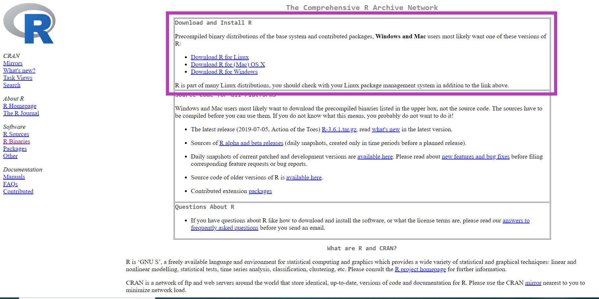
```


---
class: middle


.pull-left[
## RStudio
  - [Download neste link](https://www.rstudio.com/products/rstudio/download/)
  - Use a versão mais recente `r emo::ji("wink")`
  

  
]

.pull-right[
```{r out.width="100%"}
knitr::include_graphics("img/rstudio.png")
```
]

---
class: middle

```{r, out.width="100%"}
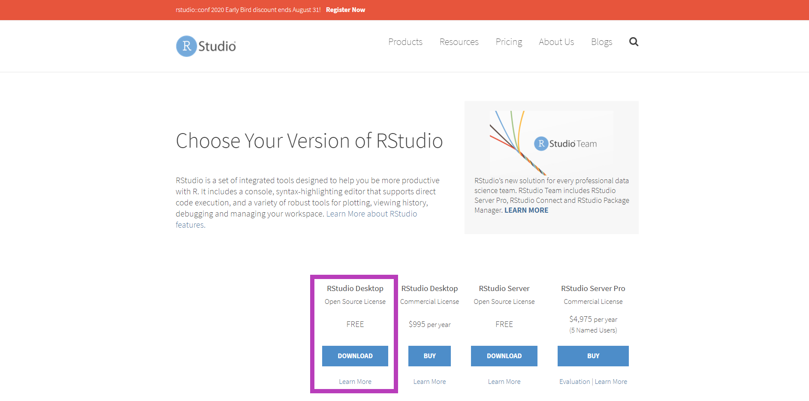
```

---
class: middle

.pull-left[

## Git 
  - [Download neste link](https://git-scm.com/downloads)

  

]


.pull-right[
```{r out.width="80%"}
knitr::include_graphics("https://git-scm.com/images/logo@2x.png")
```

]

---
class:middle

```{r, out.width="70%"}
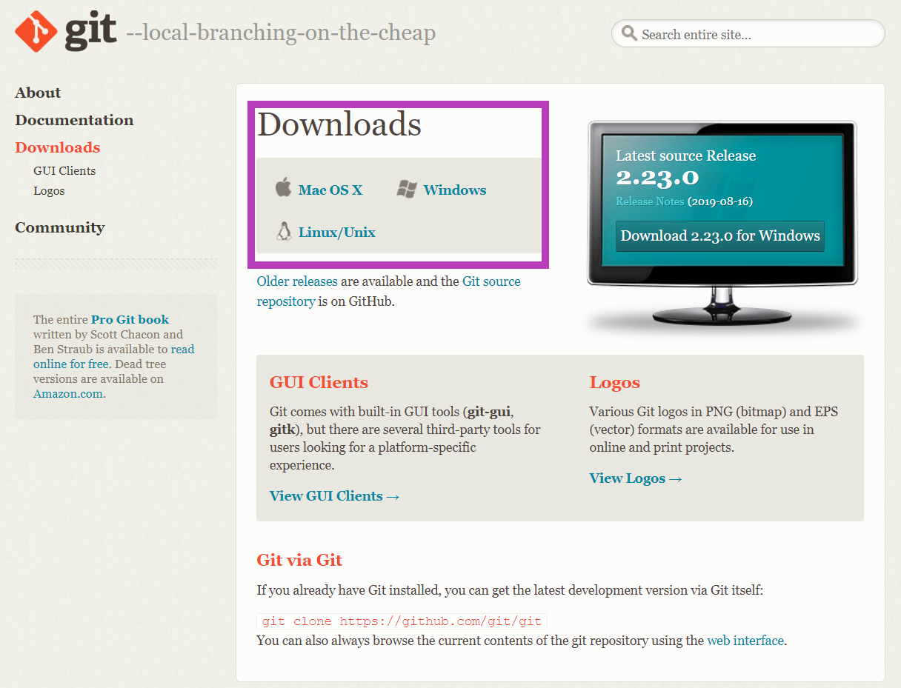
```

---
class: middle


.pull-left[
## Conta no GitHub
  - [Neste link](https://github.com/)
  - Caso já tenha, não é preciso criar uma nova conta.
  
  

  
]

.pull-right[
```{r out.width="100%"}
knitr::include_graphics("img/github-logo.png")
```
]

  - Se for estudante: 
    - [GitHub Student Developer Pack](https://education.github.com/pack) - utiliza email institucional da universidade.

---
class: middle, center

```{r echo=FALSE, out.width="70%"}
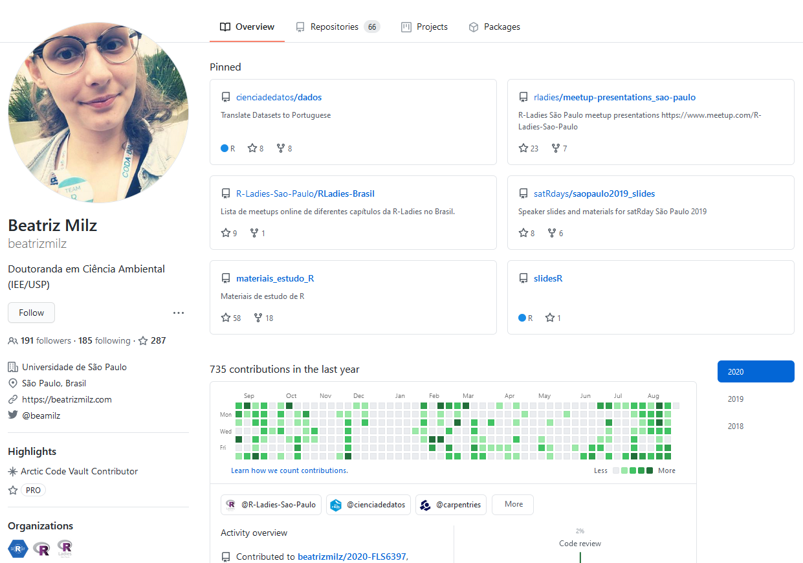
```
---
class: middle


## Instalação de pacotes

- Instalar o Pacote [`usethis`](https://usethis.r-lib.org/)

```{r echo=TRUE, eval=FALSE}
install.packages("usethis")
library(usethis)
```

```{r}
knitr::include_graphics("https://usethis.r-lib.org/reference/figures/logo.png")
```

---
class: middle, center, inverse

# Pré-requisitos

## <i class="fas fa-cloud"></i> Para usar Git na RStudio Cloud

- [Conta no GitHub](https://github.com/)

- [Conta no RStudio Cloud](https://rstudio.cloud/projects)


---
class: middle,  inverse, center

# Configurando o Git e GitHub no RStudio

`r emo::ji("woman_technologist")` No computador: É necessário fazer apenas uma vez (por usuário)!

<i class="fas fa-cloud"></i> No RStudio Cloud: É necessário fazer a configuração em CADA PROJETO.

<center> <b>Demonstração prática</b>: <i class="fas fa-cloud"></i> <a href="https://rstudio.cloud/projects"> Na RStudio Cloud </a>

---
class: middle,  inverse, center

## Configurando o Git e GitHub no RStudio

- `r emo::ji("white_large_square")` Ter o pacote `usethis` instalado 

- `r emo::ji("white_large_square")` Se apresentar para o `git` 

- `r emo::ji("white_large_square")` Abrir o arquivo `.Renviron` 

- `r emo::ji("white_large_square")` Criar um GitHub Token 

- `r emo::ji("white_large_square")` Adicionar o GitHub Token no arquivo `.Renviron` 

- `r emo::ji("white_large_square")` Reiniciar o RStudio

<!-- `r emo::ji("heavy_check_mark")` -->

<!--  `r emo::ji("x")` -->

---
class: middle

## Configurando o Git

- Informar para o Git seu nome, e email.

- Utilize o mesmo email associado à sua conta do GitHub.

- Duas possibilidades: no terminal (linha de comando) ou com uma função do `usethis`.


  - Com o `usethis`:

```{r echo=TRUE, eval=FALSE}
usethis::use_git_config(# Seu nome
                        user.name = "Beatriz Milz", 
                        # Seu email
                        user.email = "beatriz.milz@hotmail.com") 
```

---
class: middle

## Configurando o Git

- No terminal (Substitua pelo seu nome e email  vinculado à conta do GitHub):

```{git echo=TRUE, eval=FALSE}
git config --global user.name "Beatriz Milz"

git config --global user.email beatriz.milz@hotmail.com
```


```{r out.width="80%"}
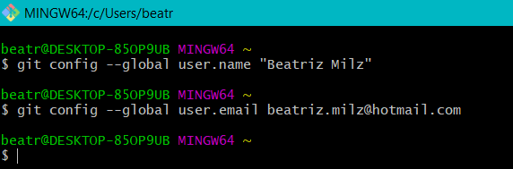
```


---
class: middle

## Configurando o GitHub + RStudio

- Abra o arquivo `.Renviron` usando a seguinte função:

```{r  echo=TRUE, eval=FALSE}
usethis::edit_r_environ()
# * Edit 'C:/Users/beatr/Documents/.Renviron'
# * Restart R for changes to take effect
```

---
class: middle

## Configurando o GitHub + RStudio

- Criar um novo token no GitHub:

```{r echo=TRUE, eval=FALSE}
usethis::browse_github_token()
# ✔ Opening URL 'https://github.com/settings/tokens/new?scopes=repo,gist&description=R:GITHUB_PAT'
# ● Call `usethis::edit_r_environ()` to open '.Renviron'.
# ● Store your PAT with a line like:
{{#   GITHUB_PAT=xxxyyyzzz}}
#   [Copied to clipboard]
# ● Make sure '.Renviron' ends with a newline!
```

- Uma página do GitHub irá abrir, com as configurações necessárias. Você pode alterar o nome do token, para saber em qual computador está vinculando. Crie o novo token.

---
class: middle  

- Exemplo:

```{r out.width="100%"}
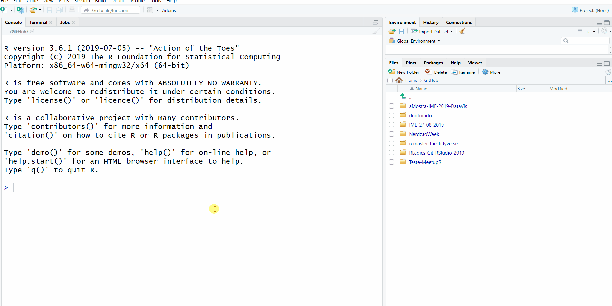
```


.minirodape[Caso você esteja vendo a versão em PDF, o video acima não irá funcionar. Veja clicando [neste link](https://beatrizmilz.github.io/slidesR/git_rstudio/img/gifs/browse-github-token2.gif).]

---

- Copie o token gerado:

```{r out.width="100%"}
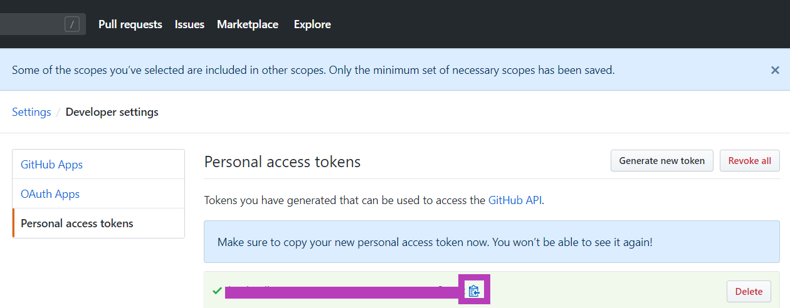
```

---

- Abra o arquivo `.Renviron`:
```{r echo=TRUE, eval=FALSE}
usethis::edit_r_environ()
# ● Modify 'C:/Users/beatr/Documents/.Renviron'
# ● Restart R for changes to take effect
```

- Crie uma nova linha na forma `GITHUB_PAT=SEU_TOKEN`, adicione o token, pule uma linha e salve o arquivo.

```{r out.width="60%"}
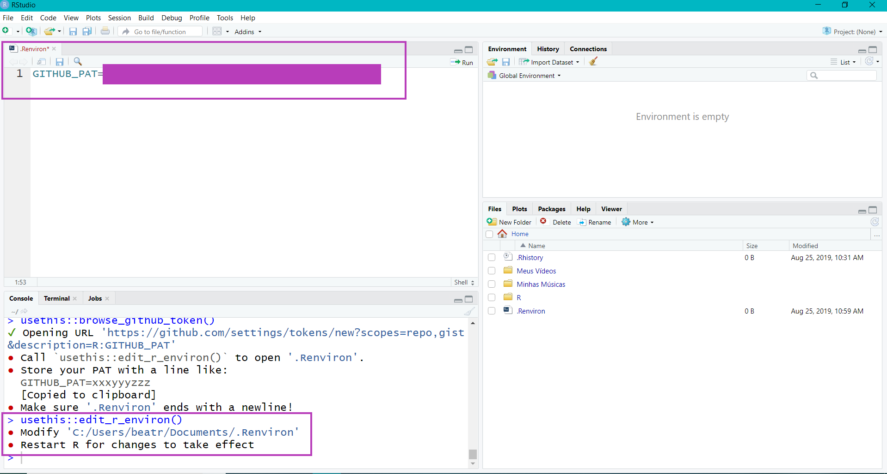
```

- **Reinicie o RStudio**:  CTRL + SHIFT + F10

---
class: middle, center, inverse

# Interface gráfica do RStudio

---
class: middle

## Interface Gráfica RStudio

- O RStudio oferece um cliente Git **simples**, na aba "Git" (em inglês, é chamado de Git Pane).

- Esse painel somente aparecerá em projetos que estejam versionados com Git.

```{r, out.width="95%"}
knitr::include_graphics("img/prints/git-pane.PNG")
```

---

## Equivalência dos principais comandos

### Linha de comando vs RStudio

- git status

- git add [arquivo]

- git commit -m "[mensagem descritiva]"

- git diff

- git pull

- git push

- ...


---
class: middle

## Git pane - Staged  `r emo::ji("white_check_mark")`

```{r}
knitr::include_graphics("img/prints/git-pane-stage.png")
```

---
class: middle

## Git pane - Commit

```{r, out.width="100%"}
knitr::include_graphics("img/prints/git-pane-commit.PNG")
```

---
class: middle

## Git pane - Commit

```{r, out.width="100%"}
knitr::include_graphics("img/prints/git_commit.PNG")
```


---
class: middle

## Botão Diff -> Review changes

```{r, out.width="90%"}
knitr::include_graphics("img/prints/git-pane-diff.PNG")
```

---
class: middle

## Botão `r emo::ji("clock3")` (history) -> Review changes

```{r, out.width="90%"}
knitr::include_graphics("img/prints/git-pane-history.PNG")
```


---
class: middle

## Branch

```{r}
knitr::include_graphics("img/prints/git-pane-branch.png")
```

---
class: middle

## Interface Gráfica RStudio

```{r, out.width="95%"}
knitr::include_graphics("img/prints/cheatsheet.PNG")
```

Fonte: [RStudio Cheatsheet](https://www.rstudio.com/wp-content/uploads/2019/01/Cheatsheets_2019.pdf)

---
class: middle, center, inverse

# Trabalhando com projetos no RStudio + GitHub

--

## `r emo::ji("woman_technologist")` No computador

---
## Método 1 - **Clonando um repositório do GitHub**

- [Crie um repositório no GitHub](https://github.com/new), ou abra a página de um repositório já existente. 

.pull-left[
- Criando um repositório no GitHub:

```{r out.width="80%"}
knitr::include_graphics("img/prints/novo-repo.PNG")
```

]

.pull-right[

Se o repositório não for "seu", faça um fork primeiro, e clone o seu fork. 

```{r out.width="100%"}
knitr::include_graphics("img/prints/fork.png")
```

]


---


- No RStudio, crie um novo projeto: File > New Project 
.pull-left[
- Na aba "Create Project", selecione a opção **Version Control**.

```{r out.width="100%"}
knitr::include_graphics("img/prints/proj-version-control-1.PNG")
```
]

.pull-right[

- Na aba "Create Project from Version Control", selecione a opção **Git**.
```{r out.width="100%"}
knitr::include_graphics("img/prints/proj-version-control-2.png")
```
]


---
- Na aba "Clone Git Repository":
  - **Repository URL**: Cole o link para o repositório
  - **Project directory name**: Após inserir o repository URL, esse campo será preenchido automaticamente.
  - **Create project as subdirectory of**: Selecione o diretório onde você deseja manter sua cópia local do repositório.
```{r out.width="50%"}
knitr::include_graphics("img/prints/proj-version-control-3.png")
```

- O **RStudio** irá fazer o clone do repositório, e abrirá um RProj para ele (caso não exista um ainda, será criado).

---

## Método 2

- **Criando um repositório novo, diretamente do RStudio**

- Vamos usar a função `create_project()` 
  - Cria um projeto `.Rproj`
  - Argumento importante: `path = ` 	É o "caminho" para o diretório (pasta). Se o diretório já existe, é utilizado. Se não existe, é criado. 
  - Cuidado com o nome do projeto, pois será o mesmo nome que será utilizado no repositório. Você não deve usar o nome de algum repositório já existente no seu GitHub.

---

### Criando um projeto
- No meu caso, tenho o hábito de deixar todos os repositórios do GitHub, na pasta `GitHub/`. No exemplo abaixo, dentro da pasta GitHub, criei o projeto chamado Teste-MeetupR. Esse será o nome da pasta criada e posteriormente do repositório no GitHub.

```{r echo=TRUE, eval=FALSE}
usethis::create_project("GitHub/Teste-MeetupR") 
# ✔ Creating 'GitHub/Teste-MeetupR/'
# ✔ Setting active project to 'C:/Users/beatr/Documents/GitHub/Teste-MeetupR'
# ✔ Creating 'R/'
# ✔ Writing 'Teste-MeetupR.Rproj'
# ✔ Adding '.Rproj.user' to '.gitignore'
# ✔ Opening 'GitHub/Teste-MeetupR/' in new RStudio session
# ✔ Setting active project to '<no active project>'
```
- O RStudio abrirá outra janela, com o novo projeto criado.

---
### Novo projeto criado! 

- Projeto `r emo::ji("heavy_check_mark")`

- Git `r emo::ji("x")`

- GitHub `r emo::ji("x")`

```{r out.width="70%"}
knitr::include_graphics("img/prints/novo_projeto.png")
```

---

```{r echo=TRUE, eval=FALSE}
usethis::use_git()
# ✔ Setting active project to 'C:/Users/beatr/Documents/GitHub/Teste-MeetupR'
# ✔ Initialising Git repo
# ✔ Adding '.Rhistory', '.RData' to '.gitignore'
# There are 2 uncommitted files:
# * '.gitignore'
# * 'Teste-MeetupR.Rproj'
# Is it ok to commit them?
# 
{{# 1: Absolutely  }}
# 2: Negative
# 3: No
# 
# Selection: 1
# ✔ Adding files
# ✔ Commit with message 'Initial commit'
# ● A restart of RStudio is required to activate the Git pane
# Restart now?
# 
# 1: No way
{{# 2: For sure}}
# 3: Negative
# 
# Selection: 2
```

- O RStudio irá reiniciar para que apareça o painel do Git

---
### Usando Git

- Projeto `r emo::ji("heavy_check_mark")`

- Git `r emo::ji("heavy_check_mark")`

- GitHub `r emo::ji("x")`

```{r out.width="70%"}
knitr::include_graphics("img/prints/novo_projeto_com_git.png")
```


---
```{r echo=TRUE, eval=FALSE}
usethis::use_github()
# ✔ Setting active project to 'C:/Users/beatr/Documents/GitHub/Teste-MeetupR'
# ✔ Checking that current branch is 'master'
# Which git protocol to use? (enter 0 to exit) 
# 
# 1: ssh   <-- presumes that you have set up ssh keys
{{# 2: https <-- choose this if you don't have ssh keys (or don't know if you do)}}
# 
# Selection: 2
# ● Tip: To suppress this menu in future, put
#   `options(usethis.protocol = "https")`
#   in your script or in a user- or project-level startup file, '.Rprofile'.
#   Call `usethis::edit_r_profile()` to open it for editing.
# ● Check title and description
#   Name:        Teste-MeetupR
#   Description: 
# Are title and description ok?
# 
# 1: No way
{{# 2: Definitely}}
# 3: Nope
# 
# Selection: 2
# ✔ Creating GitHub repository
# ✔ Setting remote 'origin' to 'https://github.com/beatrizmilz/Teste-MeetupR.git'
# ✔ Pushing 'master' branch to GitHub and setting remote tracking branch
# ✔ Opening URL 'https://github.com/beatrizmilz/Teste-MeetupR'
```

---
### Repositório criado!

- Projeto `r emo::ji("heavy_check_mark")`

- Git `r emo::ji("heavy_check_mark")`

- GitHub `r emo::ji("heavy_check_mark")`

```{r out.width="70%"}
knitr::include_graphics("img/prints/criou-repositorio-github.PNG")
```

---

### Função para criar um arquivo `README.md`
```{r, echo=TRUE, eval=FALSE}
usethis::use_readme_md()

```
- O arquivo será criado e aberto, para ser editado e salvo.

```{r, out.width="30%"}
knitr::include_graphics("https://media2.giphy.com/media/1iu8uG2cjYFZS6wTxv/giphy-downsized.gif")
```


---
class: middle  bg-main4

### Exemplo:

```{r out.width="100%"}
knitr::include_graphics("img/gifs/create-proj2.gif")
```

.minirodape[Caso você esteja vendo a versão em PDF, o video acima não irá funcionar. Veja clicando [neste link](https://beatrizmilz.github.io/slidesR/git_rstudio/img/gifs/create-proj2.gif).]

---

## Método 3

- **A partir de um repositório existente, fazer um fork e clonar diretamente do RStudio**

- Para isso, usaremos a função `usethis::create_from_github()`.

- **Não use** essa função no RStudio Cloud.

- Argumentos importantes:
  - `repo_spec = ` repositório que quer trabalhar. Deve estar no formato: "usuario_github/repositorio". Veja o exemplo abaixo.
  - `destdir =` diretório onde quer que os arquivos sejam salvos
  - `fork =` se igual a TRUE, irá fazer o fork do repositório. Só funcionará se o token do GitHub foi configurado corretamente.

---
### Exemplo do uso da função `create_from_github()`

- Exemplo: fork e clone do projeto [Lista de meetups R-Ladies no Brasil](https://github.com/R-Ladies-Sao-Paulo/RLadies-Brasil):


```{r echo=TRUE, eval=FALSE}
usethis::create_from_github("R-Ladies-Sao-Paulo/RLadies-Brasil",
                   destdir = "C:/Users/beatr/Documents/GitHub", 
                   fork = TRUE)
# ✔ Creating 'C:/Users/beatr/Documents/GitHub/datascience-box/'
# ✔ Forking 'R-Ladies-Sao-Paulo/RLadies-Brasil'
# ✔ Cloning repo from 'https://github.com/beatrizmilz/RLadies-Brasil.git' into 'C:/Users/beatr/Documents/GitHub/RLadies-Brasil'
# ✔ Setting active project to 'C:/Users/beatr/Documents/GitHub/RLadies-Brasil'
# ✔ Adding 'upstream' remote: 'https://github.com/R-Ladies-Sao-Paulo/RLadies-Brasil.git'
# ✔ Pulling changes from GitHub source repo 'upstream/master'
# ✔ Setting remote tracking branch for local 'master' branch to 'upstream/master'
# ✔ Opening 'C:/Users/beatr/Documents/GitHub/RLadies-Brasil/' in new RStudio session
# ✔ Setting active project to 'C:/Users/beatr/Documents/GitHub/RLadies-Git-RStudio-2019'
```


---
### Crie uma branch

- Antes de fazer qualquer modificação, crie uma branch, usando a função `usethis::pr_init()`. 
- Argumento importante: `branch =` indica o nome da branch que você quer criar. 

```{r echo=TRUE, eval=FALSE}
usethis::pr_init(branch = "teste")

# ✔ Checking that local branch 'master' has the changes in 'origin/master'
# ✔ Creating local PR branch 'teste'
# ✔ Switching to branch 'teste'
# ● Use `pr_push()` to create PR
```

---
### Faça alterações e commits

- Faça suas contribuições, e sempre faça commits com mensagens que deixem claro as mudanças.

- Quando terminar as contribuições necessárias, utilizar a função `pr_push()`:

```{r echo=TRUE, eval=FALSE}
pr_push()
# ✔ Pushing local 'teste' branch to 'origin:teste'
# ✔ Setting upstream tracking branch for 'teste' to 'origin/teste'
# ✔ Create PR at link given below
# ✔ Opening URL 'https://github.com/beatrizmilz/RLadies-Git-RStudio-2019/compare/teste'
```

- A página do GitHub será aberta, para que possa completar o Pull Request.

---
class: middle 

### Crie um Pull Request: 
```{r out.width="80%"}
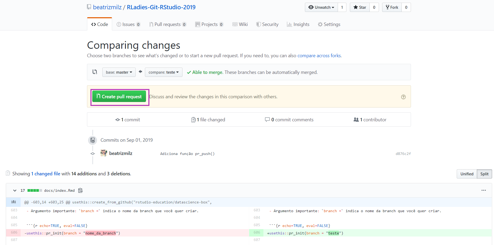
```

---
class: middle 

### Open a Pull Request: 
```{r out.width="80%"}
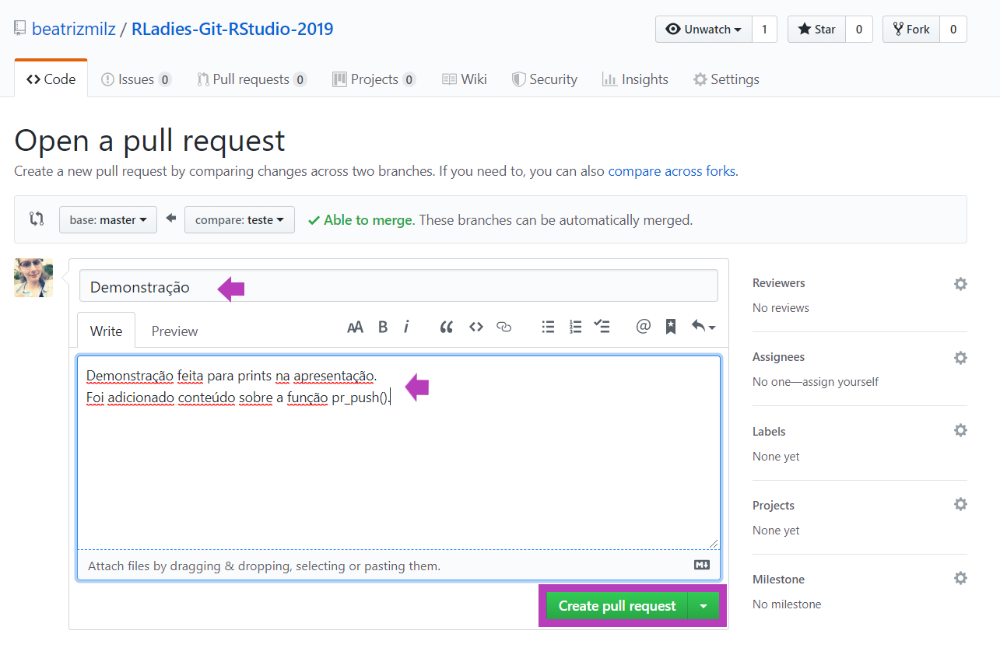
```

---


### Exemplo: PR foi aberto

```{r out.width="80%"}
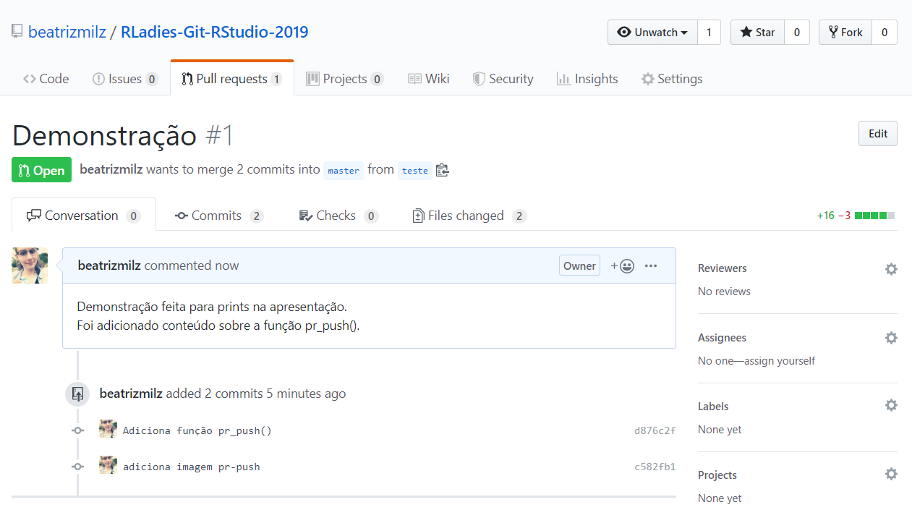
```

- Depois dessa etapa, você deve esperar a pessoa que mantém o repositório responder fazendo sujestões para melhorias, aceitando seu PR, etc.


---

### Modificar o PR

- Alguém fez uma sugestão, como alterar o PR enviado? Ex:

```{r echo=FALSE, out.width="70%"}
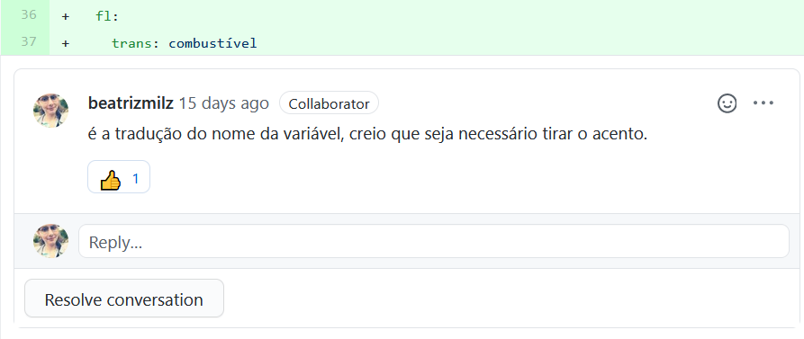
```
- No mesmo projeto e na __mesma branch__ que você usou para enviar o PR, faça as alterações.

- Selecione o arquivo modificado para deixá-lo disponível para criar um Commit. Faça o commit.

- Para enviar o novo commit, use o Git Push (aperte a seta verde para cima no painel do Git do RStudio).


---

### Depois que o PR é aceito:  Merged

```{r out.width="80%"}
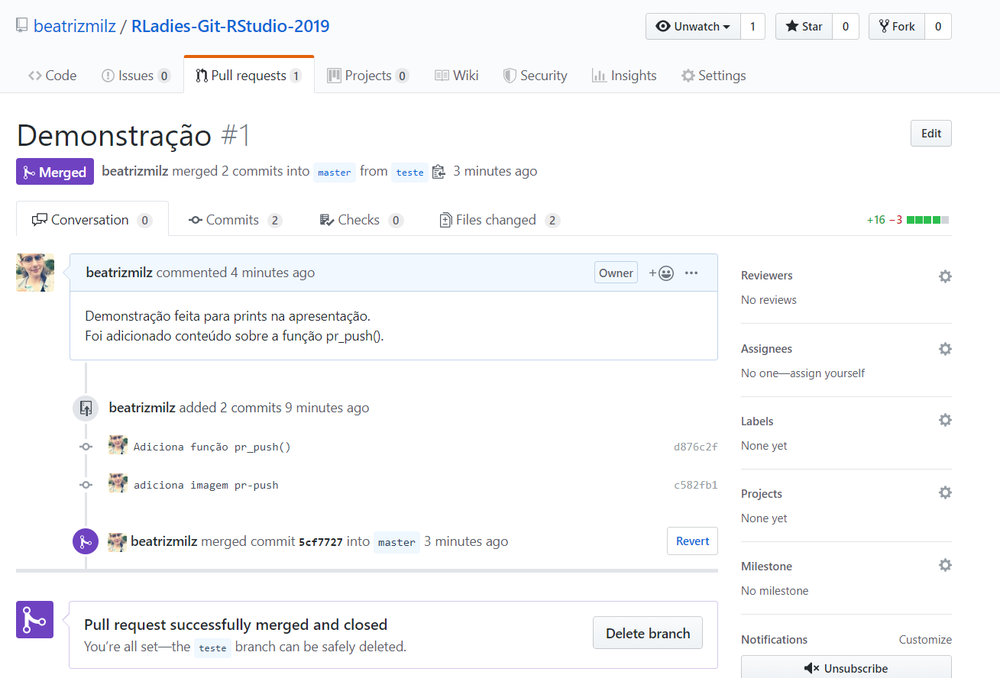
```

---
class: middle 

### Última etapa: __APÓS__ o PR ter sido aceito (merged)

- A função `pr_finish()`:
  - Retorna para master
  - Atualiza (usando o pull) o conteúdo 
  - Deleta a branch criada para enviar o PR

```{r echo=TRUE, eval=FALSE}
pr_finish()
# ✔ Switching back to 'master' branch
# ✔ Pulling changes from GitHub source repo 'origin/master'
# ✔ Deleting local 'teste' branch
```

- Pronto! 


---
class: middle, center, inverse

# Trabalhando com projetos no RStudio + GitHub

--

## <i class="fas fa-cloud"></i> Na RStudio Cloud

```{r echo=FALSE}
knitr::include_graphics("https://media.giphy.com/media/L2UdIWuCRbUL6/giphy.gif")
```

---

##  Trabalhando na RStudio Cloud <i class="fas fa-cloud"></i>

- Não é a única forma, é a forma que eu achei mais simples.

<!-- - Fiz alguns testes com o pacote `usethis` no RStudio Cloud, porém não gostei muito da experiência. -->

### **Etapa 1:** 

- Escolha um repositório **seu** para clonar. Pode ser um novo repositório, ou um já existente.

---

- Lembrando, caso queira criar um repositório no GitHub:

```{r out.width="70%"}
knitr::include_graphics("img/prints/novo-repo.PNG")
```


---

### Etapa 2: 

- No RStudio Cloud,  Clique na seta ao lado de 'New Project' e escolha a opção "New Project from Git Repo"

```{r out.width="80%"}
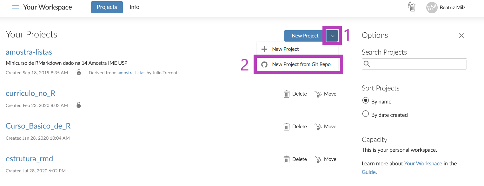
```

---
### Etapa 2: continuação

- Indique a URL do repositório (o link) e clique "OK". O RStudio Cloud criará um projeto onde esse repositório será clonado.

```{r out.width="80%"}
knitr::include_graphics("img/prints/rstudio-cloud-new-project-from-repo-url.png")
```


---

### Etapa 3: 

- Se apresente ao Git! O melhor, neste caso, é via terminal.

```{r out.width="80%"}
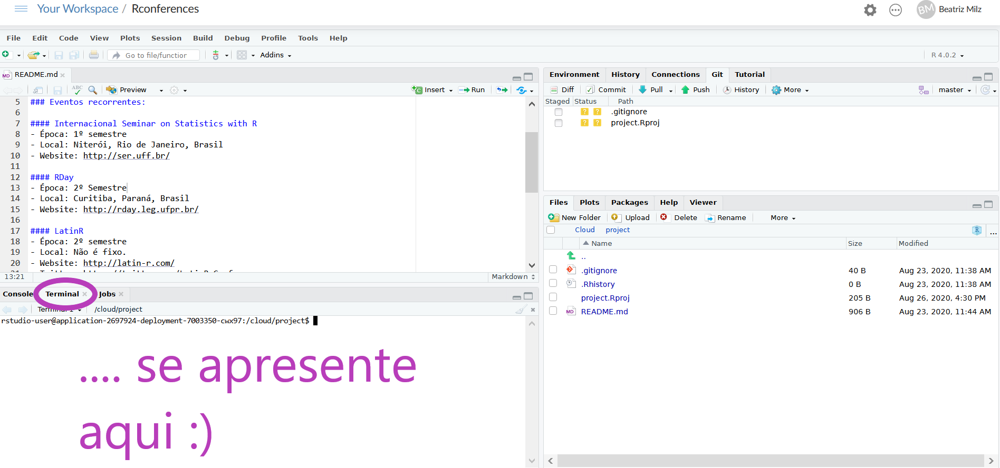
```

---

### Etapa 3: continuação

- Se apresente ao Git!

- No terminal (Substitua pelo seu nome e email vinculado à conta do GitHub):

```{git echo=TRUE, eval=FALSE}
git config --global user.name "Beatriz Milz"

git config --global user.email beatriz.milz@hotmail.com
```


---

### Etapa 4

- Faça as mudanças no código!

- Quando quiser, faça o commit das mudanças.

- Para enviar as mudanças locais para o repositório remoto, faça o Push. Na primeira vez que for fazer isso, vai abrir uma janela e pedir seu usuário e senha do GitHub (para autenticação).

- Após o push, confira no GitHub se as alterações que você fez estão lá :)

---
class: center, middle 

## Linha de comando ou interface gráfica?
## Use o que for melhor para **você**!

```{r out.width="50%"}
knitr::include_graphics("https://media0.giphy.com/media/dNgK7Ws7y176U/giphy.gif")
```

Confira a [cheatsheet do Git](https://github.github.com/training-kit/downloads/pt_BR/github-git-cheat-sheet.pdf)!


---
class:  middle

 **Preparades para a Hacktoberfest 2020?**


https://hacktoberfest.digitalocean.com/

```{r out.width="600px"}
knitr::include_graphics("https://hacktoberfest.digitalocean.com/og-hf-teaser.png")
```


---
class: middle 

# Referências

- Parte deste material foi baseado/inspirado neste post do blog da [Curso-R](https://www.curso-r.com/), escrito por [Caio Lente](https://lente.dev/):
  - [Git e GitHub (Zen do R - Parte 4)](https://www.curso-r.com/blog/2019-07-23-zen-do-r-4/)
  
- Outra referência importante: [Happy Git and GitHub for the useR - 
Jenny Bryan](https://happygitwithr.com/)


- Documentação do pacote [usethis](https://usethis.r-lib.org/reference/create_package.html)

---
class: middle, center

# Referências

##  [Palestra](https://youtu.be/ZCeBnQBQ1h8) (em inglês) da [Jenny Bryan](https://jennybryan.org/):

<iframe width="560" height="315" src="https://www.youtube.com/embed/ZCeBnQBQ1h8" frameborder="0" allow="accelerometer; autoplay; encrypted-media; gyroscope; picture-in-picture" allowfullscreen></iframe>


---
class: middle

### R-Ladies no Brasil

- Quer saber mais sobre próximos eventos das R-Ladies por aqui? Favorite este [repositório no GitHub](https://github.com/R-Ladies-Sao-Paulo/RLadies-Brasil) `r emo::ji("purple_heart")`:


<center>
<!-- Place this tag where you want the button to render. -->
<a class="github-button" href="https://github.com/R-Ladies-Sao-Paulo/RLadies-Brasil" data-color-scheme="no-preference: light; light: light; dark: dark;" data-size="large" data-show-count="true" aria-label="Star R-Ladies-Sao-Paulo/RLadies-Brasil on GitHub">Capítulos e eventos online da R-Ladies no Brasil</a>
</center>


---
class: middle

### O que achou da apresentação?

- Por favor, responda o [formulário abaixo](https://docs.google.com/forms/d/e/1FAIpQLSdGDGM80RJloUQXvX5N6kl2bFJSn60cpPcM_JR4AnNe9-tvgQ/viewform), pois me ajuda  **muito** a melhorar os materiais e as apresentações `r emo::ji("purple_heart")`:


<center>
<iframe src="https://docs.google.com/forms/d/e/1FAIpQLSdGDGM80RJloUQXvX5N6kl2bFJSn60cpPcM_JR4AnNe9-tvgQ/viewform" height="100%" width="100%" style="min-height: 400px;"></iframe>
</center>


---
class: center, middle

# Obrigada!

Slides criados com o pacote [**xaringan**](https://github.com/yihui/xaringan). 

Tema criado com o pacote [**xaringanthemer**](https://pkg.garrickadenbuie.com/xaringanthemer/) e funções extras com [**xaringanExtra**](https://pkg.garrickadenbuie.com/xaringanExtra/) e [**countdown**](https://github.com/gadenbuie/countdown).

Várias ilustrações usadas na apresentação foram feitas por  <a href='https://twitter.com/allison_horst/'> Allison Horst</a>. Clique [aqui](https://github.com/allisonhorst/stats-illustrations) para ver várias outras artes feitas por ela!

O maravilhoso logo da R-Ladies usado nesta apresentação é uma obra de [Bea @Chucheria](https://twitter.com/chucheria)! Obrigada!

- Caso encontre algum erro nesta apresentação, **[escreva uma issue neste repositório](https://github.com/beatrizmilz/slidesR/issues/new/choose)** para que o material seja aprimorado.