class: center, middle, hide-logo

```{r setup, include=FALSE}
options(htmltools.dir.version = FALSE)

knitr::opts_chunk$set(fig.align = "center",
                      message = FALSE,
                      warning = FALSE)
```

```{r xaringan-themer, include=FALSE, warning=FALSE}
library(xaringanthemer)
style_duo_accent(
  primary_color = "#88398a",
  secondary_color = "#58519b",
  inverse_header_color = "#FFFFFF"
)
```

```{r xaringanExtra, echo=FALSE}
#devtools::install_github("gadenbuie/xaringanExtra")
xaringanExtra::use_xaringan_extra(c("tile_view", "animate_css", "tachyons"))

xaringanExtra::use_editable(expires = 1)

xaringanExtra::use_logo(
  image_url = "img/rainbow-inclusive.png",
  link_url = "https://github.com/R-Ladies-Sao-Paulo/RLadies-Brasil"
)

xaringanExtra::use_clipboard()

xaringanExtra::use_fit_screen()

xaringanExtra::use_extra_styles(
  hover_code_line = TRUE,         #<<
  mute_unhighlighted_code = TRUE  #<<
)


```


```{r include=FALSE}
# remotes::install_github("cienciadedatos/dados")
# remotes::install_github("carpentries/glosario-r")
library(dados)
library(tidyverse)
library(glosario)
```

<!-- inicio font awesome -->
<script src="https://kit.fontawesome.com/1f72d6921a.js" crossorigin="anonymous"></script>
<!-- final font awesome -->


.pull-left[

# Introdução a Linguagem R

**[Beatriz Milz](https://beatrizmilz.com)**

__.can-edit[Meetup R-Ladies Curitiba]__


__.can-edit[2º semestre/2020]__


]

.pull-right[

```{r echo=FALSE, out.width="400px"}
knitr::include_graphics("img/Horst/community1.jpg")
```

<right>Ilustração por <a href='https://twitter.com/allison_horst/'> Allison Horst</a></right>

]

.minirodape[Atualizado em `r format(Sys.Date(), format='%d de %B de %Y')`. <br> Para ativar o modo tela cheia, pressione `ALT + F`, e depois `F`]

---

# Beatriz Milz

## Contexto Acadêmico

- Doutoranda no Programa de Pós-Graduação em Ciência Ambiental (PROCAM) 
  - Instituto de Energia e Ambiente - Universidade de São Paulo

- Equipe da Secretaria Executiva  Editorial - [Revista Ambiente & Sociedade](http://scielo.br/asoc)

- Anteriormente: 
  - Mestre em Ciências - UNIFESP; 
  - Bacharel em Gestão Ambiental - EACH/USP
  
---

## Comunidades de R
<center>
```{r echo=FALSE, fig.align='default', out.width="18%"}
knitr::include_graphics(c("img/Hex/1dados-hex.png",
                          "img/Hex/1hexlogorladies.jpeg",
                          "img/Hex/2satrdaysp.png",
                          "img/Hex/4LatinR_hex_violeta-cut.jpg",
                          "img/Hex/carpentries.png"))
```
</center>

- Co-autora do pacote [`{dados}`](https://cienciadedatos.github.io/dados/)

- Co-organizadora:  [R-Ladies São Paulo](https://www.meetup.com/pt-BR/R-Ladies-Sao-Paulo) `r emo::ji("purple_heart")`


- Comitê organizador: 
  - [satRday São Paulo](https://saopaulo2019.satrdays.org/)
  - [LatinR](https://latin-r.com/pt)
  - [useR! 2021](https://user2021.r-project.org/)
  
- Instrutora [The Carpentries](https://carpentries.org/)

---
class: middle

<center>
<iframe src="https://app.sli.do/event/izgrkbp8" height="100%" width="100%" style="min-height: 600px;"></iframe>
</center>

---

## Sobre este material

- Público-alvo: pessoas com interesse em começar a utilizar o R para análise de dados. 

- Parte deste conteúdo é derivado [deste material](https://beatrizmilz.github.io/2020-R-Ladies-SP-Basico/#1) da R-Ladies São Paulo.

```{r echo=FALSE, out.width="700px", fig.align="center"}
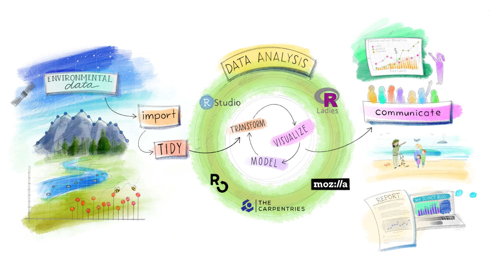

# Talvez seja interessante procurar em português
```
Ilustração por <a href='https://twitter.com/allison_horst/'> Allison Horst</a>


---
class: middle

- Conteúdo: principais conceitos necessários antes de começar a aprender o `r glosario::gdef('tidyverse', 'tidyverse')`

- Dados tabulares:

```{r echo=FALSE}
dados::diamante %>% head() %>%  knitr::kable()
```

Base de dados `diamante` disponível no pacote [`dados`](https://cienciadedatos.github.io/dados/).

---

## Pré-requisitos

### Nesta atividade:

- [RStudio Cloud](https://rstudio.cloud/project/1540517)


### Para usar no dia-a-dia:

- `R` e `RStudio` instalados no seu computador:

```{r, echo=FALSE, out.width="40%"}
knitr::include_graphics("img/rstudio-r.jpg")
```

- Links para instalação:
  - [R](https://cran.r-project.org/bin/windows/base/)
  - [RStudio](https://rstudio.com/products/rstudio/download/)


---
class: middle, center, inverse

# R e RStudio
.center[(Acompanhe no `[Rstudio Cloud](https://rstudio.cloud/project/1540517)`  `r emo::ji("woman_technologist")`)]

---
## O que é o R?

> "R é um ambiente de software livre para computação estatística e gráficos". (https://www.r-project.org/)

--

- **Por que usar o R**?

  - É uma linguagem de programação que possui muitas ferramentas para análise de dados

  - É _código aberto_ (open source)

  - Possui uma comunidade ativa de pessoas desenvolvedoras

  - É flexível, permite desenvolver funções e pacotes para facilitar o trabalho 

  - Está disponível, gratuitamente, em diferentes plataformas: Windows, Linux e Mac
    
  - Mantido pela [R Development Core Team](https://cran.r-project.org/)

---

## RStudio

**RStudio** é uma IDE (_integrated development environment_) da Linguagem R, ou seja, um ambiente de desenvolvimento que utilizamos para editar e executar os códigos em R.

```{r echo=FALSE, out.width="700px"}
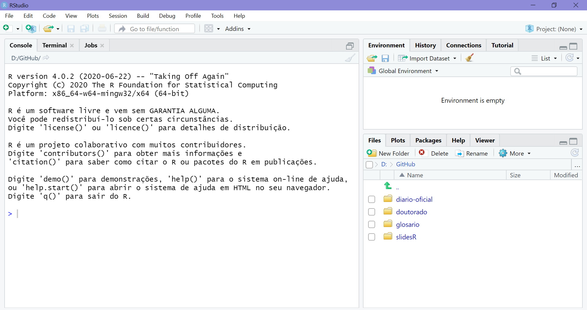
```


---
## RStudio

```{r echo=FALSE, out.width="700px"}
knitr::include_graphics("img/haydee1.jpg")
```

Fonte: [Haydee Svab](https://www.slideshare.net/mobile/haydeesvab/anlise-crtica-de-dados-primeiros-passos-com-r)

---

## RStudio

```{r echo=FALSE, out.width="700px"}
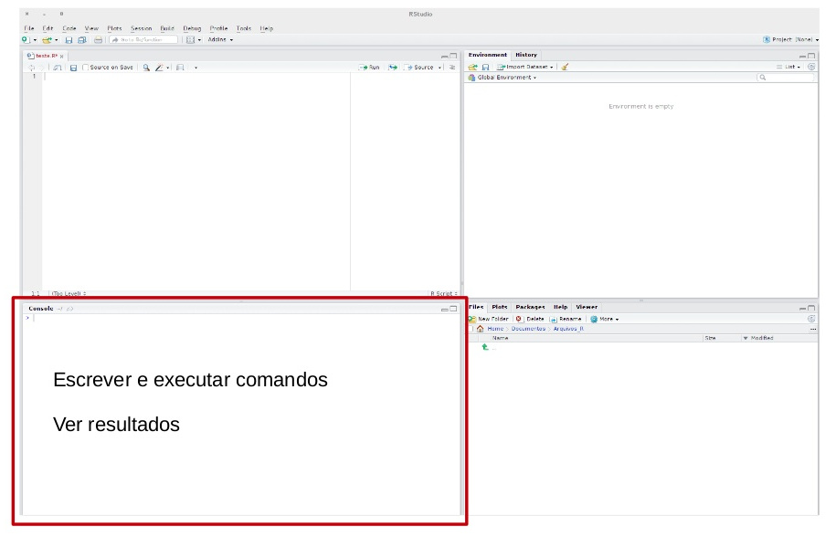
```

Fonte: [Haydee Svab](https://www.slideshare.net/mobile/haydeesvab/anlise-crtica-de-dados-primeiros-passos-com-r)

---

## RStudio

```{r echo=FALSE, out.width="700px"}
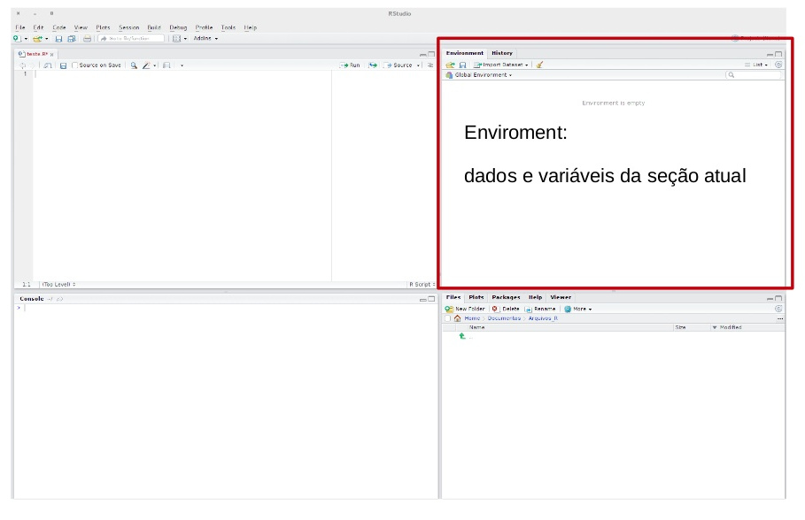
```

Fonte: [Haydee Svab](https://www.slideshare.net/mobile/haydeesvab/anlise-crtica-de-dados-primeiros-passos-com-r)

---


## RStudio

```{r echo=FALSE, out.width="700px"}
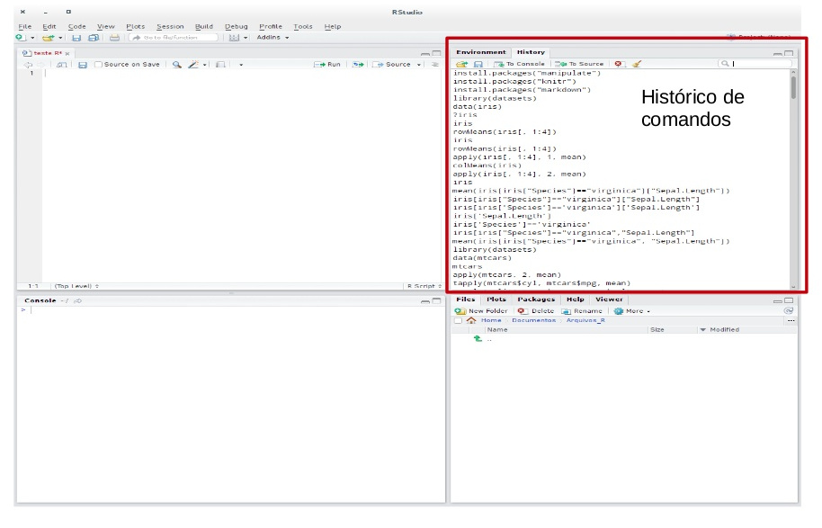
```

Fonte: [Haydee Svab](https://www.slideshare.net/mobile/haydeesvab/anlise-crtica-de-dados-primeiros-passos-com-r)

---

## RStudio

```{r echo=FALSE, out.width="700px"}
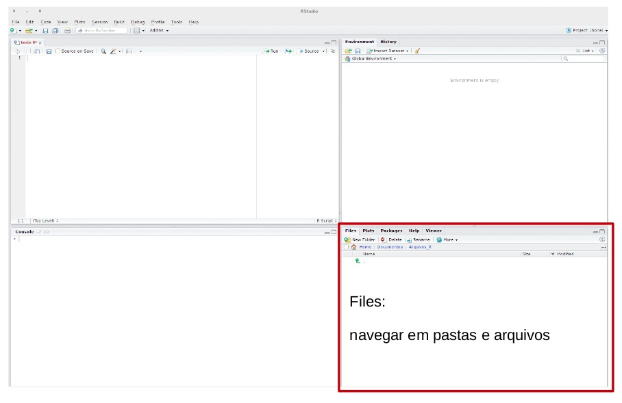
```

Fonte: [Haydee Svab](https://www.slideshare.net/mobile/haydeesvab/anlise-crtica-de-dados-primeiros-passos-com-r)

---


## RStudio

```{r echo=FALSE, out.width="700px"}
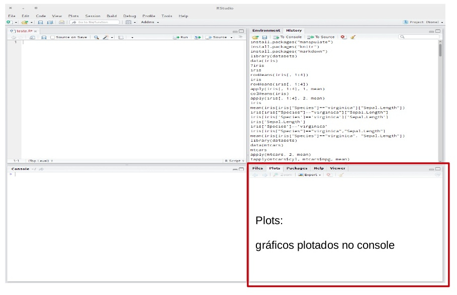
```

Fonte: [Haydee Svab](https://www.slideshare.net/mobile/haydeesvab/anlise-crtica-de-dados-primeiros-passos-com-r)

---
## RStudio

```{r echo=FALSE, out.width="700px"}
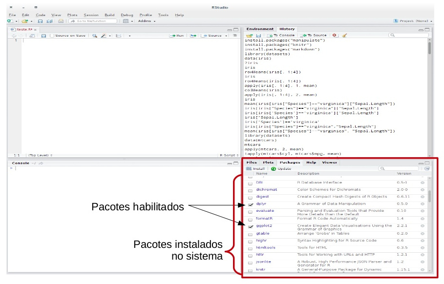
```

Fonte: [Haydee Svab](https://www.slideshare.net/mobile/haydeesvab/anlise-crtica-de-dados-primeiros-passos-com-r)

---
## RStudio
  

```{r echo=FALSE, out.width="700px"}
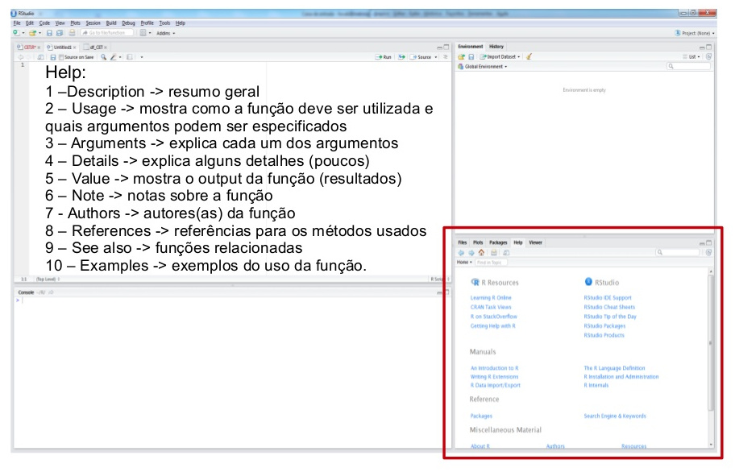
```

Fonte: [Haydee Svab](https://www.slideshare.net/mobile/haydeesvab/anlise-crtica-de-dados-primeiros-passos-com-r)

---

## Help!

- Pedir ajuda: **help**(nome_da_funcao) ou **?**nome_da_funcao.

```{r, eval=FALSE}
help(sum)
?sum
```


- Se a dúvida permanecer, procure no [Stack OverFlow](https://stackoverflow.com/) ou Google.

- E se ainda tiver dúvidas, pergunte para a comunidade (há grupos no Telegram e outras redes sociais).


---
class: middle, center, inverse

# Começando! 

.center[(Acompanhe no arquivo `1-introducao.R` `r emo::ji("woman_technologist")`)]

---
## Começando

- Abrir o `RStudio` no seu computador 

- Crie um novo `R` script (file -> new file -> `R` script)

```{r echo=FALSE, out.width="700px"}
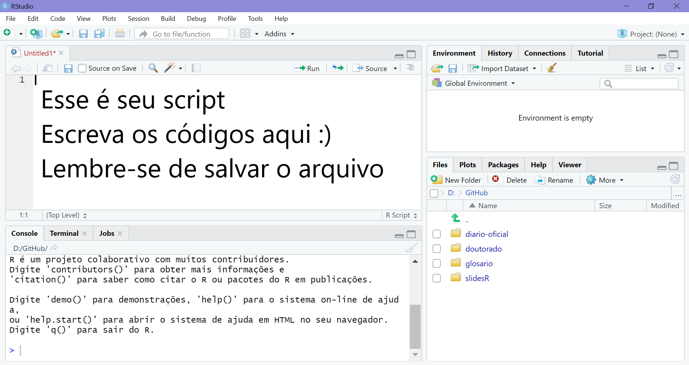
```

---

## `R` como calculadora

- O `R` permite realizar muitas operações matemáticas!

```{r}
2 + 5    # adição

9 - 4    # subtração

5 * 2    # multiplicação

7 / 5    # divisão
```


- `CTRL + ENTER`: executa a linha selecionada no script.


---


- **`R` como calculadora**

```{r}
9 %% 4   # resto da divisão de 9 por 4

7 %/% 4  # parte inteira da divisão de 7 por 4

8 ^ 2    # potenciação

sqrt(1024) # radiciação
```

A ordem matemática das operações também vale no R.

---


## Funções matemáticas

```{r}
sin(1)  # funções trigonométricas

log(1)  # logaritmo natural (base e)

log10(10) # logaritmo na base 10

exp(0.5) # e^(1/2)

```

Fonte: [SW Carpentry](http://swcarpentry.github.io/r-novice-gapminder/01-rstudio-intro/index.html)

---

## O que é um objeto?

- Ao se desenvolver um projeto, você irá trabalhar com diversos tipos de arquivos, além de informações que serão repetidas ao longo do script.

- Para reutilizar essas informações ao longo do script utilizamos o que chamamos de **objeto**

- Um objeto retém e representa um valor, função ou base de dados

---

## Atribuindo valor a um objeto no R

- Para atribuir um valor a um objeto no R, utilizamos o operador `<-` 

.center[`nome_do_objeto <- valor`]

- Atalho: `ALT` + `-`: cria o `<-` sinal de atribuição.

Exemplo:

```{r echo=TRUE}
minha_idade <- 27
minha_idade
```


---

## Exemplo: 

```{r}
nome <- "Daenerys Targaryen"
nome
horas_trabalhadas <- 160
horas_trabalhadas
salario <- 3984.23
salario
ativo <- TRUE
ativo
```


---
## Nomes de objetos

- Os nomes devem começar com uma letra. Podem conter letras, números, _ e .

- Não usar acentuação e espaços nos nomes de objetos.

- Recomendação do autor do livro `R` For Data Science: **usar_snake_case**, ou seja, palavras escritas em minúsculo separadas pelo underscore (`_`).

- O `R` é *case sensitive*, isto é, faz a diferenciação entre as letras minúsculas e maiúsculas. Portanto, um objeto chamado `teste` é diferente de uma outro objeto chamada `Teste`.

---

## Funções

xxxxxxxxxxxxxxxxxxxxxxxxxxxxxxxxxxxxxxxxxxxxx

---
class: middle, center, inverse

# Operadores Relacionais e Lógicos

.center[(Acompanhe no arquivo `2-operadores.R` `r emo::ji("woman_technologist")`)]

---
## Operadores Relacionais

- Igual a: **==** 

- Diferente de: **!=** 

- Maior que: **>** 

- Maior ou igual: **>=** 

- Menor que: **<** 

- Menor ou igual: **<=** 

---
##  Operadores Relacionais

Igual a: **==**
```{r}
TRUE == TRUE

TRUE == FALSE
```

---
## Operadores Relacionais

Diferente de **!=**
```{r}
TRUE != TRUE

TRUE != FALSE
```

---

##  Operadores Relacionais

Menor que: **<**
```{r}
3 < 5
```

Maior ou igual a: **>=**
```{r}
10 >= 10
```

Maior que: **>=**
```{r}
10 > 10
```

---

## Operadores Lógicos

- E: **&**

Será verdadeiro se os dois forem verdadeiros (`TRUE`)

```{r}
x <- 5

 x >= 3 & x <=7
```
```{r}
y <- 2

 y >= 3 & y <= 7
```


---

## Operadores Lógicos

- OU: **|**

Será verdadeiro se um dos dois forem verdadeiros (`TRUE`)

```{r}
y <- 2

 y >= 3 | y <=7
```

```{r}
y <- 1

 y >= 3 | y == 0
```

---

## Operadores Lógicos

- Negação: **!** 


```{r}
x <- 5
(!x < 4)
```


---
class: middle, center, inverse

# Tipos básicos de dados

.center[(Acompanhe no arquivo `3-tipos_dados.R` `r emo::ji("woman_technologist")`)]

---

## Tipos básicos de dados

São os tipos básicos de dados que podem ser representados na linguagem R. É neles que guardamos as informações que necessitamos para um algoritmo.

- **Integer**: números inteiros 

- **Double/Numeric**: números racionais 

- **Logical**: tipos lógicos, `TRUE` ou `FALSE` 

- **Character**: texto (sempre entre aspas)

- **Factor**: dados categóricos


- A função `class()` retorna o tipo do dado.

---
## Números

- Um número inteiro seguido de `L` será considerado do tipo `integer`:

```{r}
class(3L)
```
- Números racionais serão considerados como `double/numeric`: 

```{r}
class(3)
```
```{r}
class(3.1)
```

---
## Lógicos

- Verdadeiro (`TRUE`) ou Falso (`FALSE`)

```{r}
class(TRUE)
```

- O R entende `TRUE` sendo igual a um, e `FALSE` sendo igual a zero. 

- Isso significa que podemos fazer operações matemáticas com eles (como por exemplo somar):

```{r}
TRUE + TRUE + TRUE + FALSE
```

---

##  Textos

- **Qualquer** código entre aspas será interpretado como texto (`character`):

```{r}
class("TEXTO")
```
```{r}
escola <- c("Fundamental", "Médio", "Superior")

class(escola)
```

```{r}
class("3")
```


---
##  Fatores

```{r}
# Criando factor

escola_categorias <- factor(c("Fundamental", "Médio", "Superior"))

escola_categorias

class(escola_categorias)
```


A função `as.factor()` cria um objeto do tipo factor, ou converte um objeto existente.

Na linha `levels` aparecem os rótulos do fator.

---
## Exercícios

1) Primeiro, tente adivinhar o tipo de dado dos objetos abaixo: 

```{r}
cor_favorita <- "rosa"
idade <- 27L
altura <- "1.75"
peso <- 61.1
gosta_brocolis <- TRUE
gosta_carne <- "FALSE"
```


2) Use a função `class()` e descubra qual é o tipo dos objetos acima.

---

Resposta do exercício:

```{r}
class(cor_favorita)
class(idade)
class(altura)
class(peso)
class(gosta_brocolis)
class(gosta_carne)

```

---

## NA

Uma característica importante do R que pode dificultar a comparação são os valores ausentes ou **NAs** (não disponíveis). 

**NA** representa um valor desconhecido. 

---

## NA

-  Operações envolvendo um valor desconhecido também será desconhecido:

```{r}
NA > 10
10 == NA
NA + 10
NA / 2
```

---

## NA


```{r}
NA == NA
```


---

## NA

`is.na()` é a função que testa se um objeto é NA.

```{r}
vetor_logico <- c(NA, TRUE, FALSE, FALSE, TRUE, NA)
is.na(vetor_logico)
!is.na(vetor_logico)
```


---

## Conversão de classes

Podemos alterar o tipo de dado de um objeto com as funções iniciadas com `as.`:  


- `as.numeric()`

- `as.integer()`

- `as.logical()`

- `as.character()` 

- `as.factor()` 


---

## Conversão de classes

**Exemplos de conversão de classes**

```{r}
vetor_logical <- c(TRUE, FALSE, TRUE, FALSE)

as.integer(vetor_logical)
as.numeric(vetor_logical)
as.character(vetor_logical)
as.factor(vetor_logical)
```

---

## Conversão de classes

**Exemplos de conversão de classes**

```{r}
frutas <- c("banana", "maça", "melancia")

as.integer(frutas)
as.numeric(frutas)
as.character(frutas)
as.factor(frutas)
```

---
class: middle, center, inverse

# Tipos de objetos

.center[(Acompanhe no arquivo `4-tipos_objetos.R` `r emo::ji("woman_technologist")`)]

---

## Tipos de objetos

- No R, os 4 principais tipos de dados são: `vetor`, `matriz`, `lista`, `data.frame`

- Vamos focar em dois:  `vetor` e `data.frame`

---
## Vetores

- Armazena elementos de mesma classe, apenas uma dimensão.

- São criados usando a função `c()`

- Exemplo:

```{r}
primeiro_semestre <- c("Janeiro", "Fevereiro", "Março",
                       "Abril", "Maio", "Junho")

```

---
## Vetores

- Selecionando elementos por índice: utilizar `[]`

```{r}
primeiro_semestre[1] # primeiro elemento do vetor

primeiro_semestre[1:2] # primeiro elemento até o segundo

primeiro_semestre[-1] # remove o elemento 1

primeiro_semestre[6:4] # seleciona o elemento seis até o
# quatro (e muda a ordem dos elementos)

```


---
## Dataframes

xxxxxxxxxxxxxxxxxxxxxxxxxxxxxxxxxxxxxxxxxxxxx


---
class: middle, center, inverse

# Pacotes no R


.center[(Acompanhe no arquivo `5-pacotes.R` `r emo::ji("woman_technologist")`)]

---
## Pacotes no R

**Pacotes** são coleções de funções, dados e documentação que estendem as capacidades do `R` básico.

Eles precisam ser instalados e carregados.


```{r echo=FALSE, out.width="400px"}
knitr::include_graphics("img/icon-packages.jpg")
```

---
    


## Instalação de Pacotes:

- Via CRAN: 


`install.packages("nome-do-pacote")`

```{r, include=TRUE, eval = FALSE }
install.packages("tidyverse")
```

- Via GitHub:


`devtools::install_github("nome-da-org/nome-do-repo)`

```{r, include=TRUE, eval = FALSE }
devtools::install_github("tidyverse/dplyr")
```

---

## Carregar pacotes:

-  Função: `library(nome-do-pacote)`

```{r, eval=TRUE, message=FALSE}
library(tidyverse)
```


## Dicas sobre Pacotes

1. Você só precisa instalar o pacote uma vez, mas precisa carregá-lo sempre que começar uma nova sessão;

2. Para instalar o pacote use as aspas;  

3. Para carregar o pacote, não é necessário utilizar aspas.

---
background-image: url("img/Horst/tidyverse_celestial.png")
background-position: center
background-size: cover


.destaque[Ilustração por <a href='https://twitter.com/allison_horst/'> Allison Horst</a>]

---
class: middle

Ao final, se quiser fazer download dos arquivos que usamos, é só realizar o procedimento abaixo: 

  1) Na aba `Files`, selecionar todos os arquivos do projeto, clicando na caixinha ao lado de <i class="fas fa-cloud"></i> `Cloud`

  2) Clique em  <i class="fas fa-cog"></i> `More`

  3) Selecione a opção `Export...` 

  4) Um arquivo `.zip` será baixado com os arquivos `r emo::ji("smiley")`

```{r echo=FALSE}
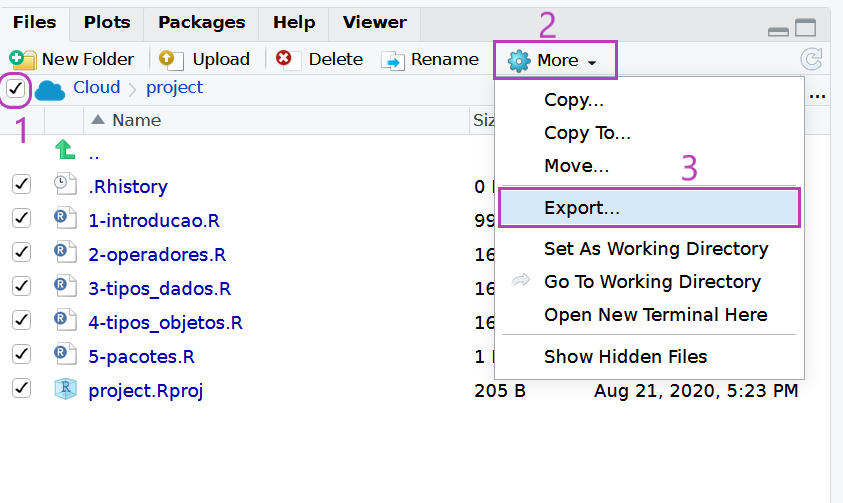
```


---
class: center, middle

# Obrigada!

Slides criados com o pacote [**xaringan**](https://github.com/yihui/xaringan). 

Tema criado com o pacote [**xaringanthemer**](https://pkg.garrickadenbuie.com/xaringanthemer/) e funções extras com [**xaringanExtra**](https://pkg.garrickadenbuie.com/xaringanExtra/).


