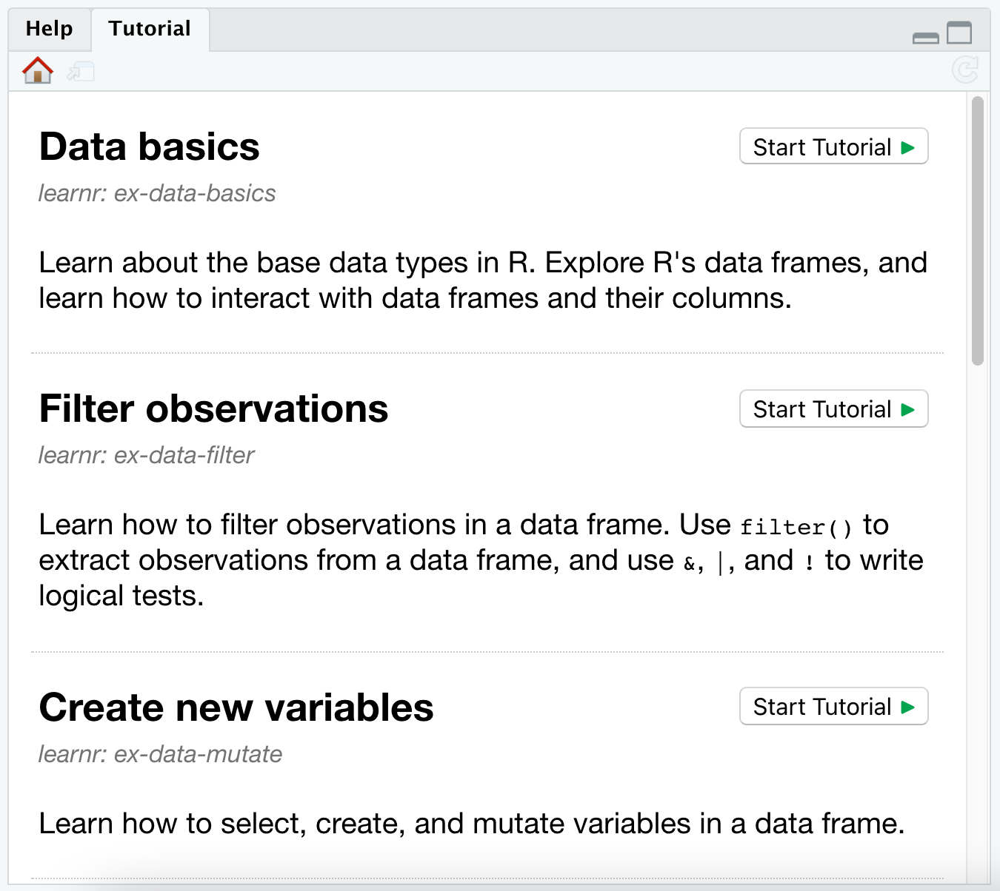

class: middle

```{r setup, include=FALSE}
options(htmltools.dir.version = FALSE)
knitr::opts_chunk$set(
  fig.width=9, fig.height=3.5, fig.retina=3,
  out.width = "100%",
  cache = FALSE,
  echo = TRUE,
  message = FALSE, 
  warning = FALSE,
  hiline = TRUE,
  fig.align = "center"
)
```

```{r eval=FALSE, include=FALSE}
# devtools::install_github("hadley/emo")
# devtools::install_github("gadenbuie/xaringanExtra")
# devtools::install_github("gadenbuie/ermoji")
```


```{r xaringanExtra-clipboard, echo=FALSE}
xaringanExtra::use_clipboard()
```


```{r xaringan-themer, include=FALSE, warning=FALSE}
library(xaringanthemer)
style_duo_accent(
  primary_color = "#138583",
  title_slide_background_color = "#51B8B6",
  title_slide_text_color = "#FFFFFF",
  inverse_text_color = "#138583",
  inverse_header_color = "#138583",
  secondary_color = "#EDBBC8",
  
  header_font_google = google_font("Josefin Slab", "600"),
  text_font_google   = google_font("Work Sans", "300", "300i"),
  code_font_google   = google_font("Fira Code"),
  base_font_size = "25px"
)
```


.pull-left[

## Beatriz Milz

- 2019 - * - Doutoranda em Ciência Ambiental - PROCAM/IEE/USP

- 2016-2018 - Mestrado em Ciências - Programa de Pós-Graduação em Análise Ambiental Integrada - UNIFESP

- 2012-2015 - Bacharelado em Gestão Ambiental - EACH/USP 
]

.pull-right[
<center>
</center>

]


---

### R: Comunidades, eventos, pacotes, livros..
<center>

<a href='https://education.rstudio.com/trainers/'>  </a>


<a href='https://rladies.org/'>  </a>

<a href='https://curso-r.com/'>  </a>

<a href='https://livro.curso-r.com/'>  </a>


<a href='https://saopaulo2019.satrdays.org/'>  </a>
<a href='https://latin-r.com/'>  </a>
<a href='https://carpentries.org/'>   </a>
<a href='https://user2021.r-project.org/'>   </a>

<a href='https://cienciadedatos.github.io/dados/'>  </a>
<a href='https://beatrizmilz.github.io/mananciais/'>  </a>
</center>


---

## Temas de hoje


- O que é o pacote learnr

- Exemplos de tutoriais feitos com learnr

- Como usar, criar e compartilhar os tutoriais feitos com learnr?

- learnr-verse

- learnr em português?

- Links para saber mais, e referências


---
class: middle

## Pacote learnr  📦

- É muito interessante para quem quer aprender 👩‍🎓 ou quem quer ensinar! 👩‍🏫

- [Documentação](https://rstudio.github.io/learnr/) do pacote e repositório no [GitHub](https://github.com/rstudio/learnr)

- Mantido pela [RStudio](https://www.rstudio.com/), que é muito além de uma IDE!

- Começou a ser desenvolvido em outubro de 2016, pelo [
J.J. Allaire](https://github.com/jjallaire) - fundador e CEO da RStudio

- Pessoas mais ativas na manutenção e desenvolvimento do pacote: [Barret Schloerke](https://github.com/schloerke) e [Garrick Aden-Buie](https://github.com/gadenbuie) 


---
class: middle


## Pacote learnr 📦

- Escrevemos um arquivo `.Rmd` e geramos um aplicativo Shiny.

- Podemos adicionar os conteúdos que já são possíveis de serem adicionados em um `.Rmd`, como: textos, imagens, vídeos, equações, códigos, tabelas, etc. 

- Além disso, também podemos colocar: 
  - Exercícios (exercises)
  - Perguntas de múltipla escola (questions)

---
class: middle

## Exemplos de learnr 🌟

- [Exploring missing values in naniar](https://allisonhorst.shinyapps.io/missingexplorer/)

- Alguns dos [RStudio Primers](https://rstudio.cloud/learn/primers)


---


```{r embed-xaringan, echo=FALSE}
xaringanExtra::embed_xaringan(url = "https://beatriz-milz.shinyapps.io/formative_assessment/")
```


---

## Como usar um tutorial learnr? 👩‍🎓

.pull-left[
- Tutoriais disponíveis na internet: interagir através do link

- Tutoriais disponíveis em pacotes:

```r
# Instalar via CRAN
install.packages("learnr")
# Instalar via GitHub
install.packages("remotes")
remotes::install_github("rstudio/learnr")
```
]

.pull-right[

```{r echo=FALSE}

```

]

---

## Como criar um tutorial learnr? 👩‍🏫


Inicie com o template disponibilizado pelo pacote! No RStudio: **File -> New File -> RMarkdown -> From template**, e escolha o template  **Interactive Tutorial**:

```{r echo=FALSE, out.width="40%"}
knitr::include_graphics("img/rmarkdown-template.png")
```


---

## Como criar um tutorial learnr? 👩‍🏫


```{r echo=FALSE, out.width="80%"}
knitr::include_graphics("img/learnr-template.png")
```


---
## Como compartilhar um tutorial learnr? 👩‍🏫


|Forma|Exemplo|Vantagens| Desvantagens|
|---------|---------|---------|-------------|
|Fazendo o deploy do Shiny App|[shinyapps.io](https://www.shinyapps.io/)| 👩‍🎓1. Muito mais fácil para quem está aprendendo:  A pessoa aluna não precisa ter o R e o RStudio instalado para conseguir usar o tutorial <br> 👩‍🏫 2. Estudantes felizes, professoras felizes | 👩‍🎓 1. Precisa de acesso à internet <br> 👩‍🏫 2. A ferramenta gratuita tem limitação, dependendo da quantidade de pessoas alunas, será necessário pagar para que o serviço seja oferecido sem travamentos. |
|Adicionando em um pacote em R 📦|[CursoRTarefas](https://github.com/curso-r/CursoRTarefas) | 👩‍🎓1. Não precisa de acesso à internet <br> 👩‍🏫 2. Totalmente gratuito | 👩‍🎓1. Precisa ter o R e o RStudio instalados <br> 👩‍🏫 2. Precisa saber sobre Git, GitHub, Pacotes em R... <br> 3. **Possíveis problemas de encoding!** |

---

## Compartilhando o tutorial em um pacote 📦

- Tenha o pacote usethis e o pacote learnr instalados:

```{r eval=FALSE, include=TRUE}
install.packages("learnr")
install.packages("usethis")
```


- Crie um pacote para armazenar os tutoriais:

```{r eval=FALSE, include=TRUE}
usethis::create_package("nomeDoPacote")
```

-  Para cada novo tutorial, crie um arquivo usando a seguinte função:

```{r eval=FALSE, include=TRUE}
usethis::use_tutorial(name = "nome-do-arquivo", title = "Nome do tutorial")
```

---

## Documente as dependências do pacote 📦

- Pacotes instalados via CRAN:

```{r eval=FALSE, include=TRUE}
usethis::use_package("dplyr")
```


- Pacotes instalados via GitHub: (ele precisa estar instalado no seu computador)

```{r eval=FALSE, include=TRUE}
usethis::use_dev_package("learnrhash")
```

---

## Disponibilize seu pacote  📦 no GitHub 

- Faça os passos abaixo uma vez por pacote, considerando que o Git e o GitHub estão configurados corretamente .footnote[Caso queira saber mais sobre essa configuração, acesse [o capítulo do livro Zen do R que trata sobre Git e GitHub](https://curso-r.github.io/zen-do-r/git-github.html), e também [essa apresentação da R-Ladies São Paulo](https://r-ladies-sao-paulo.github.io/2020-hacktoberfest/slides/git_rstudio/setup_Git_GitHub_RStudio.html#1)]:

- Inicie o versionamento com o Git:

```{r eval=FALSE, include=TRUE}
usethis::use_git()
```

- Crie um repositório no GitHub e sincronize para manter o seu pacote lá:

```{r eval=FALSE, include=TRUE}
usethis::use_github()
```


---

## Compartilhe o pacote com outras pessoas

- Depois de já estar disponível, indique para as pessoas como instalar seu pacote. Por exemplo:

```r
# Instalar via GitHub
install.packages("remotes")
remotes::install_github("nome-de-usuario/nome-do-repositorio")
```

---
background-image: url(img/quasaroutflow.png) 
background-size: cover
background-position: right
class:  middle, inverse


## learnrverse

.footnote[Fonte da imagem: [NASA](https://www.nasa.gov/feature/goddard/2021/nasa-s-webb-will-use-quasars-to-unlock-the-secrets-of-the-early-universe)]
---
## learnrverse

- Nenhum dos pacotes está no CRAN por enquanto!


- Pacote [gradethis](https://github.com/rstudio/gradethis), mantido pela RStudio - [Documentação](https://pkgs.rstudio.com/gradethis/)

- Pacote [learnrhash](https://github.com/rundel/learnrhash), por Colin Rundel [](https://lifecycle.r-lib.org/articles/stages.html#experimental)

--

### Fluxo com learnrverse:

- Criar um tutorial com `learnr`
- `gradethis` ajuda com a avaliação dos exercícios
- `learnrhash` ajuda comprimindo as respostas em um texto hash
- Google formulários para coletar as respostas
- `googlesheets4` para importar as respostas para o R 
- Relatório final em RMarkdown: ajuda a identificar quais temas precisam ser revisados.


---
## learnr em português?

- Botões e mensagens básicas do learnr ✅-  [Contribuição](https://github.com/rstudio/learnr/pull/488)


- Mensagens de encoragamento e elogios 🍪 ✅  - [Sugestão](https://github.com/rstudio/learnr/issues/534) e  [contribuição](https://github.com/rstudio/learnr/pull/551)


### Próximos passos:

- Gradethis e learnrhash - ainda estão 100% em inglês

### Solução temporária:

Gradethis em Português: https://github.com/curso-r/gradethis (por [Fernando Corrêa](https://github.com/azeloc))


---


## Links interessantes e referências

### Em Inglês:

- [Documentação](https://rstudio.github.io/learnr/) do pacote e repositório no [GitHub](https://github.com/rstudio/learnr)

- [building interactive tutorials in R](https://mine-cetinkaya-rundel.github.io/teach-r-online/02-tutorial/02-tutorial.html#1) - dr. Mine Çetinkaya-Rundel &  dr. Colin Rundel

- [Feedback at scale](https://youtu.be/cgiKP7pZWKo) - Mine Çetinkaya-Rundel

- [Teach R with learnr: a powerful tool for remote teaching](https://education.rstudio.com/blog/2020/05/learnr-for-remote/)

- [Learning learnr](https://education.rstudio.com/blog/2020/07/learning-learnr/)

- Livro [RMarkdown: The definitive guide](https://bookdown.org/yihui/rmarkdown/learnr.html)

- [Livro Teach Tech Together](https://teachtogether.tech/) - Greg Wilson

---


## Links interessantes e referências

### Em Inglês:

- [Polyglot](https://learnr-examples.shinyapps.io/polyglot/) - learnr usando código Python - [Código disponível aqui](https://github.com/rstudio/learnr/blob/master/inst/tutorials/polyglot/polyglot.Rmd).

- [RStudio Community - learnr com python](https://community.rstudio.com/t/learnr-with-python-and-chained-code-chunks/83372/2)


---


## Links interessantes e referências


### Em Espanhol:

- [Aprendiendo {learnr}](https://learning-learnr.netlify.app/) - Yanina Bellini Saibene

- RSTUDIO::GLOBAL 2021:  [On programming, teaching, and building interactive tutorials with learnr](https://resources.rstudio.com/resources/rstudioglobal-2021/on-programming-teaching-and-building-interactive-tutorials-with-learnr/) - Yanina Bellini Saibene


---

## Links relacionados com as dúvidas:

- [O que é a Hacktoberfest?](https://r-ladies-sao-paulo.github.io/2020-hacktoberfest/slides/hacktoberfest/)

- [Certificação da RStudio](https://beatrizmilz.com/blog/2021-03-02-certificacao-rstudio/)

## Eventos comentados

- [3º R Day](http://rday.leg.ufpr.br/)

- [Semana Acadêmica de Estatística - PET Estatística UFPR](https://pet.leg.ufpr.br/semana/)

---
class: center

## Muito obrigada!

.pull-left[

```{r echo=FALSE, fig.align='center', out.width="50%"}
knitr::include_graphics("https://media.giphy.com/media/M9NbzZjAcxq9jS9LZJ/giphy.gif")
```


Slides criados usando os pacotes em R  📦 :

[**xaringan**](https://github.com/yihui/xaringan)<br>
[gadenbuie/xaringanthemer](https://github.com/gadenbuie/xaringanthemer)

O chakra vem da biblioteca javascript [remark.js](https://remarkjs.com), e os pacotes  [**knitr**](http://yihui.name/knitr), e [R Markdown](https://rmarkdown.rstudio.com).
]

.pull-right[

<center>
</center>

<i class="fas fa-home"></i> [beatrizmilz.com](https://beatrizmilz.com)

<i class="fab fa-twitter"></i> [@BeaMilz](https://twitter.com/BeaMilz)

<i class="far fa-envelope"></i> [milz.bea@gmail.com](mailto:milz.bea@gmail.com)
]


<!-- inicio academic icons -->
<link rel="stylesheet" href="https://cdn.jsdelivr.net/gh/jpswalsh/academicons@1/css/academicons.min.css">
<!-- final academic icons -->

 
<!-- inicio font awesome -->
<script src="https://kit.fontawesome.com/1f72d6921a.js" crossorigin="anonymous"></script>

<!-- final font awesome -->
