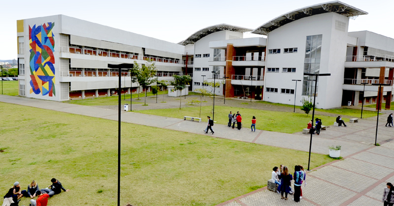
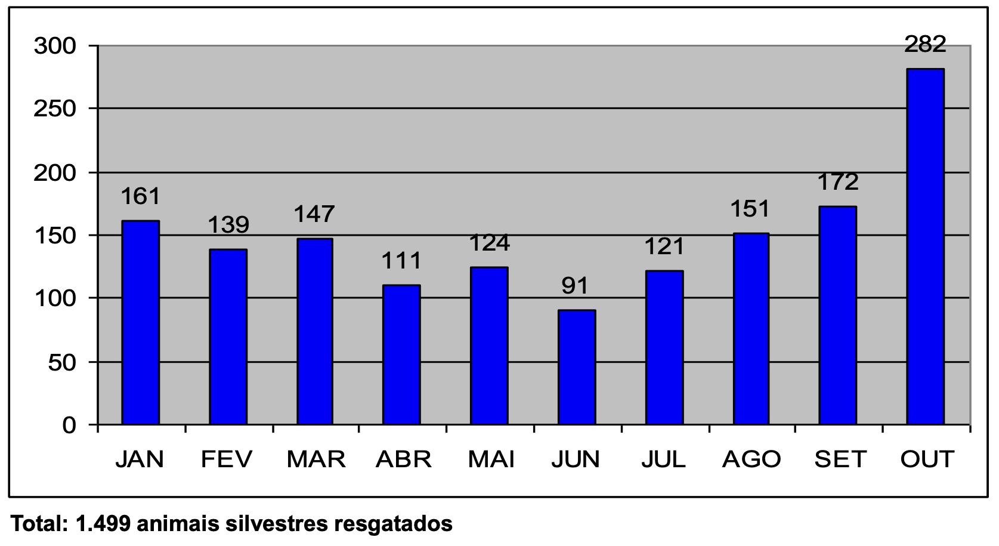
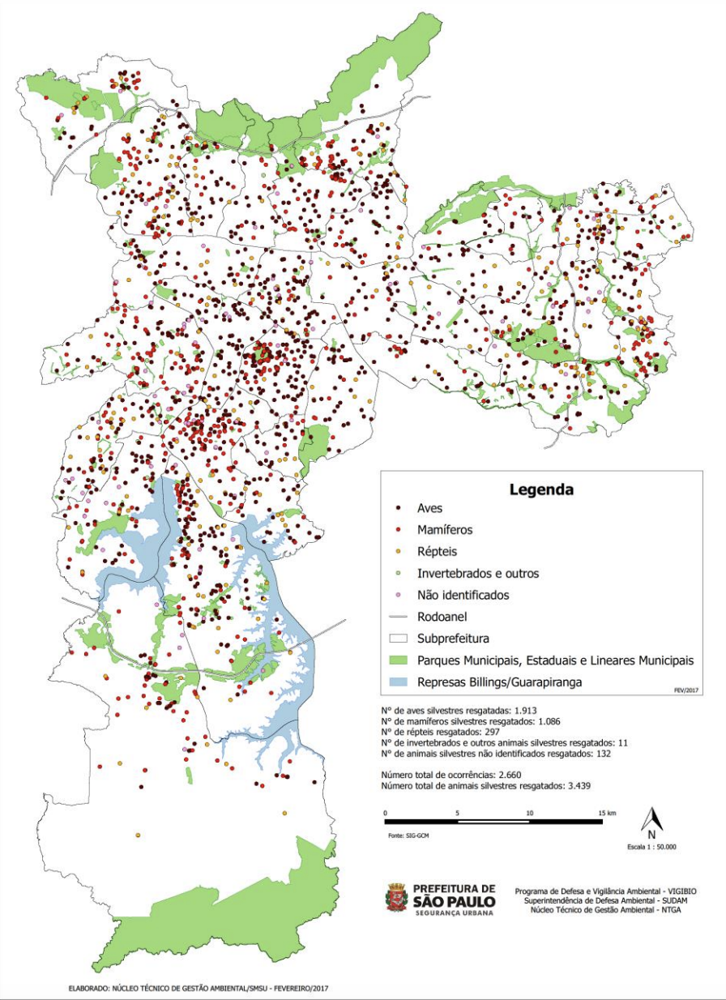
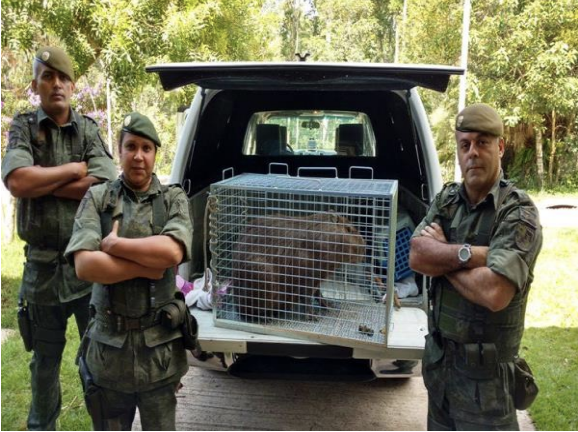
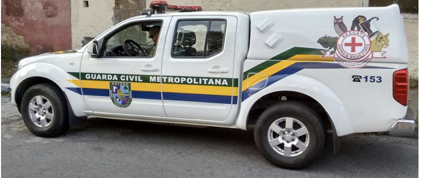
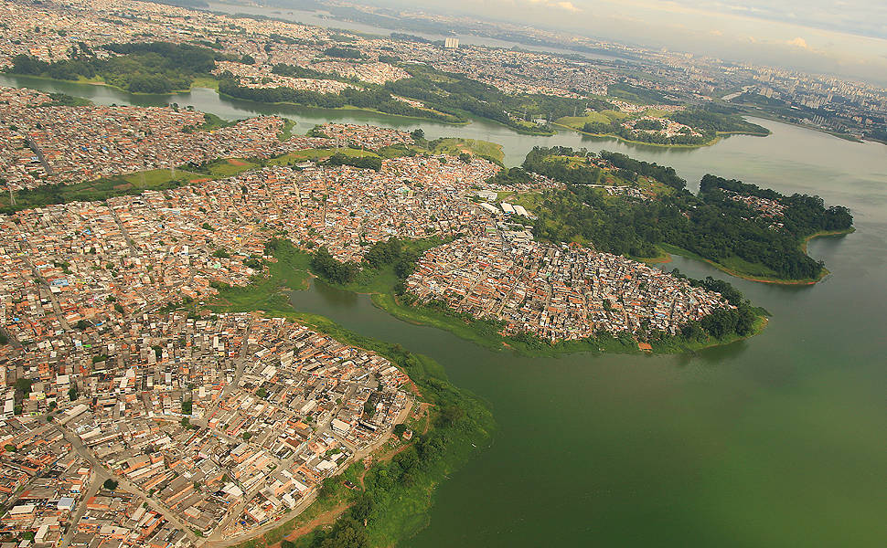
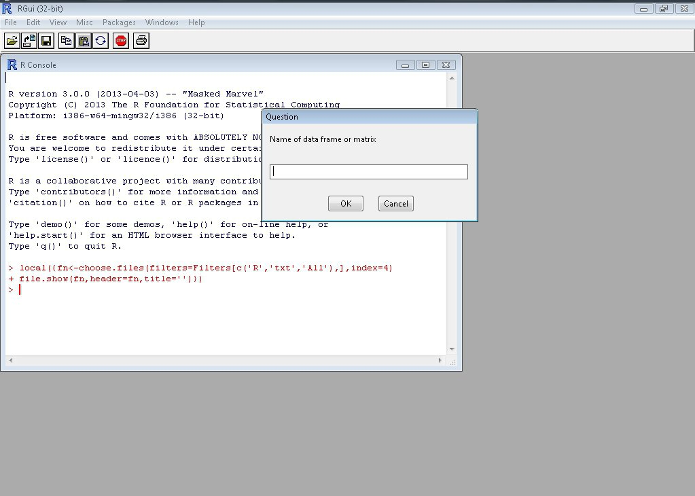
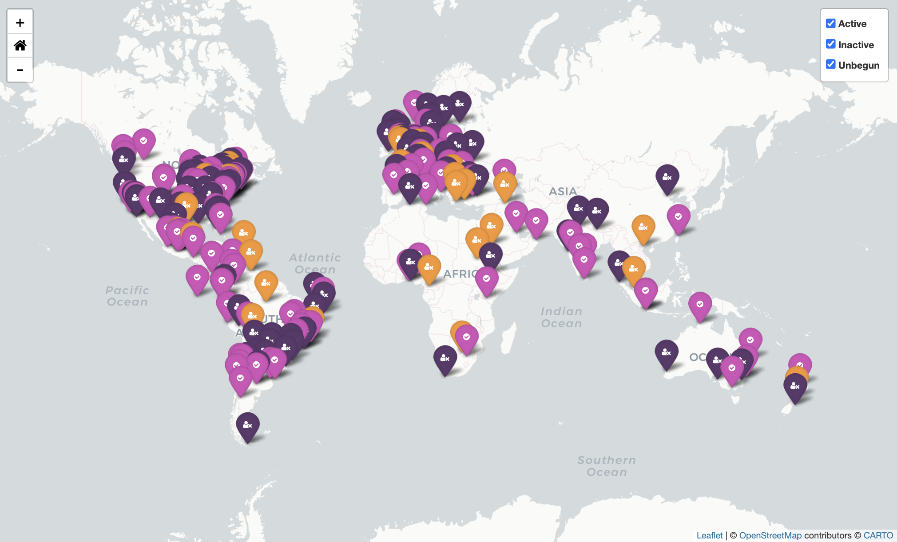
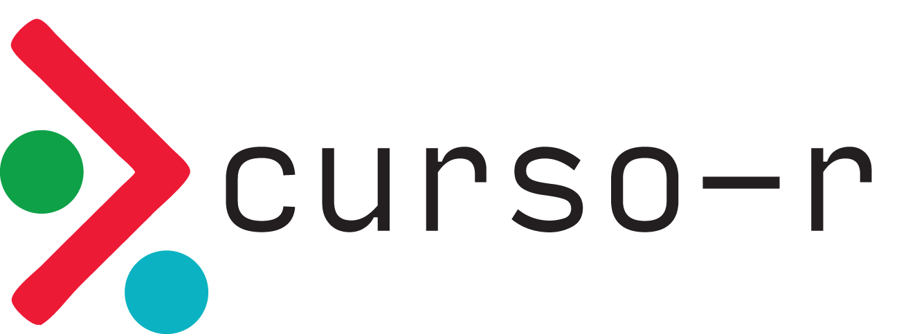

class: middle

```{r setup, include=FALSE}
options(htmltools.dir.version = FALSE)
knitr::opts_chunk$set(
  fig.width = 9,
  fig.height = 3.5,
  fig.retina = 3,
  out.width = "100%",
  cache = FALSE,
  echo = FALSE,
  message = FALSE,
  warning = FALSE,
  hiline = TRUE,
  fig.align = "center"
)
```

```{r eval=FALSE, include=FALSE}
# devtools::install_github("hadley/emo")
# devtools::install_github("gadenbuie/xaringanExtra")
# devtools::install_github("gadenbuie/ermoji")
```

```{css}
/* custom.css */
.left-code {
  color: #777;
  width: 38%;
  height: 92%;
  float: left;
}
.right-plot {
  width: 60%;
  float: right;
  padding-left: 1%;
}
```


```{r xaringanExtra-clipboard, echo=FALSE}
xaringanExtra::use_clipboard()
```


```{r xaringan-themer, include=FALSE, warning=FALSE}
library(xaringanthemer)
style_duo_accent(
  primary_color = "#138583",
  title_slide_background_color = "#51B8B6",
  title_slide_text_color = "#FFFFFF",
  inverse_text_color = "#138583",
  inverse_header_color = "#138583",
  inverse_background_color = "#dcf3f2",
  secondary_color = "#EDBBC8",
  
  header_font_google = google_font("Josefin Slab", "600"),
  text_font_google   = google_font("Work Sans", "300", "300i"),
  code_font_google   = google_font("Fira Code"),
  base_font_size = "25px"
)
```


.pull-left[

## Público-alvo

Discentes da Disciplina de Análise e visualização de dados com R, ofertada pelo programa de pós-gradução em Meteorologia Aplicada do Departamento de Engenharia Agrícola (DEA) da Universidade Federal de Viçosa (UFV).
]
.pull-right[

```{r}
knitr::include_graphics("img/ufv.jpeg")
```

]

---
class: inverse, middle, center

# Graduação <BR> 2012-2015


---

## EACH/USP 

- 2012 até 2015 - Graduação em Gestão Ambiental, na Escola de Artes, Ciências e Humanidades da Universidade de São Paulo


```{r, out.width="70%"}

```

---
class: inverse, middle, center

# Estágio no NTGA/SMSU/PMSP <BR> 2014 - 2015


Núcleo técnico de Gestão Ambiental (NTGA)

Secretaria Municipal de Segurança Urbana (SMSU)

Prefeitura Municipal de São Paulo (PMSP)


---
## Como começou...

- Achava muito interessante as disciplinas de geoprocessamento da graduação


- No NTGA, utilizavam software fechado para as tarefas de geoprocessamento, e só tinha 1 licença disponível


- Comecei a estudar por conta própria o software livre QGIS 


- Participei do projeto sobre Serviço de Resgate de Animais Silvestres Vitimados

- Com o passar do tempo, compartilhei conhecimentos sobre QGIS internamente :)

---
## Ferramentas

.pull-left[

- Relatórios mensais com: 

```{r}

```


]
.pull-right[


- Mapas mensais com: 

```{r, out.width="60%"}
knitr::include_graphics("img/QGis_Logo.png")
```

]

---

##  Produtos


.pull-left[

```{r}

```
]
.pull-right[


```{r, out.width="50%"}

```

]

Fonte: [Acesse aqui](http://www.anggulo.com.br/p+l/2017/palestras/Coronel%20Jose%20roberto.pdf)

---


## Resultados

[Portaria Intersecretarial SMSU e SVMA - 26/06/2014](http://legislacao.prefeitura.sp.gov.br/leis/portaria-intersecretarial-secretaria-municipal-de-seguranca-urbana-1-de-27-de-junho-de-2014/consolidado) - Estrutura e organiza o Serviço de Resgate de Animais Silvestres vitimados na Cidade de São Paulo.

.pull-left[
```{r, out.width="90%"}

```


]
.pull-right[
<br>
```{r}

```
]

Fonte: [Acesse aqui](http://www.anggulo.com.br/p+l/2017/palestras/Coronel%20Jose%20roberto.pdf)

---

##  Conclusões - Estágio no NTGA 

- Atividade que foi importante para mim!

- No final dos dois anos, havia aprendido muito e compartilhado também! Todas as tarefas de geoprocessamento eram feitas com software livre QGIS.

Porém...

- Relatórios mensais:

  - Sem reprodutibilidade
  
  - Demorado
  
  - Muito trabalho repetitivo!

---
class: inverse, middle, center

# Mestrado UNIFESP <BR> 2016 - 2018


[Programa de Pós-Graduação em Análise Ambiental Integrada](https://ppgaai-unifesp.webs.com/)

Universidade Federal de São Paulo (UNIFESP) - Campus Diadema 


---


## Tema de pesquisa

 Avaliação da qualidade da água e mapeamento por sensoriamento remoto (LANDSAT-8/OLI) do compartimento ambiental Corpo Central I Da Represa Billings (São Paulo, SP)

```{r, out.width="60%"}

```

Fonte da imagem: [Folha/UOL](https://fotografia.folha.uol.com.br/galerias/32350-represa-billings)

---


## Ferramentas

- Ainda sem reprodutibilidade!

.pull-left[

- Ainda com: 

```{r}

```


]
.pull-right[


- Ainda com: 

```{r, out.width="60%"}
knitr::include_graphics("img/QGis_Logo.png")
```

]

---

## Precisava aprender R...


.pull-left[
- Não conhecia outras pessoas que programavam em R...


- Não conhecia a comunidade...

- Não conhecia o RStudio


- Tentei usar o R algumas vezes e acabei desistindo.. :(


- Pesquisadores da UFG me ajudaram nas análises que eu precisava.
]

.pull-right[
```{r, out.width="100%"}

```
]


---

##  Conclusões - Mestrado


- Alguns problemais iguais ao estágio:

  - Sem reprodutibilidade
  
  - Demorado
  
  - Muito trabalho repetitivo!
  
- Desanimador não conseguir executar as próprias análises!  

---
class: inverse, middle, center

# Período pós mestrado <BR>2 sem  2018


---

## Motivações


.pull-left[
- Período do processo seletivo do doutorado na USP

- Queria muito aprender R...

- Conheci as [R-Ladies São Paulo](https://r-ladies-sao-paulo.github.io/RLadiesTheme/#1) em agosto de 2018 (no primeiro encontro da comunidade em São Paulo)
]

.pull-right[


```{r, out.width="100%"}
knitr::include_graphics("https://beatrizmilz.github.io/slidesR/rladies/img/1meetupsp.jpeg")
```
]


---
## R-Ladies 

.pull-left[
- R-Ladies é uma organização mundial cuja missão é promover a diversidade de gênero na comunidade da linguagem R.

- A R-Ladies dedica-se a proporcionar uma experiência livre de assédio para todas as pessoas partcicipantes, desta forma, não é tolerada nenhuma forma de assédio. Para assegurar isso, temos um [código de conduta](https://github.com/rladies/.github/blob/master/CODE_OF_CONDUCT.md#portuguese).
]

.pull-right[
```{r, out.width="80%", fig.cap="Ilustração por <a href='https://twitter.com/allison_horst'>Allison Horst</a>"}
knitr::include_graphics("img/community1.jpg")
```

]

---
## R-Ladies 

- Existem capítulos em diversas cidades no mundo! [Veja esse dashboard](https://benubah.github.io/r-community-explorer/rladies.html), e também [a lista de capítulos no Brasil](https://r-ladies-sao-paulo.github.io/RLadiesTheme/#5).

```{r, out.width="60%"}

```


---
## Aprendendo mais R...

.pull-left[
- Através da R-Ladies, recebi uma bolsa de diversidade de gênero para participar de um curso sobre [introdução ao R](https://curso-r.com/cursos/r4ds-1/), da Curso-R.

- Foi muito bom! Aprendi muita coisa em muito tempo.

- Maior dica: pratique com algum exemplo que seja interessante para você.

```{r, out.width="60%"}

```
]

.pull-right[
- [Curso-R](https://curso-r.com/) - materiais em português e gratuitos:

  - [Materiais dos cursos](https://curso-r.com/material/) 
  
  - [Livro](https://livro.curso-r.com/)
  
  - [Blog](https://blog.curso-r.com/posts/2021-03-29-desvendando-erros/)
  
  - [Fórum para tirar dúvidas](https://discourse.curso-r.com/)
  
  - [Youtube - Lives nas quartas-feiras às 20h](https://www.youtube.com/c/CursoR6)
  
  

]

---

## Minha reação nas aulas...


```{r, out.width="60%"}
knitr::include_graphics("https://i.giphy.com/media/w3J7mstYCISqs/giphy.webp")
```

---

## Deste ponto em diante...


```{r, out.width="60%"}
knitr::include_graphics("https://i.giphy.com/media/aNqEFrYVnsS52/giphy.webp")
```


---
class: inverse, middle, center

# Doutorado (em andamento) <BR> 2019 - atualmente


---


.pull-left[

## Ferramentas

```{r, out.width="60%"}
knitr::include_graphics(c("img/rstats.jpeg", "img/rstudio.png"))
```
]

.pull-right[
```{r, out.width="55%"}
knitr::include_graphics(c( "img/tidyverse.png", "img/sf.gif"))
```
]

---

## Reprodutibilidade

```{r, out.width="55%", fig.cap="Ilustração por <a href='https://twitter.com/allison_horst'>Allison Horst</a>"}
knitr::include_graphics("https://github.com/allisonhorst/stats-illustrations/raw/master/rstats-artwork/reproducibility_court.png")
```

---
## Exemplo: pacote Mananciais

https://beatrizmilz.github.io/mananciais/

---


```{r echo=TRUE}
# Carregar pacotes
library(ggplot2) # pacote para criar gráficos
library(dplyr) # pacote para manipulação de dados
library(magrittr, include.only = "%>%") # carregar o pipe

# Buscar a base de dados
mananciais <- mananciais::dados_mananciais() 

tabela <- mananciais %>%
  head(7) %>% 
  # select(data:volume_porcentagem) %>% 
  gt::gt()
```

---
class: middle, center

```{r echo=FALSE}
tabela
```

---

```{r plot-label-fc, echo=TRUE,  fig.show="hide", fig.width=9, fig.height=5}
mananciais %>%
  filter(sistema == "Cantareira") %>%
  ggplot() +
  geom_line(aes(x = data, y = volume_porcentagem)) +
  scale_y_continuous(breaks = c(-25, 0, 25, 50, 75, 100)) +
  facet_wrap(~ sistema, ncol = 2) +
  theme_bw() +
  labs(x = "Ano", y = "Volume operacional (%)") +
  ylim(-25, 100)
```


---


`)


---


### R: Comunidades, eventos, pacotes, livros..
<center>

<a href='https://education.rstudio.com/trainers/'>  </a>


<a href='https://rladies.org/'>  </a>

<a href='https://curso-r.com/'>  </a>

<a href='https://livro.curso-r.com/'>  </a>


<a href='https://saopaulo2019.satrdays.org/'>  </a>
<a href='https://latin-r.com/'>  </a>
<a href='https://carpentries.org/'>   </a>
<a href='https://user2021.r-project.org/'>   </a>

<a href='https://cienciadedatos.github.io/dados/'>  </a>
<a href='https://beatrizmilz.github.io/mananciais/'>  </a>
</center>


---
class: center

## Muito obrigada!

.pull-left[

```{r echo=FALSE, fig.align='center', out.width="50%"}
knitr::include_graphics("https://media.giphy.com/media/M9NbzZjAcxq9jS9LZJ/giphy.gif")
```


Slides criados usando os pacotes em R  📦 :

[**xaringan**](https://github.com/yihui/xaringan)<br>
[gadenbuie/xaringanthemer](https://github.com/gadenbuie/xaringanthemer)

O chakra vem da biblioteca javascript [remark.js](https://remarkjs.com), e os pacotes  [**knitr**](http://yihui.name/knitr), e [R Markdown](https://rmarkdown.rstudio.com).
]

.pull-right[

<center>
</center>

<i class="fas fa-home"></i> [beatrizmilz.com](https://beatrizmilz.com)

<i class="fab fa-twitter"></i> [@BeaMilz](https://twitter.com/BeaMilz)

<!-- <i class="far fa-envelope"></i> [milz.bea@gmail.com](mailto:milz.bea@gmail.com) -->
]


<!-- inicio academic icons -->
<link rel="stylesheet" href="https://cdn.jsdelivr.net/gh/jpswalsh/academicons@1/css/academicons.min.css">
<!-- final academic icons -->

 
<!-- inicio font awesome -->
<script src="https://kit.fontawesome.com/1f72d6921a.js" crossorigin="anonymous"></script>

<!-- final font awesome -->
