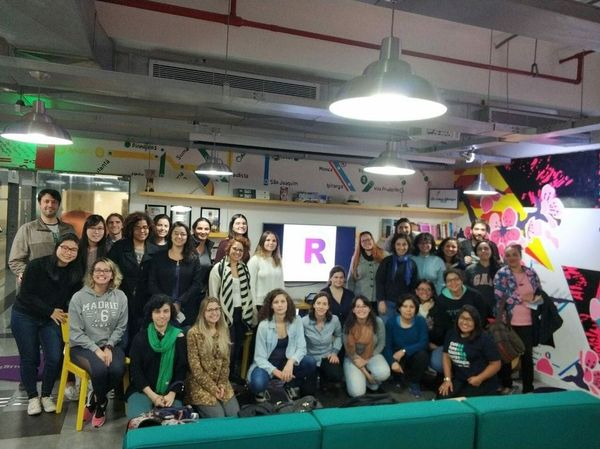

layout: true
  
<div class="my-footer"><span>

<a href="https://www.meetup.com/pt-BR/R-Ladies-Sao-Paulo">Meetup</a> |
<a href="https://twitter.com/RLadiesSaoPaulo">Twitter</a> | 
<a href="http://instagram.com/RLadiesSaoPaulo">Instagram</a> |
<a href="http://facebook.com/RLadiesSaoPaulo">Facebook</a> |
<a href="https://github.com/rladies/meetup-presentations_sao-paulo">GitHub</a>  |
<a href="https://www.youtube.com/channel/UCU3ePTnZQurDkYgPK61DAOw">Youtube</a> 

</span></div> 

```{r setup, include=FALSE}
options(htmltools.dir.version = FALSE)

knitr::opts_chunk$set(echo = FALSE, fig.align = "center", message=FALSE, warning=FALSE)

library(tidyverse)

```

```{r eval=FALSE, include=FALSE}
url <- "https://benubah.github.io/r-community-explorer/data/rladies.csv"
download.file(url, "data/rladies.csv", method = "curl")
```

```{r echo=FALSE, }
rladies <- readr::read_csv("data/rladies.csv")
```

---
class:  

# O que é o R-Ladies?

R-Ladies é uma organização mundial cuja missão é promover a diversidade de gênero na comunidade da linguagem R.

R-Ladies São Paulo integra, orgulhosamente, a organização R-Ladies Global, em São Paulo.

## Como?

Através de meetups e mentorias em um ambiente seguro e amigável.

Nosso principal objetivo é promover a linguagem computacional estatística R compartilhando conhecimento, assim, quem tiver interesse na linguagem será bem-vinda, independente do nível de conhecimento. 


Fonte: [About us - R-Ladies](https://rladies.org/about-us/), [Meetup R-Ladies São Paulo](https://www.meetup.com/R-Ladies-Sao-Paulo/)

---
class:   

# Para quem?

Nosso principal público-alvo são as pessoas que se identificam com gêneros sub-representados na comunidade R, portanto: mulheres cis, mulheres trans, homens trans, pessoas não-binárias e queer.

## Missão

Como uma iniciativa de diversidade, a missão das R-Ladies é alcançar uma representação proporcional de pessoas de gêneros atualmente sub-representados na comunidade R, incentivando, inspirando e capacitando-as.


## Código de conduta

O R-Ladies dedica-se a proporcionar uma experiência livre de assédio para todas as pessoas partcicipantes, desta forma, não é tolerada nenhuma forma de assédio. [Código de conduta - R-Ladies](https://github.com/rladies/starter-kit/wiki/Code-of-Conduct#portuguese)


Fonte: [About us - R-Ladies](https://rladies.org/about-us/), [Meetup R-Ladies São Paulo](https://www.meetup.com/R-Ladies-Sao-Paulo/)

---
class:

# R-Ladies - Capítulos no mundo

Atualizado em: `r  format(Sys.time(), '%B de %Y')`. Fonte: [R Community Explorer](https://benubah.github.io/r-community-explorer/rladies.html) 

```{r echo=FALSE}
rladies %>%  
  group_by(region) %>% 
  summarise(n_capitulos = n(), 
            total_participantes = sum(members, na.rm = TRUE)) %>% 
  dplyr::arrange(desc(n_capitulos)) %>%
    DT::datatable(autoHideNavigation = TRUE
                  ,
                options = list(pageLength = 7),
                  colnames = c("Região", "Número de Capítulos", "Total de participantes")
                )
```

---
class:    

# R-Ladies no Brasil


Atualizado em: `r  format(Sys.time(), '%B de %Y')`. Fonte: [R Community Explorer](https://benubah.github.io/r-community-explorer/rladies.html) 

```{r echo=FALSE}
rladies %>%
  dplyr::arrange(desc(members)) %>%
  filter(country == "Brazil") %>%
  mutate(name = paste0("<a href='", fullurl, "' target='_blank'>", name, "</a>")) %>%
  select(
    -X1,
    -city,
    -region,
    -fullurl,
    -country,
    -created,
    -upcoming_events,
    -last_event,
    -past_events,
    -status
  ) %>%
  
  DT::datatable(autoHideNavigation = TRUE                ,
                options = list(pageLength = 7),
                  colnames = c("Capítulo", "Pessoas participantes"))
```

```{r include=FALSE}
pessoas_sp <- rladies %>% filter(city == "São Paulo") %>% select(members) %>% pull()
```

---
class: 

# R-Ladies em São Paulo

```{r out.width="65%"}

```


- **Primeiro encontro da R-Ladies São Paulo ** - Agosto/2018

- **+ `r pessoas_sp` pessoas participantes** - `r format(Sys.Date(), format='%B de %Y')`


---
class:

# Saiba mais sobre a R-Ladies
.pull-left[

- [Website RLadies Global](https://rladies.org/)
- Twitter: [@RLadiesGlobal](https://twitter.com/rladiesglobal), [@RLadiesSaoPaulo](https://twitter.com/RLadiesSaoPaulo)
- [Instagram](http://instagram.com/RLadiesSaoPaulo)
- [Facebook](http://facebook.com/RLadiesSaoPaulo)
- [Meetup](https://www.meetup.com/pt-BR/R-Ladies-Sao-Paulo)
- [GitHub](https://github.com/rladies/meetup-presentations_sao-paulo)
- [Youtube](https://www.youtube.com/channel/UCU3ePTnZQurDkYgPK61DAOw)
- [Capítulos da R-Ladies no Brasil](https://github.com/R-Ladies-Sao-Paulo/RLadies-Brasil) - Não tem capítulo na sua cidade e quer iniciar um?  Saiba como em [R-Ladies - How do get involved](https://rladies.org/about-us/help/)! 


.footnote[Apresentação feita por [Beatriz Milz](https://beatrizmilz.com) com o pacote [xaringan](https://github.com/yihui/xaringan), com o tema `metropolis` modificado.]


]


.pull-right[
```{r fig.cap="Ilustração por <a href='https://twitter.com/allison_horst' target=_blank>@allison_horst</a> "}
knitr::include_graphics("img/allisonhorst/principio_agora_pt.png")
```
]
