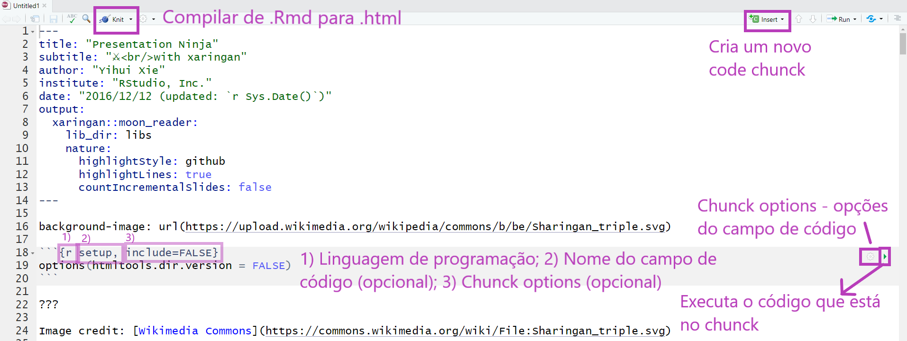

class:

```{r pacotes, eval=FALSE, include=FALSE}
# if (!require("devtools")) install.packages("devtools")
# if (!require("emo")) devtools::install_github("hadley/emo")
```


```{r setup, include=FALSE}
options(htmltools.dir.version = FALSE)
knitr::opts_chunk$set(
  fig.width = 9,
  fig.height = 3.5,
  fig.retina = 3,
  out.width = "100%",
  cache = TRUE,
  echo = FALSE,
  message = FALSE,
  warning = FALSE,
  hiline = TRUE,
  fig.align = "center"
)

library(tidyverse)

```

```{css}
/* custom.css */
.left-code {
  color: #777;
  width: 38%;
  height: 92%;
  float: left;
}
.right-plot {
  width: 60%;
  float: right;
  padding-left: 1%;
}

a, a > code {
    text-decoration: underline;
}


```


```{r xaringan-themer, include=FALSE, warning=FALSE}
library(xaringanthemer)
style_duo_accent(
  primary_color = "#6469ab",
  title_slide_background_color = "#ffffff",
  title_slide_text_color = "#33456e",
  inverse_text_color = "#826b37",
  inverse_header_color = "#33456e",
  inverse_background_color = "#FFFFFF",
  secondary_color = "#EDBBC8",
  background_color = "#f7f7f7",
  code_inline_background_color = "#faf0f4",
 
  
  header_font_google = google_font("Josefin Slab", "600"),
  text_font_google   = google_font("Work Sans", "300", "300i"),
  code_font_google   = google_font("Fira Code"),
  base_font_size = "25px",
  extra_css = list(".remark-code-line" = list("background-color" = "#faf0f4"))
)
# Cores AI
#9d8cf0, #6469ab, #33456e
```

```{r xaringan-logo, echo=FALSE}
xaringanExtra::use_logo(
  image_url = "img/logo_ai.jpeg", 
    link_url = "https://linktr.ee/ai_inclusive",
  exclude_class = c("hide-logo", "title-slide", "inverse")
)
```


.pull-left[

## Beatriz Milz

- 2019 - * - Doutoranda em Ciência Ambiental - PROCAM/IEE/USP

- 2016-2018 - Mestrado em Ciências - Programa de Pós-Graduação em Análise Ambiental Integrada - UNIFESP

- 2012-2015 - Bacharelado em Gestão Ambiental - EACH/USP 
]

.pull-right[
<BR>
<center>
</center>

]


---
class: inverse

## R: Comunidades, eventos, pacotes, livros..
<center>

<a href='https://education.rstudio.com/trainers/'>  </a>


<a href='https://rladies.org/'>  </a>

<a href='https://curso-r.com/'>  </a>

<a href='https://livro.curso-r.com/'>  </a>


<a href='https://saopaulo2019.satrdays.org/'>  </a>
<a href='https://latin-r.com/'>  </a>
<a href='https://carpentries.org/'>  </a>
<a href='https://user2021.r-project.org/'>  </a>

<a href='https://cienciadedatos.github.io/dados/'>  </a>
<a href='https://beatrizmilz.github.io/mananciais/'>  </a>
</center>


---
name: sumario
## Temas de hoje...


- [O ciclo de ciência de dados](#ciclo_ds)

- [Pacote R Markdown](#pacote_rmarkdown)

- [Exemplos de produtos feitos com R Markdown](#outros_pacotes_rmd)

- [Criando um arquivo R Markdown](#criando_rmd)

- [Relembrando o Markdown](#markdown)

- [Adicionando conteúdo no arquivo .Rmd](#adicionando_conteudo_rmd)

- [Coisas legais com R Markdown](#coisaslegais) (com live coding!)

  
---
name: ciclo_ds
class: middle, center, inverse

# O ciclo de Ciência de Dados

---

## Ciclo da ciência de dados


```{r, out.width="65%"}
knitr::include_graphics("https://beatrizmilz.github.io/python-brasil-2021-reticulate/img/environmental-data-science-r4ds-general.png")
```


Fonte: Conceito do ciclo de ciência de dados apresentado por [Hadley Wickham no livro R for Data Science](https://r4ds.had.co.nz/introduction.html), ilustração por [Allison Horst](https://github.com/allisonhorst).


---

## Ciclo da ciência de dados


```{r, out.width="60%"}
knitr::include_graphics("https://beatrizmilz.github.io/python-brasil-2021-reticulate/img/ciclo-ciencia-de-dados.png")
```


Fonte: Conceito do ciclo de ciência de dados apresentado por [Hadley Wickham no livro R for Data Science](https://r4ds.had.co.nz/introduction.html), figura elaborada pela equipe da [Curso-R](https://curso-r.com/).


---

## Tidyverse


.pull-left[


```{r, out.width="70%"}
knitr::include_graphics("https://beatrizmilz.github.io/python-brasil-2021-reticulate/img/tidyverse-logo.png")
```


Fonte: logo do pacote [Tidyverse](https://www.tidyverse.org/).

]

.pull-right[


```{r, out.width="80%"}
knitr::include_graphics("https://beatrizmilz.github.io/python-brasil-2021-reticulate/img/tidyverse_celestial.png")
```


Fonte: Ilustração por [Allison Horst](https://github.com/allisonhorst).

]


---

## Ciclo da ciência de dados com R


```{r, out.width="60%"}
knitr::include_graphics("https://beatrizmilz.github.io/python-brasil-2021-reticulate/img/ciclo-ciencia-de-dados-pacotes.png")
```


Fonte: Conceito do ciclo de ciência de dados apresentado por [Hadley Wickham no livro R for Data Science](https://r4ds.had.co.nz/introduction.html), figura elaborada pela equipe da [Curso-R](https://curso-r.com/).

---
name: pacote_rmarkdown
class: inverse, middle, center

# Pacote R Markdown

---


## Pacote R Markdown

.pull-left[
- Criado e mantido pela [RStudio](https://rstudio.com/)

- Princípio: arquivos onde escrevemos textos e marcamos com `markdown`, mas também podemos adicionar códigos que são executados.

- Extensão `.Rmd`

- Possibilita a utilização de códigos `R`, `Python`, `Markdown`, `HTML`, `CSS`, `SQL`, e outros em um único arquivo.

- Ideia similar ao Jupiter Notebook.

]

.pull-right[
```{r, out.width="70%", fig.cap="<center><b>Logo: <a href='https://rmarkdown.rstudio.com'>Pacote rmarkdown</a></b></center>"}
knitr::include_graphics("https://beatrizmilz.github.io/python-brasil-2021-reticulate/img/hex-rmarkdown.png")
```
]

---
class:  middle

```{r out.width="60%", fig.cap="Ilustração por Allison Horst - Twitter: <a href='https://twitter.com/allison_horst/'> @allison_horst</a>"}
knitr::include_graphics("https://raw.githubusercontent.com/allisonhorst/stats-illustrations/master/rstats-artwork/rmarkdown_rockstar.png")
```

---
name: outros_pacotes_rmd
class: middle, center, inverse

# Exemplos de produtos feitos com R Markdown

---


## Pacote R Markdown

.pull-left[
- A reprodutibilidade é algo importante para o R Markdown.

-  A comunidade de R, e a equipe da RStudio, desenvolveram outros pacotes que integram bem com R Markdown para  gerar diversos produtos de análise de dados diferentes, com arquivos .Rmd. 


## Alguns exemplos:

(apenas alguns mesmo pois tem muita coisa além disso!)
]

.pull-right[
```{r, out.width="80%", fig.cap="<center><b>Fonte: <a href='https://rmarkdown.rstudio.com'>Pacote `rmarkdown`</a></b></center>"}
knitr::include_graphics("https://beatrizmilz.github.io/slidesR/img/rmarkdown/markdown.png")
```
]


---

### Apresentações com o pacote [xaringan](https://slides.yihui.org/xaringan/)

- Exemplo: Essa apresentação! [E muitas outras que fiz](https://beatrizmilz.com/talk/), como a [abaixo](https://beatrizmilz.github.io/slidesR/xaringan/09-2021-rday.html#1): 

```{r}
xaringanExtra::embed_xaringan("https://beatrizmilz.github.io/slidesR/xaringan/09-2021-rday.html#1", max_width = "70%")
```

---

### Livros com o pacote [bookdown](https://bookdown.org/home/)

- Exemplo: [Livro Ciência de Dados em R](https://livro.curso-r.com/) da [Curso-R](https://curso-r.com/)

```{r}
xaringanExtra::embed_xaringan("https://livro.curso-r.com/", max_width = "70%")
```

---

### Blogs com o pacote [blogdown](https://pkgs.rstudio.com/blogdown/)

- Exemplo: [meu blog](https://beatrizmilz.com/blog/2021-python-serie/semana-1-parte-1/)

```{r}
xaringanExtra::embed_xaringan("https://beatrizmilz.com/blog/2021-python-serie/semana-1-parte-1/", max_width = "70%")
```


---

### Blogs com o pacote [blogdown](https://pkgs.rstudio.com/blogdown/)

- Exemplo: [blog da Curso-R](https://blog.curso-r.com/posts/2021-06-23-dnd/)

```{r}
xaringanExtra::embed_xaringan("https://blog.curso-r.com/posts/2021-06-23-dnd/", max_width = "70%")
```

---

## Produtos em PDF com o pacote [pagedown](https://github.com/rstudio/pagedown)


Exemplo: o [relatório](https://abjur.github.io/obsRJRJ/relatorio/obs_rjrj_abj.pdf) do [Observatório da insolvência: Rio de Janeiro](https://abj.org.br/cases/obsrjrj/), feito pela [ABJ](https://abj.org.br/) .footnote[ABJ: Associação Brasileira de Jurimetria]


```{r}
xaringanExtra::embed_xaringan("https://abjur.github.io/obsRJRJ/relatorio/obs_rjrj_abj.pdf", max_width = "70%")
```


---
name: criando_rmd
class: middle, center, inverse

# Criando um arquivo R Markdown

---


.pull-left[
## O que utilizaremos?

- **R** - [Download aqui](https://cran.r-project.org/)

- **RStudio** - [Download aqui](https://www.rstudio.com/products/rstudio/download/)


- Também existe a opção de utilizar o **RStudio Cloud**: https://rstudio.cloud/
]

.pull-right[
### Pacotes

```r
install.packages("knitr")
install.packages("rmarkdown")
```

### Pacotes usados nos exemplos

```r
install.packages("xaringan")
install.packages("pagedown")
install.packages("reticulate")
install.packages("tidyverse")
```
]

---


## Criando a estrutura

- Criar um projeto no RStudio. Facilita muito para organizar os arquivos, posteriormente sincronizar com o GitHub, entre outros. Neste capítulo do livro Zen do R, da [Curso-R](https://www.curso-r.com), tem mais informações sobre [RProj e diretórios](https://curso-r.github.io/zen-do-r/rproj-dir.html).

  - File > New Project > New Directory > New Project
  
  - Dê um nome para seu projeto (será o nome da pasta), escolha a pasta no seu computador, e clique em `Create Project`.
  
  

---

 
## Criar um arquivo rmarkdown

- `File > New File > R Markdown`... ok :)
  
  
-  Pacotes também oferecem templates (`File > New File > R Markdown > From template`).

  
---


## Estrutura do arquivo rmarkdown


```{r, out.width="70%"}
knitr::include_graphics("https://beatrizmilz.github.io/slidesR/img/rmarkdown/rmd-estrutura.png")
```

- Code chunks - Campos de códigos R (porém pode receber outros tipos, como SQL e Python)

---


## Compilar o arquivo

- Botão Knit, ou usando o atalho: `Ctrl + Shift + K`

- Boa prática: compilar com frequência. 

```{r, out.width="90%"}
knitr::include_graphics("https://beatrizmilz.github.io/slidesR/img/rmarkdown/knit-button.png")
```

---


## Alterar YAML

- O `YAML` possui informações importantes para a apresentação, como o título, subtítulo, autor, instituição, data, etc.

- __output:__ formato (Ex: html_document, pdf_document, etc). 
- Cuidado com a identação!

```{r, out.width="40%"}
knitr::include_graphics("https://media0.giphy.com/media/xT9IgIc0lryrxvqVGM/giphy-downsized.gif")
``` 


---
name: markdown

class: middle, center, inverse

# Relembrando o Markdown
---
class:

## Markdown

- O RMarkdown possibilita a utilização da linguagem de marcação simples Markdown. Essa linguagem de marcação foi elaborada para ser fácil de ler e  fácil de escrever.

* Confira as cheatsheets: [`rmarkdown` Cheatsheet 2.0](http://www.rstudio.com/wp-content/uploads/2016/03/rmarkdown-cheatsheet-2.0.pdf) e [`rmarkdown` Cheatsheet](https://www.rstudio.com/wp-content/uploads/2015/02/rmarkdown-cheatsheet.pdf).


---
class:

## Elementos básicos 

`**negrito**` - **negrito**

`_itálico_` - _itálico_

`~~riscado~~` - ~~riscado~~ 

---
class:

## Títulos


`# Título 1`


`## Título 2`
## Título 2

`### Título 3`
### Título 3

---
class:

## Listas
.pull-left[
Você pode fazer uma lista escrevendo com hifens ou asteriscos, como a seguir:

`* Maçã`

`* Banana`

`* Uva`

ou desta forma:

`- Maçã`

`- Banana`

`- Uva`
]

.pull-right[
Cada um vai aparecer como:

- Maçã
- Banana
- Uva
]


---
class:

## Fazendo uma lista enumerada
Você pode fazer uma lista numerada usando somente números. Você pode usar o mesmo número quantas vezes quiser: 

`1. Maçã`

`1. Banana`

`1. Uva`

Isso irá aparecer como:

1. Maçã
1. Banana
1. Uva

---


## Outros elementos em markdown

- Você pode fazer um hiperlink dessa forma: `[texto para mostrar](http://the-web-page.com)`.

- Você pode incluir arquivo de imagem dessa forma: ``


---

## Equações


### Equação centralizada

$$y = \mu + \sum_{i=1}^p \beta_i x_i + \epsilon$$

### Equação junto ao texto

Ou também na linha $y = \mu + \sum_{i=1}^p \beta_i x_i + \epsilon$, junto ao texto!

**Código Markdown:**


```md
$$y = \mu + \sum_{i=1}^p \beta_i x_i + \epsilon$$
```


---
name: adicionando_conteudo_rmd
class: middle, center, inverse

# Adicionando conteúdo no arquivo .Rmd

---

## Chunks de Código R

Os chunks são campos onde podemos inserir código de R (ou Python, SQL,  Bash...) em um arquivo RMarkdown. Existe um atalho do teclado para criar chunks no RStudio:  `Ctrl + ALt + I`. Também é possível criar um chunk clicando no seguinte botão do RStudio:


```{r echo=FALSE, out.width="90%"}
knitr::include_graphics("https://beatrizmilz.github.io/slidesR/img/rmarkdown/create-chunck.png")
```

---

class:

## Exemplo:

```{r echo=TRUE}
summary(mtcars)
```

---
class:

## Exemplo:

.left-code[
```{r plot-exemplo-ggplot2, echo=TRUE, fig.show="hide", out.width="95%", echo=TRUE}
library(ggplot2)
ggplot(mtcars) +
  aes(x = hp,
      y = mpg,
      colour = cyl) +
  geom_point(size = 2L)
```
]

.right-plot[
`)
]


---
class:

## Opções de Chunk

- Há uma variedade de opções de chunk que podem afetar como os chunks de código são compilados. Exemplos: 

- `echo=FALSE`- evita que o próprio código apareça

- `eval=FALSE` - mostra o código, mas ele não é executado

- `warning=FALSE` e `message=FALSE` - oculta mensagens de avisos produzidas

- `out.width` - controla o a largura das figuras, gráficos, tabelas geradas (Ex: out.width = "100%")

- Ex de configuração do chunk: `{r, warning=FALSE, message=FALSE}`


---
class:

## Códigos em R - Opções de chunk

.pull-left[
#### Código + Resultado
- `echo=TRUE`
```{r echo=TRUE}
nrow(mtcars)
```
]

.pull-right[

#### Apenas código
- `echo=TRUE, eval=FALSE`
```{r echo=TRUE, eval=FALSE}
nrow(mtcars)
```

#### Apenas resultado
- `echo=FALSE`
```{r echo=FALSE}
nrow(mtcars)
```

]

---
class: 

## Dicas - RStudio


```{r echo=FALSE, out.width="100%"}

```
---


## Código inline

A base mtcars possui `r nrow(mtcars)` carros.

**Código Markdown:**

```{r,  eval=F, echo=T}
A base mtcars possui `r nrow(mtcars)` carros.
```


---

## Opções globais de Chunk

As opções globais de chunk são opções de chunk que são válidas para o documento inteiro. Algumas opções são úteis, como `fig.align = "center"`.
Para configurar as opções globais de chunk, modifique o código abaixo e insira após o código `YAML` (retire os `#` no início de cada linha):

- Ex:
  - Configurações do chunk:
`{r setup, include=FALSE}`
  - Conteúdo do chunk:
`knitr::opts_chunk$set(...)`


---


## Adicionando imagens usando o knitr

Função: `knitr::include_graphics()`

Exemplo:
```{r  out.width = "30%"}
knitr::include_graphics("https://www.r-project.org/Rlogo.png")
```

---
class:

## Adicionando imagens usando knitr

### Opções de Chunk 

- `out.width = "30%"` - tamanho da imagem


```{r echo=FALSE, out.width = "30%"}
knitr::include_graphics("https://www.r-project.org/Rlogo.png")
```

[Opções do KnitR](https://yihui.name/knitr/options/#chunk-options)

---
class:

## Adicionando imagens usando knitr

### Opções de Chunk 

- **Alinhamento da figura**
- `fig.align = 'center', 'default', **'left'**,'right'` 

```{r echo=FALSE,  out.width="10%", fig.align='left'} 
knitr::include_graphics("https://www.r-project.org/Rlogo.png")
```

- `fig.align = 'center', 'default', 'left', **'right' **`

```{r echo=FALSE,  out.width="10%", fig.align='right'}
knitr::include_graphics("https://www.r-project.org/Rlogo.png")
```

---


## Adicionando imagens usando knitr

### Opções de Chunk 

- Legenda de figura 

- `fig.cap="Logo R"`


```{r echo=FALSE,  out.width="30%", fig.cap="R Logo", fig.align='center'}
knitr::include_graphics("https://www.r-project.org/Rlogo.png")
```


---

### Tabelas em Markdown

.pull-left[

- **Resultado:**


|Petal.Length|Petal.Width|Species|
|-----------:|----------:|:------|
|        1.4|       0.2|setosa  |
|        1.4|       0.2|setosa  |
|        1.3|       0.2|setosa  |
|        1.5|       0.2|setosa  |
|        1.4|       0.2|setosa  |
|        1.7|       0.4|setosa  |
]

.pull-right[
- **Código Markdown**:


```{r  eval=F, echo=T}
| Petal.Length| Petal.Width|Species |
|------------:|-----------:|:-------|
|          1.4|         0.2|setosa  |
|          1.4|         0.2|setosa  |
|          1.3|         0.2|setosa  |
|          1.5|         0.2|setosa  |
|          1.4|         0.2|setosa  |
|          1.7|         0.4|setosa  |
```

]

---

### Tabelas com R

```{r echo=TRUE}
knitr::kable(x = head(iris), format = "html")
```

- Outra opção:  `DT::datatable(iris)`  


---

## ERRO!

- Boa prática: compilar com frequência. 

- É bem comum dar erro ao compilar o arquivo pois **qualquer** código errado causa isso. Algumas coisas pra se observar:

  - **YAML header** - se algo estiver errado, vai dar erro ao compilar. 
Muito cuidado com a identação!

  - **Código nos chunks** - teste o _Run All Chunks_ e veja se aparece erro em algum chunk específico.
Se descobrir, tente verificar o que há de errado no código (pode ser a falta de um parênteses, vírgula, entre outros).

  - Todos os objetos e pacotes usados no seu script precisam estar disponíveis no seu `.Rmd`. Verifique isso :)

```{r echo=FALSE, out.width="10%"}
knitr::include_graphics("https://media.giphy.com/media/j9GASQ5ocrIRicnmyq/giphy.gif")
```


---
name: coisas_legais
class: middle, center, inverse

# Coisas legais com R Markdown
---

## Coisas legais com R Markdown

- Gerar um PDF! - Apenas na versão desktop, não funciona no RStudio Cloud

- Visualizar uma prévia enquanto estamos escrevendo: `xaringan::inf_mr()` - Funciona melhor na versão Desktop
  
- RStudio Visual editor 
  
- Exemplos mostrados no RStudio Cloud, Código em: https://rstudio.cloud/project/3072545
  - Adicionar código em Python
  - Relatórios com parâmetros

  


---
class: 

```{r, out.width="50%", fig.cap="<center><b>Ilustração por Allison Horst - Twitter: <a href='https://twitter.com/allison_horst/'> @allison_horst</a> </b></center>"}
knitr::include_graphics("https://beatrizmilz.github.io/slidesR/img/Horst/community1.jpg")
```


---

## Referências

- **RMarkdown**:
  - [RMarkdown Cheatsheet](https://www.rstudio.com/wp-content/uploads/2015/02/rmarkdown-cheatsheet.pdf)
  
  - [R Markdown from RStudio](https://rmarkdown.rstudio.com/lesson-1.html)
  
  - [R Markdown: The Definitive Guide](https://bookdown.org/yihui/rmarkdown/)
  
  - [R for Data Science - Cap 27: R Markdown](https://r4ds.had.co.nz/r-markdown.html)
  
  - [Software Carpentry - Producing Reports With knitr ](https://swcarpentry.github.io/r-novice-gapminder/15-knitr-markdown/)

  - [Advanced R Markdown](https://slides.yihui.name/2017-rstudio-conf-rmarkdown-Yihui-Xie.html)

---

## Referências

- [Relatórios com parâmetros](https://rmarkdown.rstudio.com/developer_parameterized_reports.html)


## Cheatsheets

- **Online**: [https://www.rstudio.com/wp-content/uploads/2015/02/rmarkdown-cheatsheet.pdf](https://www.rstudio.com/wp-content/uploads/2015/02/rmarkdown-cheatsheet.pdf)

- **No RStudio**: No RStudio > Help > Cheatsheets > RMarkdown CheatCheet

- Outras Cheatsheets: [RStudio Resources](https://www.rstudio.com/resources/cheatsheets/)

---


## Agradecimentos especiais:

- [AI Inclusive](https://linktr.ee/ai_inclusive) - Gabriela e Fernanda, obrigada pelo convite!

- [R-Ladies](https://linktr.ee/rladies_sp) - Sem essa comunidade, nada disso seria possível :)

- [Yihui Xie](https://github.com/yihui) - Pelo pacotes, livros, blogposts, vídeos 

- [Julio Trecenti](https://github.com/jtrecenti), [Curso-R](https://www.curso-r.com/) e [13 aMostra de Estatística - IME  USP](https://www.ime.usp.br/~amostra/) pelo mini-curso de RMarkdown (em 2018! `r emo::ji("purple_heart")`)


---
class: center

## Muito obrigada!

.pull-left[

```{r echo=FALSE, fig.align='center', out.width="50%"}
knitr::include_graphics("https://media.giphy.com/media/M9NbzZjAcxq9jS9LZJ/giphy.gif")
```


Slides criados usando os pacotes em R  📦 :

[**xaringan**](https://github.com/yihui/xaringan)<br>
[gadenbuie/xaringanthemer](https://github.com/gadenbuie/xaringanthemer)

O chakra vem da biblioteca javascript [remark.js](https://remarkjs.com), e os pacotes  [**knitr**](http://yihui.name/knitr), e [R Markdown](https://rmarkdown.rstudio.com).
]

.pull-right[

<center>
</center>

<i class="fas fa-home"></i> [beatrizmilz.com](https://beatrizmilz.com)

<i class="fab fa-twitter"></i> [@BeaMilz](https://twitter.com/BeaMilz)

<!-- <i class="far fa-envelope"></i> [milz.bea@gmail.com](mailto:milz.bea@gmail.com) -->
]


 
<!-- inicio font awesome -->
<script src="https://kit.fontawesome.com/1f72d6921a.js" crossorigin="anonymous"></script>

<!-- final font awesome -->


