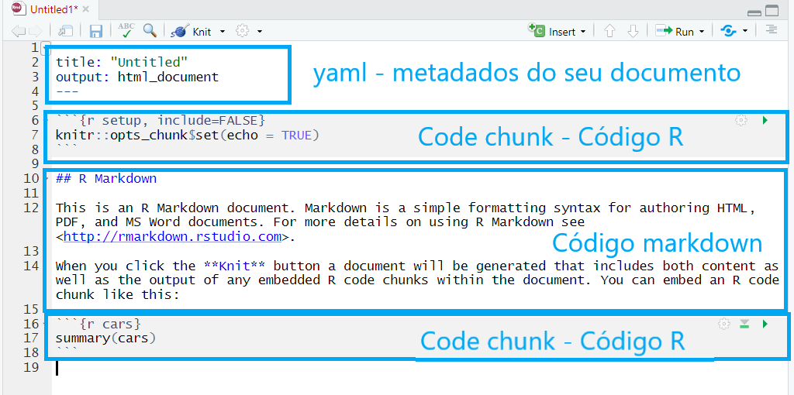

layout: true
  
<div class="my-footer"><span>


<a href="https://beatrizmilz.com">Beatriz Milz</a> - Email: <a href="mailto:beatriz.milz@usp.br">beatriz.milz@usp.br</a>


</span></div> 
---
class:

```{r setup, include=FALSE}
options(htmltools.dir.version = FALSE)

knitr::opts_chunk$set(fig.align = "center",
                      message = FALSE,
                      echo=FALSE,
                      warning = FALSE)

library(tidyverse)

```

# Beatriz Milz
- Doutoranda no Programa de Pós-Graduação em Ciência Ambiental (PROCAM) - Instituto de Energia e Ambiente - Universidade de São Paulo

  - Bolsista FAPESP - Processo nº 2018/23771-6 
  
  - Projeto Temático FAPESP Macroamb - Processo nº 2015/03804-9 
  
```{r echo=FALSE, out.width="60%"}
knitr::include_graphics("img/logos_bia.png")
```

- Equipe da Secretaria Executiva  Editorial - [Revista Ambiente & Sociedade](http://scielo.br/asoc)

- Co-organizadora - [R-Ladies São Paulo](https://www.meetup.com/pt-BR/R-Ladies-Sao-Paulo) `r emo::ji("purple_heart")`

- [Currículo disponível neste link](https://beatrizmilz.github.io/resume/index.pdf)

- Anteriormente: Mestre em Ciências - UNIFESP; Bacharel em Gestão Ambiental - EACH/USP

---

class: 

# Pré-requisitos

## R
- Download em: https://cran.r-project.org/

## RStudio
- Download em: https://www.rstudio.com/products/rstudio/download/

- Também existe a opção de utilizar o RStudio Cloud: https://rstudio.cloud/

---
class: 

# Pacote rmarkdown

```{r, out.width="25%", fig.cap="<center><b>Logo: <a href='https://rmarkdown.rstudio.com'>Pacote `rmarkdown`</a></b></center>"}
knitr::include_graphics("img/rlogos/hex-rmarkdown.png")
```

- Mantido pela [RStudio](https://rstudio.com/)

- extensão `.Rmd`

- Possibilita a utilização de códigos `R`, `Markdown`, `HTML` e outros.

---
class:  

# Pacote rmarkdown

```{r, out.width="50%", fig.cap="<center><b>Fonte: <a href='https://rmarkdown.rstudio.com'>Pacote `rmarkdown`</a></b></center>"}
knitr::include_graphics("img/rmarkdown/markdown.png")
```

---
class:  

# Começando com a estrutura

- Criar um projeto no RStudio. Facilita muito para organizar os arquivos, posteriormente sincronizar com o GitHub, entre outros.Neste post da [Curso-R](https://www.curso-r.com), tem mais informações sobre [RProj e diretórios](https://www.curso-r.com/blog/2019-07-16-zen-do-r-3/).

  - File > New Project > New Directory > New Project
  
  - Dê um nome para seu projeto (será o nome da pasta), escolha a pasta no seu computador, e clique em `Create Project`.
  
  - 

---
class:  
 
# Criar um arquivo rmarkdown

  - File > New File > R Markdown... ok :)
  
  
- __Atualizar imagem__
  
---
class:  

# Estrutura do arquivo rmarkdown


- yaml - Metadados do documento

- Code chunk - códigos R (porém pode receber outros tipos, como SQL e Python)

```{r, out.width="90%"}

```


---
class:  

# Compilar o arquivo

- Botão Knit, ou usando o atalho: `Ctrl + Shift + K`

```{r, out.width="90%"}
knitr::include_graphics("img/rmarkdown/knit-button.png")
```

---
class:


# Alterar yaml

- O `yaml` possui informações importantes para a apresentação, como o título, subtítulo, autor, instituição, data, etc.

- __output:__ formato (Ex: html_document, pdf_document, etc). 
- Cuidado com a identação!

```{r}
knitr::include_graphics("https://media0.giphy.com/media/xT9IgIc0lryrxvqVGM/giphy-downsized.gif")
``` 


---
class:

# ERRO NO KNITR!

- Boa prática: compilar com frequência. 

- É bem comum dar erro ao compilar o arquivo pois **qualquer** código errado causa isso. Algumas coisas pra se observar:

- **yaml header** - se algo estiver errado, vai dar erro ao compilar. 
Muito cuidado com a identação!

- **Código nos chunks** - teste o _Run All Chunks_ e veja se aparece erro em algum chunk específico.
Se descobrir, tente verificar o que há de errado no código (pode ser a falta de um parênteses, vírgula, entre outros).

```{r echo=FALSE, out.width="30%"}
knitr::include_graphics("https://media.giphy.com/media/j9GASQ5ocrIRicnmyq/giphy.gif")
```

---
class:

# Markdown

- O RMarkdown possibilita a utilização da linguagem de marcação simples Markdown. Essa linguagem de marcação foi elaborada para ser fácil de ler e  fácil de escrever.

* Confira as cheatsheets: [`rmarkdown` Cheatsheet 2.0](http://www.rstudio.com/wp-content/uploads/2016/03/rmarkdown-cheatsheet-2.0.pdf) e [`rmarkdown` Cheatsheet](https://www.rstudio.com/wp-content/uploads/2015/02/rmarkdown-cheatsheet.pdf).


---
class:

# Elementos básicos 

`**negrito**` - **negrito**

`_itálico_` - _itálico_

`~~riscado~~` - ~~riscado~~ 

---
class:

# Títulos


`# Título 1`


`## Título 2`
## Título 2

`### Título 3`
### Título 3

---
class:

# Listas

Você pode fazer uma lista escrevendo com hifens ou asteriscos, como a seguir:

`* Maçã`

`* Banana`

`* Uva`

ou desta forma:

`- Maçã`

`- Banana`

`- Uva`

Cada um vai aparecer como:

- Maçã
- Banana
- Uva

---
class:

# Fazendo uma lista enumerada
Você pode fazer uma lista numerada usando somente números. Você pode usar o mesmo número quantas vezes quiser: 

`1. Maçã`

`1. Banana`

`1. Uva`

Isso irá aparecer como:

1. Maçã
1. Banana
1. Uva

---
class:


# Outros elementos em markdown

- Você pode fazer um hiperlink dessa forma: `[texto para mostrar](http://the-web-page.com)`.

- Você pode incluir arquivo de imagem dessa forma: ``

- Se você utiliza equações em LaTeX, ficará feliz em saber que pode usar `$$` para inserir equações matemáticas, como: 

```{r, echo=TRUE, eval=FALSE}
$$y = \mu + \sum_{i=1}^p \beta_i x_i + \epsilon$$
```

$$y = \mu + \sum_{i=1}^p \beta_i x_i + \epsilon$$

---
class:

# Chunks de Código R

Os chunks são campos onde podemos inserir código de R (ou Python, SQL,  Bash...) em um arquivo RMarkdown. Existe um atalho do teclado para criar chunks no RStudio:  `Ctrl + ALt + I`. Também é possível criar um chunk clicando no seguinte botão do RStudio:


```{r echo=FALSE, out.width="90%"}
knitr::include_graphics("img/rmarkdown/create-chunck.png")
```

---

class:

# Exemplo:

```{r echo=TRUE}
summary(mtcars)
```

---
class:

# Exemplo:

.left-code[
```{r plot-exemplo-ggplot2, echo=TRUE, fig.show="hide", out.width="95%", echo=TRUE}
library(ggplot2)
ggplot(mtcars) +
  aes(x = hp,
      y = mpg,
      colour = cyl) +
  geom_point(size = 2L)
```
]

.right-plot[
`)
]


---
class:

# Opções de Chunk

- Há uma variedade de opções de chunk que podem afetar como os chunks de código são compilados. Exemplos: 

- `echo=FALSE`- evita que o próprio código apareça

- `eval=FALSE` - mostra o código, mas ele não é executado

- `warning=FALSE` e `message=FALSE` - oculta mensagens de avisos produzidas

- `out.width` - controla o a largura das figuras, gráficos, tabelas geradas (Ex: out.width = "100%")

- Ex de configuração do chunk: `{r, warning=FALSE, message=FALSE}`


---
class:

# Códigos em R - Opções de chunk

.pull-left[
### Código + Resultado
- `echo=TRUE`
```{r echo=TRUE}
nrow(mtcars)
```
]

.pull-right[

### Apenas código
- `echo=TRUE, eval=FALSE`
```{r echo=TRUE, eval=FALSE}
nrow(mtcars)
```

### Apenas resultado
- `echo=FALSE`
```{r echo=FALSE}
nrow(mtcars)
```

]

---
class:

# Código inline

A base mtcars possui `r nrow(mtcars)` carros.

**Código Markdown:**

```{r echo=TRUE}
#   A base mtcars possui `r nrow(mtcars)` carros.
```


---
class:

# Opções globais de Chunk

As opções globais de chunk são opções de chunk que são válidas para o documento inteiro. Algumas opções são úteis, como `fig.align = "center"`.
Para configurar as opções globais de chunk, modifique o código abaixo e insira após o código `yaml` (retire os `#` no início de cada linha):

- Ex:
  - Configurações do chunk:
`{r setup, include=FALSE}`
  - Conteúdo do chunk:
`knitr::opts_chunk$set(...)`


---
class:

# Adicionando imagens usando o knitr

Função: `knitr::include_graphics()`

Exemplo:
```{r  out.width = "50%"}
knitr::include_graphics("https://www.r-project.org/Rlogo.png")
```

---
class:

# Adicionando imagens usando knitr

## Opções de Chunk 

- `out.width = "50%"` - tamanho da imagem


```{r echo=FALSE, out.width = "50%"}
knitr::include_graphics("https://www.r-project.org/Rlogo.png")
```

[Opções do KnitR](https://yihui.name/knitr/options/#chunk-options)

---
class:

# Adicionando imagens usando knitr

## Opções de Chunk 

- **Alinhamento da figura**
- `fig.align = 'center', 'default', **'left'**,'right'` 

```{r echo=FALSE,  out.width="20%", fig.align='left'} 
knitr::include_graphics("https://www.r-project.org/Rlogo.png")
```

- `fig.align = 'center', 'default', 'left', **'right' **`

```{r echo=FALSE,  out.width="20%", fig.align='right'}
knitr::include_graphics("https://www.r-project.org/Rlogo.png")
```

---
class:

# Adicionando imagens usando knitr

## Opções de Chunk 

- Legenda de figura 

- `fig.cap="Logo R"`


```{r echo=FALSE,  out.width="50%", fig.cap="R Logo", fig.align='center'}
knitr::include_graphics("https://www.r-project.org/Rlogo.png")
```


---
class:

# Adicionando tabelas 

- Markdown
- `knitr::kable()`
- `DT::datatable(iris)`

- Exemplo com knitr:
```{r echo=TRUE}
knitr::kable(x = head(iris), format = "html")
```

