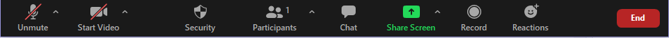
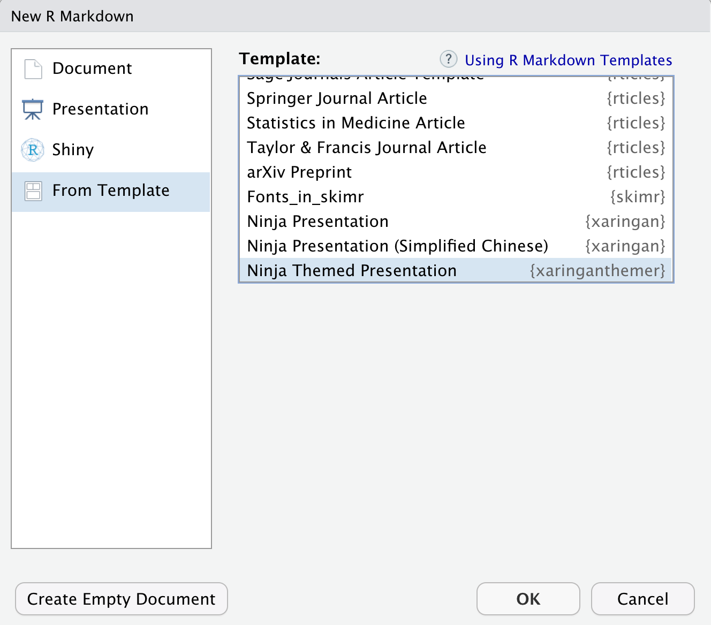

class: middle

```{r setup, include=FALSE}
options(htmltools.dir.version = FALSE)
knitr::opts_chunk$set(
  fig.width=9, fig.height=3.5, fig.retina=3,
  out.width = "100%",
  cache = FALSE,
  echo = TRUE,
  message = FALSE, 
  warning = FALSE,
  hiline = TRUE,
  fig.align = "center"
)
```

```{r eval=FALSE, include=FALSE}
# devtools::install_github("hadley/emo")
# devtools::install_github("gadenbuie/xaringanExtra")
# devtools::install_github("gadenbuie/ermoji")
```


```{r xaringanExtra-clipboard, echo=FALSE}
xaringanExtra::use_clipboard()
```


```{r xaringan-themer, include=FALSE, warning=FALSE}
# library(xaringanthemer)
# style_duo_accent(outfile = "xaringan-themer2021.css",
#   primary_color = "#af1313",
#   title_slide_background_color = "#af1313",
#   title_slide_text_color = "#FFFFFF",
#   inverse_text_color = "#af1313",
#   inverse_header_color = "#af1313",
#   secondary_color = "#a7a3b4",
#   title_slide_background_image = "https://i.giphy.com/media/l49JHOl3OFL6c6u1W/giphy.webp", title_slide_background_size = "300",
# 
#   header_font_google = google_font("Jost"),
#   text_font_google   = google_font("Work Sans", "300", "300i"),
#   code_font_google   = google_font("Fira Code"),
#   base_font_size = "25px"
# )
```


.pull-left[

## Beatriz Milz

- 2019 - * - Doutoranda em Ciência Ambiental - PROCAM/IEE/USP

- 2016-2018 - Mestrado em Ciências - Programa de Pós-Graduação em Análise Ambiental Integrada - UNIFESP

- 2012-2015 - Bacharelado em Gestão Ambiental - EACH/USP 
]

.pull-right[
<center>
</center>

]


---


### R: Comunidades, eventos, pacotes, livros..
<center>

<a href='https://education.rstudio.com/trainers/'>  </a>


<a href='https://rladies.org/'>  </a>

<a href='https://curso-r.com/'>  </a>

<a href='https://livro.curso-r.com/'>  </a>


<a href='https://saopaulo2019.satrdays.org/'>  </a>
<a href='https://latin-r.com/'>  </a>
<a href='https://carpentries.org/'>   </a>
<a href='https://user2021.r-project.org/'>   </a>

<a href='https://cienciadedatos.github.io/dados/'>  </a>
<a href='https://beatrizmilz.github.io/mananciais/'>  </a>
</center>

---


## Agradecimento especial


.pull-left[


### Haydee Svab

<a href='https://www.linkedin.com/in/hsvab/' target="_blank"><i class="fab fa-linkedin"></i></a>
<a href='mailto:hsvab@hsvab.eng.br'><i class="far fa-envelope"></i></a>   <a href='https://twitter.com/hsvab'  target="_blank"><i class="fab fa-twitter"></i></a>   <a href='https://www.instagram.com/haydeesvab/' target="_blank"><i class="fab fa-instagram"></i></a>  <a href='https://github.com/hsvab' target="_blank"><i class="fab fa-github"></i></a>   <a href='http://lattes.cnpq.br/9186914175329359' target="_blank"><i class="ai ai-lattes"></i></a>


]

.pull-right[
<center>
</center>

]


---
class: middle

## Combinados

- Todas as pessoas devem seguir o [código de conduta do evento](http://rday.leg.ufpr.br/inscricao/).

- Espaço acolhedor e amigável `r emo::ji("hugs")`

- O evento será gravado. Caso não queira aparecer na gravação, pedimos que desligue sua câmera.

- Escreva suas dúvidas no chat.

- Mantenha seu microfone desligado. 

```{r echo=FALSE, out.width="100%"}

```


---

## Combinados

- Não vamos dar spoilers, ok?

```{r echo=FALSE, out.width="50%"}
knitr::include_graphics("https://media.giphy.com/media/4ExWdLKTCaz16/giphy.gif?cid=ecf05e47i4gfrx05lt6kkjhk4djin4lskhh0ruvfektkzhd5&rid=giphy.gif&ct=g")
```


---

## Temas de hoje

- Pré-requisitos

- O que é o pacote xaringan?

- Recomendações de uso

- Como criar um arquivo

- Como alterar metadados

- Como alterar estilo

- Como compartilhar a apresentação

---

class: 

## Pré-requisitos

- R: faça o download da versão mais recente [neste link](https://cran.r-project.org/).

- RStudio: faça o download da versão mais recente [neste link](https://www.rstudio.com/products/rstudio/download/).

- Instale os seguintes pacotes:

```{r echo=TRUE, eval=FALSE}
install.packages("rmarkdown")
install.packages("xaringan")
install.packages("xaringanthemer")
install.packages("pagedown")
```


---
class: 

## Pacote xaringan

.pull-left[

- Possibilita criar apresentações **ninjas** com `R Markdown`

- Utiliza a biblioteca `remark.js`

- Gera resultado em HTML 

- HTML pode ser convertido para PDF (estático)
]

.pull-right[

```{r echo=FALSE, fig.cap="<center><b>Logo: <a href='https://github.com/yihui/xaringan'>Pacote xaringan</a>", out.width="65%"}
knitr::include_graphics("img/hex-xaringan.png")
```

]


---

## Vantagens 

👍 É reprodutível.

👍 Podemos inserir equações em LaTeX.

👍 Inserir códigos R e seus resultados.

👍 É possível utilizar o versionamento de código utilizando Git e GitHub.

👍 Possibilita o desenvolvimento do material em equipe (através do GitHub).

👍 Disponibilizando online e enviando o link, é possível atualizar o conteúdo em qualquer momento.


---
class: 

## Estrutura da apresentação

- No `xaringan`, utilizamos o arquivo `.Rmd` para escrever o código da apresentação que é compilado para um arquivo `.html`

- Esse arquivo `.html` é interpretado pelo navegador (ex. Chrome), utilizando também os arquivos `.css` e `.js`


```{r echo=FALSE, out.width="50%"}
knitr::include_graphics("img/html-css-javascript.jpg")
```


---
class: 

## Estrutura da apresentação

```{r echo=FALSE, out.width="40%"}
knitr::include_graphics("img/html-css-javascript.jpg")
```

  - **HTML** (HyperText Markup Language - Linguagem de Marcação de Hipertexto): é uma linguagem de marcação, é usado para estruturar a página.

  - **CSS** (Cascading Style Sheets - Folha de Estilo em Cascata): é usado para estilizar os elementos escritos no HTML.

  - **Javascript**: é uma linguagem de programação, permite que as páginas sejam dinâmicas.

---
class: 

## O que precisa saber? 

- **HTML**: É gerado automaticamente ao compilar o `.Rmd`

- **CSS**: É usado para personalizar a parte visual da apresentação. Para saber mais sobre temas: [xaringan wiki](https://github.com/yihui/xaringan/wiki/Themes)

- **JS**: utiliza o `Remark.JS`, mas aceita outros códigos caso seja necessário.

```{r echo=FALSE, out.width="20%"}
knitr::include_graphics("https://media1.giphy.com/media/VbnUQpnihPSIgIXuZv/giphy-downsized.gif")
```


---
class:  

## Recomendações #1

- Desenvolva a apresentação em um projeto no RStudio: <br>
facilita muito para organizar os arquivos e posteriormente sincronizar com o GitHub.

  - `File > New Project > New Directory > New Project`
  
  - Dê um nome para seu projeto (será o nome da pasta)
  
  - Escolha a pasta no seu computador
  
  - Clique em `Create Project`

---
class:  

## Recomendações #2

- Organize o seu diretório. <br>
Por exemplo:

  - `img/` - imagens, figuras, etc.
  
  - `libs/` - bibliotecas. 
  
  - `css/` - para arquivos `.css` (opcional)
  
- `r emo::ji("bell")` **Importante**: Compile (knit) o arquivo com frequência!  

---
class: 

## Criar um arquivo de apresentação ninja

.pull-left[


  - `File > New File > R Markdown...`
  
  - Na janela New R Markdown: <br> `From Template > Ninja Themed Presentation`
  


]
.pull-right[
```{r echo=FALSE, out.width="100%"}

```
]

---
class: 

## Demonstração do resultado

- Salve o documento antes de usar essa função.

- Atualiza a apresentação enquanto é editada:

```{r echo=TRUE, eval=FALSE}
xaringan::inf_mr()
```

---
class:  

## Estrutura arquivo R Markdown

```{r echo=FALSE, out.width="70%"}
knitr::include_graphics("img/rmd-estrutura-xaringan.png")
```

---
class: 

## Como delimitar slides?

- No xaringan, os slides são delimitados por `---` no início da linha.

- Para fazer slides que aparecem aos poucos ( _incremental slides_ ), utilize `--` no início da linha.
<br>
<br>
Por exemplo:

--

O conteúdo 
--

aparece 
--

aos poucos!


---
class: inverse, center, middle

## Live coding! `r emo::ji("woman_technologist")`

???
- Live coding:
   - Mostrar criando um projeto
   - Criar um arquivo com template ninja presentation
   - Apagar o conteúdo da documentação (falar que aquele código todo é a documentação do pacote)
   - apertar knit e mostrar o resultado
   - colocar conteúdo em dois novos slides (escrever só uma frase para mostrar que é com --- que delimitamos os slides)
   - knit novamente :)

---
class: 

## `r emo::ji("woman_technologist")` Exercícios para treinar em casa

1. Crie um projeto `.Rproj`

2. Crie um arquivo R Markdown com o template `Ninja themed presentation`, e com o nome `index.html`

3. Apague o conteúdo após o `YAML` 

4. Aperte `Knit` e veja o resultado

5. Treine as tags de markdown! <br>
Dica: [Relembre como fazer no tutorial enviado](https://beatriz-milz.shinyapps.io/tutorial_markdown/)


---


# Chunk de código

Para inserir um chunk, ou campo de código

- O chunk deve ***iniciar e terminar*** por uma série de 3 crases ` ``` `

- O chunk deve iniciar fornecendo os parâmetro entre `{}` <br>
Se quiser ver o código e o resultado use echo = TRUE, <br>
se quiser ver apenas o resultado use echo = FALSE.

```{r echo=FALSE, out.width="100%"}
knitr::include_graphics("img/chunk-options.png")
```

---
class: inverse, center, middle

## Live coding `r emo::ji("woman_technologist")`

???
- Live coding:
   - Mostrar como adicionar o chunk (botão insert + atalho com CTRL + ALT + I)
   - clicar na engrenagem e falar de algumas opções
   - escrever um código R no chunk e apertar knit para ver código e resultado
   - Mostrar um chunk e setup!
   
   
   
---
class: 

## `r emo::ji("woman_technologist")` Exercícios para treinar em casa

6. Adicione uma tabela a partir de um `data frame` <br>
  (Você pode usar `mtcars`, por exemplo).
  
7. Adicione uma imagem na sua apresentação <br>
  (Dica: crie uma pasta `img`, salve a imagem nesta pasta)
  
8. Inclua um chunk de código em que a variável x recebe o valor 4, a variável y recebe o valor 6 e calcula a soma de x e y.

Dica: Se precisar, [consulte o tutorial enviado](https://beatriz-milz.shinyapps.io/tutorial_markdown/)

--

```{r, echo = TRUE}
x <-4
y <- 6
x + y
```

???

Depois do tempo do exercício, mostrar um exemplo de resolução.

---
class: inverse, center, middle

# Metadados da apresentação: `YAML`


---
class:  

## Alterar `YAML`

- O `YAML` possui informações importantes para a <br> apresentação como:
  - título;
  - subtítulo;
  - autor;
  - instituição;
  - data;
  - etc.

- __output:__ indica o formato, por exemplo html_document, pdf_document, etc.
No caso do  `xaringan`, o output é `xaringan::moon_reader`

- __libs_dir:__ pasta onde colocará bibliotecas necessárias. <br>
Por exemplo: `lib_dir: libs` indica que a biblioteca que usamos remark-latest.min.js será salva na pasta libs.
    
---

## Alterar `YAML`

- Cuidado com a identação!

```{r echo=FALSE, out.width="50%"}
knitr::include_graphics("https://media0.giphy.com/media/xT9IgIc0lryrxvqVGM/giphy-downsized.gif")
``` 


---
class: 

## Exemplo do código `YAML`:

```{r echo=TRUE, eval=FALSE}
---
{{title: "Título da apresentação"}}
{{subtitle: "Subtítulo da apresentação"}}
{{author: "Autor"}}
{{institute: "Instituição"}}
{{date: "07/09/2019"}}
output:
  xaringan::moon_reader:
    lib_dir: libs
    nature:
      highlightStyle: github
      highlightLines: true
      countIncrementalSlides: false
---
```

- Aperte H ou ? para conferir a lista de atalhos do  `xaringan`


---
class: 

## Encoding

- Adicionar no `YAML`:

```{r echo=TRUE, eval=FALSE}
encoding: "UTF-8"
```

> "Uma **codificação de caracteres** é um padrão de relacionamento entre um conjunto de caracteres(...) com um conjunto de outra coisa, como por exemplo números ou pulsos elétricos com o objetivo de **facilitar o armazenamento de texto em computadores e sua transmissão** através de redes de telecomunicação." <br>
[Wikipedia](https://pt.wikipedia.org/wiki/Codificação_de_caracteres)

<!--"There Ain’t No Such Thing As Plain Text." <br>
[Joel Spolsky, 2003](https://www.joelonsoftware.com/2003/10/08/the-absolute-minimum-every-software-developer-absolutely-positively-must-know-about-unicode-and-character-sets-no-excuses/)
 If you have a string, in memory, in a file, or in an email message, you have to know what encoding it is in or you cannot interpret it or display it to users correctly." -->

---
class: 

## Biblioteca `remark.js`

- Seu uso é opcional, mas recomendado! <br>
Possibilita que sua apresentação seja **visualizada offline**!


- Duas opções para fazer download da biblioteca `remark.js`:
<br><br>
  - A função `xaringan::summon_remark()` faz o download da versão mais atual do `remark.js` e salva na pasta `/libs`
<br><br>
  - Usando a função `download.file` indicando como primeiro parâmetro a url de origem, bem como o destino como parâmetro do *destfile*
  
---
name: chakra
class: 

## Biblioteca `remark.js`  
  
```{r echo=TRUE, eval=FALSE}
xaringan::summon_remark()

# Ou:

download.file("https://remarkjs.com/downloads/remark-latest.min.js",
              destfile = "libs/remark-latest.min.js")
```
--
- Adicionar no `YAML`:

```{r echo=TRUE, eval=FALSE}
output:
  xaringan::moon_reader:
{{   chakra: libs/remark-latest.min.js  }}
    lib_dir: libs
```


   
---
class: 

## `r emo::ji("woman_technologist")` Exercícios para treinar em casa 

1. Altere o YAML:

  1. Adicione um título
  
  2. Adicione um subtítulo
  
  3. Adicione seu nome no campo de autoria
  
  4. Adicione a data
  
  5. Extra: possibilite que a sua apresentação seja visualizada offline, salvando a biblioteca `remark.js` e [alterando o chakra no YAML](#chakra).


???
Depois do tempo do exercício, mostrar a resolução.


---
class: inverse, center, middle

# Estilo (`.css`)

???
Mostrar cada uma das possibilidades com live coding!

---
class: 

## Estilo (`.css`)

- Possibilidades:

  - Temas do xaringan
  
  - Temas com [`{xaringanthemer}`](https://pkg.garrickadenbuie.com/xaringanthemer/)
  
  - Alterando o `.css`: arquivo `custom.css`

- Como eu uso?    Temas com [`{xaringanthemer}`](https://pkg.garrickadenbuie.com/xaringanthemer/) + arquivo `custom.css`


---
<!-- class: tiny -->

### Tema

- Depende da versão do `xaringan` que está usando.

- Para consultar os temas disponíveis:

.tiny[
```{r echo=TRUE}
names(xaringan:::list_css())
```
]


---
class: 

### Tema


- `r emo::ji("bell")` Dica: <br>
Usar em dupla: `nomedotema` e `nomedotema-fonts`

- Adicionar no `YAML`:

```{r echo=TRUE, eval=FALSE}
output:
  xaringan::moon_reader:
{{    css: ["default", "rladies", "rladies-fonts"]}}
```


---
class: 

### Exemplo do código `YAML`:

```{r echo=TRUE, eval=FALSE}
---
title: "Título da apresentação"
subtitle: "Subtítulo da apresentação"
author: "Autor"
institute: "Instituição"
date: "07/09/2019"
encoding: "UTF-8"
output:
  xaringan::moon_reader:
{{   chakra: libs/remark-latest.min.js  }}
{{   css: ["default", "rladies", "rladies-fonts"]}}
    lib_dir: libs
    nature:
      highlightStyle: github
      highlightLines: true
      countIncrementalSlides: false
---
```

---
class: 

### xaringanthemer

- O xaringanthemer cria o arquivo `.css`!

- Para usar: Criar um arquivo com template:  Ninja **themed** presentation


- No YAML:

```{r echo=TRUE, eval=FALSE}
output:
  xaringan::moon_reader:
    lib_dir: libs
    chakra: libs/remark-latest.min.js
{{    css: [xaringan-themer.css]     }}

```
  

---
### xaringanthemer

- Altere o tema!

```r
library(xaringanthemer)
style_duo_accent(
  primary_color = "#1381B0",
  secondary_color = "#FF961C",
  inverse_header_color = "#FFFFFF"
)
```

- Veja mais na [documentação do pacote](https://pkg.garrickadenbuie.com/xaringanthemer/articles/themes.html)

---
### xaringanthemer

- Exemplo: como está nessa apresentação?

```r
library(xaringanthemer)
style_duo_accent(
  outfile = "xaringan-themer2021.css",
  primary_color = "#af1313",
  title_slide_background_color = "#af1313",
  title_slide_text_color = "#FFFFFF",
  inverse_text_color = "#af1313",
  inverse_header_color = "#af1313",
  secondary_color = "#a7a3b4",
  title_slide_background_image = "https://i.giphy.com/media/l49JHOl3OFL6c6u1W/giphy.webp", title_slide_background_size = "300",
  header_font_google = google_font("Jost"),
  text_font_google   = google_font("Work Sans", "300", "300i"),
  code_font_google   = google_font("Fira Code"),
  base_font_size = "25px"
)
```

---
class:

## Customizando o CSS

- Podemos alterar coisas específicas no CSS.

- Dica: usar o inspetor do navegador para descobrir o que mudar. Firefox é `CTRL + SHIFT + C`

- Crie um arquivo CSS no projeto (Ex: `custom.css`), e adicione no YAML.

- Caso sejam poucas mudanças, você pode criar um chunk de CSS e adicionar o código CSS nele, dentro do arquivo da apresentação!


---
class:

## Customizando o CSS

- Como eu faço? usar `{xariganthemer}`, e arquivos CSS customizados.

```{r echo=TRUE, eval=FALSE}
output:
  xaringan::moon_reader:
{{    css: [xaringan-themer.css, custom.css]     }}

```
  


---

## `r emo::ji("woman_technologist")` Exercícios para treinar em casa

1. Mude o estilo da sua apresentação! (sua escolha como quer mudar)

---
class: inverse, center, middle

# Compartilhando a apresentação

---
Class: 

## PDF

- Para compartilhar em PDF, é possível converter o HTML em PDF com a função `pagedown::chrome_print()`:

```{r echo=TRUE, eval=FALSE}
remotes::install_github('rstudio/pagedown')
pagedown::chrome_print("index.html")
```

???
Mostrar isso com live coding!
---
Class: 


## Página web

- HTML - Pode disponibilizar online :)

  - Em seu site;

  - A partir de um repositório do GitHub: 
      - [GitHub Pages](https://pages.github.com/) 
      - [Netlify](https://www.netlify.com/) - Faça login com a sua conta no GitHub!
  
  - Arrastando para enviar:
      - [Netlify Drop](https://app.netlify.com/drop)


- Dica: você pode encurtar o link com o [bit.ly](https://bitly.com)

???
Mostrar isso com live coding!

---

## `r emo::ji("woman_technologist")` Exercícios 

1. Gere um arquivo PDF da sua apresentação usando a função `pagedown::chrome_print("index.html")`

2. Deixe sua apresentação online e envie o link no chat! Ex. com o [Netlify Drop](https://app.netlify.com/drop)

---

## Outros pacotes -  Aumentando as possibilidades!

- [pagedown](https://github.com/rstudio/pagedown) - `r emo::ji("heavy_check_mark")` CRAN, `r emo::ji("heavy_check_mark")` GitHub

- [xaringanthemer](https://pkg.garrickadenbuie.com/xaringanthemer/) - `r emo::ji("heavy_check_mark")` CRAN, `r emo::ji("heavy_check_mark")` GitHub

- [giphyr](https://github.com/haozhu233/giphyr) - `r emo::ji("heavy_check_mark")` CRAN, `r emo::ji("heavy_check_mark")` GitHub

- [metathis](https://pkg.garrickadenbuie.com/metathis/) - `r emo::ji("heavy_check_mark")` CRAN, `r emo::ji("heavy_check_mark")` GitHub
 
- [xaringanExtra](https://pkg.garrickadenbuie.com/xaringanExtra/) - `r emo::ji("x")` CRAN, `r emo::ji("heavy_check_mark")` GitHub
 
- [countdown](https://pkg.garrickadenbuie.com/countdown/#1) - `r emo::ji("x")` CRAN, `r emo::ji("heavy_check_mark")` GitHub
 
- [emo](https://github.com/hadley/emo) + [ermoji](https://www.garrickadenbuie.com/project/ermoji/)  - `r emo::ji("x")` CRAN, `r emo::ji("heavy_check_mark")` GitHub

???

Se sobrar tempo podemos comentar sobre esses pacotes!


---
class: middle, center

```{r echo=FALSE, fig.cap="<center><b>Ilustração por Allison Horst - Twitter: <a href='https://twitter.com/allison_horst/'>allison_horst</a>", out.width="40%"}
knitr::include_graphics("img/community1.jpg")
```

---
class: 

# Referências

## **R Markdown**:
  - [R Markdown Cheatsheet](https://www.rstudio.com/wp-content/uploads/2015/02/rmarkdown-cheatsheet.pdf)
  
  - [R Markdown from RStudio](https://rmarkdown.rstudio.com/lesson-1.html)
  
  - [R Markdown: The Definitive Guide](https://bookdown.org/yihui/rmarkdown/)
  
  - [R for Data Science - Cap 27: R Markdown](https://r4ds.had.co.nz/r-markdown.html)
  
  - [Software Carpentry - Producing Reports With knitr ](https://swcarpentry.github.io/r-novice-gapminder/15-knitr-markdown/)

  - [Advanced R Markdown](https://slides.yihui.name/2017-rstudio-conf-rmarkdown-Yihui-Xie.html)


---
class: 

# Referências

## **xaringan**:

  - [Introdução ao pacote xaringan, Criando apresentações com R](https://beatrizmilz.github.io/IME-27-08-2019/)

  - [Apresentação da documentação](http://slides.yihui.name/xaringan/) 

  - [xaringan Wiki](https://github.com/yihui/xaringan/wiki)
  
  - [Livro R Markdown (Capítulo 7)](https://bookdown.org/yihui/rmarkdown/xaringan.html)

  - [Remark.js Wiki](https://github.com/gnab/remark/wiki)
 


---
class: center

## Muito obrigada!

.pull-left[

```{r echo=FALSE, fig.align='center', out.width="40%"}
knitr::include_graphics("https://media.giphy.com/media/M9NbzZjAcxq9jS9LZJ/giphy.gif")
```


Slides criados usando os pacotes em R  📦 :

[**xaringan**](https://github.com/yihui/xaringan)<br>
[gadenbuie/xaringanthemer](https://github.com/gadenbuie/xaringanthemer)

O chakra vem da biblioteca javascript [remark.js](https://remarkjs.com), e os pacotes  [**knitr**](http://yihui.name/knitr), e [R Markdown](https://rmarkdown.rstudio.com).
]

.pull-right[

<center>
</center>

<i class="fas fa-home"></i> [beatrizmilz.com](https://beatrizmilz.com)

<i class="fab fa-twitter"></i> [@BeaMilz](https://twitter.com/BeaMilz)

<i class="far fa-envelope"></i> [milz.bea@gmail.com](mailto:milz.bea@gmail.com)
]


<!-- inicio academic icons -->
<link rel="stylesheet" href="https://cdn.jsdelivr.net/gh/jpswalsh/academicons@1/css/academicons.min.css">
<!-- final academic icons -->

 
<!-- inicio font awesome -->
<script src="https://kit.fontawesome.com/1f72d6921a.js" crossorigin="anonymous"></script>

<!-- final font awesome -->
